# Huuk — System Architecture & End-to-End Workflow (Reverse-Engineered)

> Generated from a full read of `app/` (Vue 3), `server/` (Rust/Axum) and `desktop/` (Tauri).
> Every diagram below reflects the code **as it exists today**, not an intended design.

---

## 0. Executive Summary

| ประเด็น | ข้อเท็จจริงจากโค้ด |
|---|---|
| **Data Store** | **ไม่ใช่ PostgreSQL** — เป็น `Store` ในหน่วยความจำ (`tokio::sync::RwLock<Store>`) + atomic JSON snapshot (`DATA_FILE`, `write_atomic`, 0600) เขียนทุก 5 วินาที (`server/src/store.rs`, `server/src/main.rs:157`) |
| **`deploy/postgres/`, `ops/deploy/postgres/`** | โฟลเดอร์ว่าง/มีแค่ `DATABASE_URL`, `password` ที่ตกค้าง — **ไม่มีโค้ดเชื่อม Postgres เลย** (ไม่มี `sqlx`/`diesel` ใน `Cargo.toml`) |
| **Postgres** | ถูกกล่าวถึงเฉพาะใน `server/README.md:565` และ prompt ว่า *"อนาคต"* เท่านั้น |
| **Multi-tenancy** | Workspace แยกเฉพาะ `brand`, `connections`, `live`, `ads` — ส่วน `posts/ideas/hashtags/metrics/txns/content/campaigns` เป็น **global** ไม่ผูก workspace |
| **Auth** | Argon2id + opaque session token (random 64-hex, hash ด้วย Blake2b-256 เก็บใน snapshot, TTL 7 วัน) |
| **Realtime** | **ไม่มี polling** — Live/Ads refresh เฉพาะกด Sync หรือ background loop ฝั่ง server |
| **Risk สูงสุด** | 1) Privilege escalation ผ่านชื่อ display ตอน `register` 2) `set_plan` อัปเกรดแพ็กเกจตัวเองฟรี 3) workspace isolation ไม่ครบ 4) ads hierarchy พังเพราะ field หาย |

---

## 1. High-Level Architecture & Data Flow

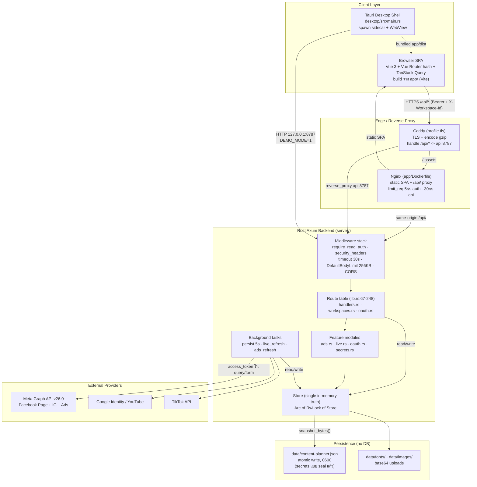

### 1.1 Deployment topologies ที่มีจริง

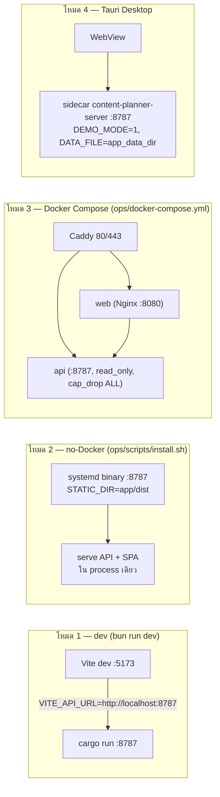

---

## 2. Data Model (ความจริงเรื่อง Storage)

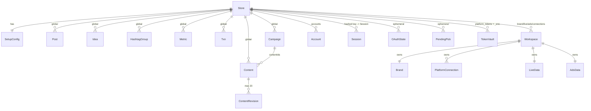

**Snapshot (`server/src/store.rs:612-647`)** เก็บ: `setup, posts, ideas, hashtags, metrics, txns, workspaces, content, campaigns, accounts, sessions(hashed), platform_tokens_enc(sealed), token_salt`.
**ไม่เก็บ**: `login_attempts`, `oauth_states`, `oauth_picks`, `platform_tokens` (plaintext) — เป็น ephemeral (`prune_ephemeral`, `store.rs:949`).

---

## 3. Core Business Logic Flows

### 3.1 Authentication & Session Flow (Login · Token · Workspace setup)

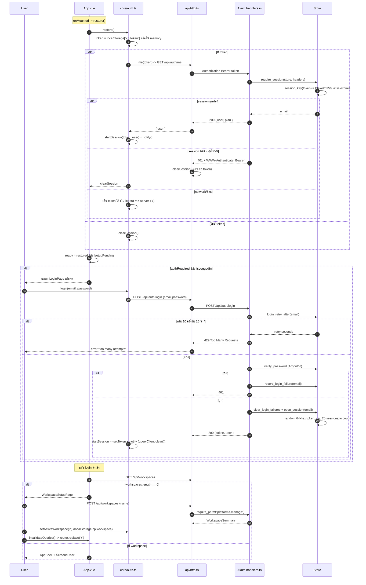

**จุดสำคัญ**
- Token เก็บใน `localStorage` (`cp.token`) — ไม่ใช่ HttpOnly cookie ⇒ เสี่ยง XSS ขโมย token
- `require_read_auth` (`lib.rs:360`) บังคับเฉพาะ **GET/HEAD**; mutation ทุกตัวต้องเรียก `require_perm` เอง
- `X-Admin-Token` (operator) bypass ทุก permission (`handlers.rs:226-260`) — break-glass, log ไว้

### 3.2 Permission Resolution (State)

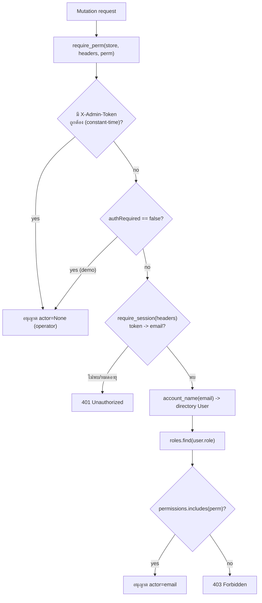

> ⚠️ Role ถูก resolve ผ่าน **display name** ไม่ใช่ email ⇒ ดูช่องโหว่ #G1 ในบทที่ 5

### 3.3 Content Planning & CRUD (Planner · Ideas · Tags · Metrics)

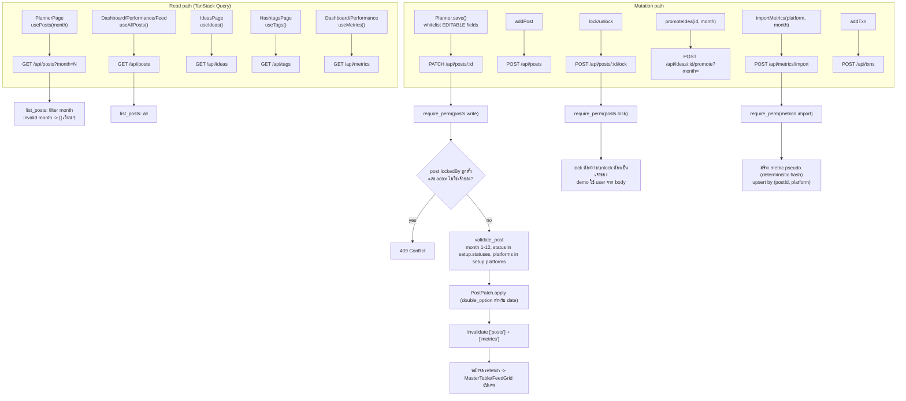

**หมายเหตุ:** ไม่มี optimistic update ทุกที่ — mutate สำเร็จแล้ว `invalidateQueries` แล้วรอ refetch (staleTime 30s)

### 3.4 CMS Content Studio Flow (Create · Autosave · Publish · Schedule · Revision)

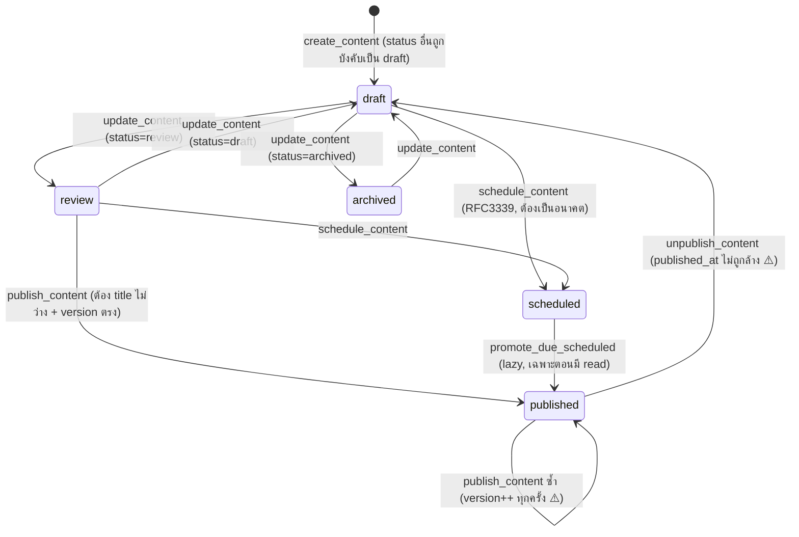

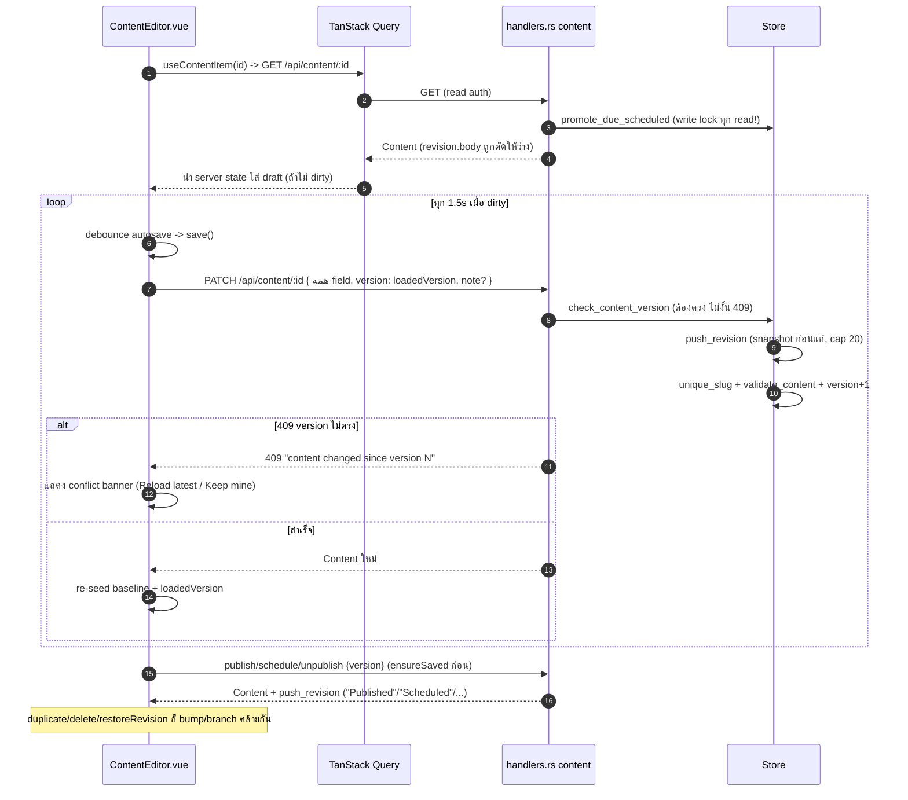

**ประเด็นที่พบ**
- `list_content`/`get_content`/`list_public_content` **ทุก read เขียน write lock** เพื่อ `promote_due_scheduled` (`handlers.rs:2934, 2957, 3247`) → คอขวด
- Scheduled publish ไม่มี background timer ⇒ ถ้าไม่มีคนอ่าน งานไม่ publish
- `unpublish` ไม่ล้าง `published_at`; `restoreRevision` ไม่คืน `kind/slug/heroImageUrl`
- `content_view` ตัด `revision.body` แต่ Type ฝั่ง FE บอก `body: string` ⇒ contract ไม่ตรง (ข้อ #F1)

### 3.5 Live Mirror & OAuth Platform Connections

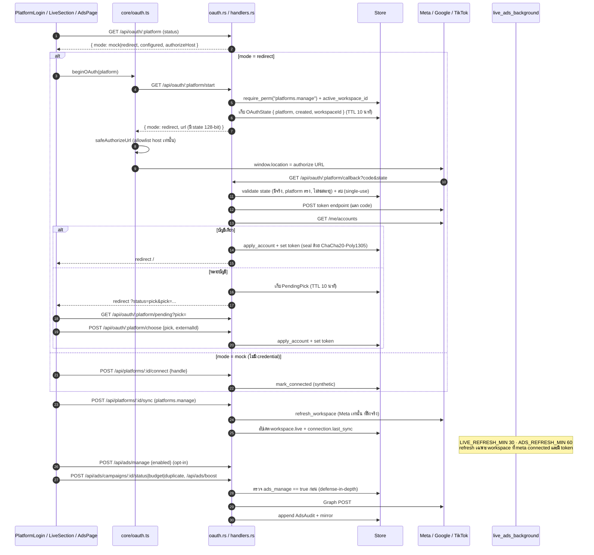

### 3.6 Meta Ads Management Gate

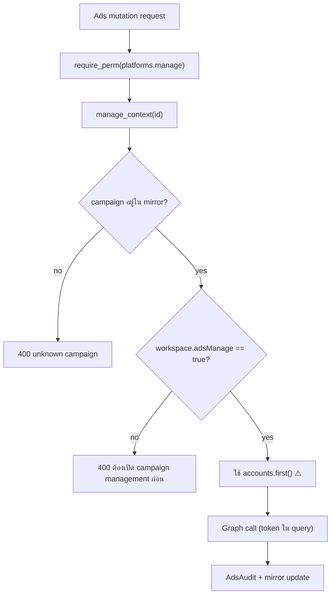

### 3.7 Workspace Lifecycle

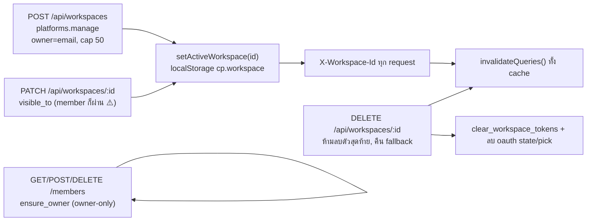

---

## 4. Component & State Interaction Flow (Frontend)

### 4.1 Query Client configuration (`app/src/app/main.ts:8-17`)

| Setting | ค่า | ผล |
|---|---|---|
| `staleTime` | 30_000 | ข้อมูลถือว่า fresh 30s |
| `retry` | 1 | query retry 1 ครั้ง |
| mutations `retry` | 0 | ไม่ retry mutation |
| `refetchOnWindowFocus` | false | ไม่ refetch ตอนกลับมาโฟกัส |
| `onSessionChange` | `queryClient.clear()` | login/logout/expiry ล้าง cache ทั้งหมด |

### 4.2 Page → Hook → Endpoint → Invalidation

| Page (route) | Hooks หลัก | Endpoints | Mutation invalidates |
|---|---|---|---|
| `App.vue` (gate) | `usePermission`, `useSetup`, `useWorkspaces`, `useBrand`, `useBrandFonts` | `/api/setup`, `/api/workspaces`, `/api/brand`, `/api/brand/fonts` | — |
| `BrandPage` `/brand` | `useBrand`, `useSaveBrand`, `useUploadBrandImage`, `useBrandFonts`, `useUploadFont`, `useDeleteFont` | `GET/PATCH /api/brand`, `POST/DELETE /api/brand/images`, `GET/POST/DELETE /api/brand/fonts` | `['brand']`, `['brand','fonts']` + `applyBrandTheme` |
| `PlannerPage` `/planner/:month` | `usePosts`, `useSetup`, `useUpdate/Add/Delete/Lock/UnlockPost`, `usePermission` | `/api/posts*` | `['posts']` (+`['metrics']`), lock `['posts',m]` |
| `CalendarPage` `/calendar` | `usePosts`, `useSetup` | `/api/posts?month=` | — |
| `FeedPage` `/feed` | `useSetup`, `useAllPosts` + `LiveSection` | `/api/posts`, `/api/live` | — |
| `DashboardPage` `/dashboard` | `useDashboard`→`usePosts`+`useMetrics`, `useAds` | `/api/posts`, `/api/metrics`, `/api/ads` | — |
| `PerformancePage` `/performance` | `useMetrics`, `useAllPosts`, `useImportMetrics` | `/api/metrics`, `/api/metrics/import` | `['metrics']` |
| `IdeasPage` `/ideas` | `useIdeas`, `useAddIdea`, `useToggleIdea`, `usePromoteIdea` | `/api/ideas*` | `['ideas']` (+`['posts']`) |
| `HashtagsPage` `/hashtags` | `useTags`, `useAddTag` | `/api/tags*` | `['tags']` |
| `FinancePage` `/finance` | `useTxns`, `useAddTxn` | `/api/txns` | `['txns']` |
| `LivePage` `/live` | `LiveSection`: `useLive`, `usePlatforms`, `useAds`, `useSyncPlatform` | `/api/live`, `/api/platforms`, `/api/ads`, `/api/platforms/:id/sync` | `['platforms']`,`['live']`,`['metrics']` |
| `CampaignsPage` `/campaigns/:id?` | `useCampaigns`, `useContentList`, `useCreate/Update/DeleteCampaign` | `/api/campaigns*`, `/api/content` | `['campaigns']` |
| `AdsPage` `/ads` | `useAds`, `useLive`, `usePlatforms`, ads mutations | `/api/ads*` | `['ads']` (+`['platforms']`) |
| `MembersPage` `/members` | `useWorkspaces`, `useWorkspaceMembers`, `useAdd/RemoveWorkspaceMember` | `/api/workspaces/:id/members` | `['workspaces',id,'members']`,`['workspaces']` |
| `StudioPage` `/studio/:id?` | `useContentList`, `useCreateContent`, `usePermission` | `/api/content` | `['content']`,`['public-content']` |
| `ContentEditor` | `useContentItem`, `useContentRevisions`, publish/schedule/delete/duplicate/restore | `/api/content/:id*` | `['content']`,`['public-content']` |
| `ReadPage` `/read/:slug` (public) | `usePublicContentList`, `usePublicContent` | `/api/public/content*` | — |
| `LoginPage`/`RegisterPage`/`PlansPage` (public) | `core/auth.login/register/choosePlan` | `/api/auth/login|register|plan` | session change → clear |
| `WorkspaceSetupPage` `/welcome` | `useCreateWorkspace` | `/api/workspaces` | `invalidateQueries()` ทั้งหมด |
| `SettingsPanel` (overlay) | `useSaveSetup`, `useAddOption`, `useAddUser/Role`, `useAccounts`, `useDeleteAccount`, `useCreateAccount` | `/api/setup*`, `/api/auth/accounts*` | `['setup']`,`['accounts']` |
| `AppShell` (OAuth callback) | `useOAuthPending`, `useChooseOAuthPage` | `/api/oauth/:platform/pending|choose` | `['platforms']` + (sync) `['live']`,`['metrics']` |

### 4.3 App.vue Render Gate

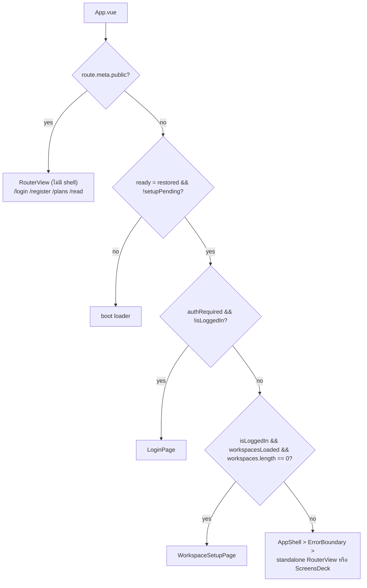

> ⚠️ `workspacesLoaded` เป็น `isSuccess` ถ้า query error จะเป็น false ⇒ ข้าม onboarding ไปเข้า shell เลย (ข้อ #F2)

---

## 5. Code Review & Gap Analysis

ระดับความรุนแรง: 🔴 สูง · 🟠 กลาง · 🟡 ต่ำ · 🔵 ข้อมูล

### 5.1 Security

| # | ระดับ | ปัญหา | หลักฐาน | ผลกระทบ / แนวทางแก้ |
|---|---|---|---|---|
| **G1** | 🔴 | **Privilege escalation ผ่าน `register`** — permission map ใช้ display name (`email → name → directory User → Role`) แต่ register เช็คชื่อซ้ำเฉพาะ *account* ไม่เช็ค *directory user* ที่มีอยู่ ถ้าชื่อตรงกับ directory user ที่ยังไม่มี account จะ**ข้ามการสร้าง Viewer** แล้วสืบทอด role ของ user นั้น | `handlers.rs:742-793` (โค้ด `if !users.iter().any(name==...) { push Viewer }`), `handlers.rs:243-253` | เมื่อเปิด `ALLOW_REGISTRATION=1` attacker สมัครด้วยชื่อ "Owner"/"Editor" ที่มีใน directory แล้วได้สิทธิ์ทันที → **ย้าย role ไปเก็บที่ `Account` หรือบังคับ invite/claim token** |
| **G2** | 🔴 | **`set_plan` อัปเกรดแพ็กเกจตัวเองได้ฟรี** — ใช้แค่ `require_session` ไม่มี permission/ไม่มี billing | `handlers.rs:866-884` | ผู้ใช้ตั้ง `business` ได้เอง → ต้องตรวจ payment/role |
| **G3** | 🟠 | **Workspace isolation ไม่ครบ** — `posts/ideas/hashtags/metrics/txns/content/campaigns` เป็น global `Store` vector; read middleware เช็คแค่ "มี session" | `store.rs:83-97`, `lib.rs:360-374` | ผู้ใช้ที่ล็อกอินอ่าน/แก้ข้อมูล planner/CMS/finance ของ workspace อื่นได้ → scope ทุก query ด้วย workspace หรือยอมรับ single-tenant และเขียนเอกสาร |
| **G4** | 🟠 | **Member แก้/ลบ workspace ได้** — `rename`/`remove` ใช้ `visible_to` (member = true) แทน `ensure_owner` | `workspaces.rs:89, 108`, `model.rs:547-552` | member ที่มี `platforms.manage` ลบ workspace เจ้าของ → ใช้ owner-only |
| **G5** | 🟠 | **OAuth pick ข้าม workspace** — `pending_pick` เช็คแค่ `has_read_access`, `callback`/`choose` resolve workspace ด้วย `account=None` | `oauth.rs:510-529, 570` | ใครมี `platforms.manage` + รู้ pick id ผูก connection ข้าม workspace → bind pick กับ caller/workspace |
| **G6** | 🟠 | **Token รั่วใน log / URL** — body จาก token endpoint ถูกใส่ error string → `tracing::warn` + redirect `reason=` | `oauth.rs:793, 887 → 452, 459` | token endpoint อาจคืน refresh token ใน body → scrub response body |
| **G7** | 🟠 | **Rate limit ล็อกอินแข่งกัน + per-email** — เช็คใต้ read lock แล้วปล่อยก่อน verify Argon2/บันทึก failure; `register`/`create_account` ไม่มี throttle | `handlers.rs:810-835` | brute force ขนาน, lockout DoS ต่อ victim, Argon2 CPU DoS → atomic + IP/global limit |
| **G8** | 🟠 | **Post lock หลอกได้ใน demo** — actor มาจาก body `user` | `handlers.rs:1135, 1163-1164, 1187, 1219` | demo เท่านั้น แต่ lock ไม่น่าเชื่อถือเมื่อ auth off |
| **G9** | 🟡 | **Ownerless workspace มองเห็นได้ทุกคน** — operator/demo สร้าง `owner=""` ⇒ `visible_to` true ทุก account | `workspaces.rs:67`, `model.rs:547-552`, `store.rs:1230` | ถ้าใช้ `ADMIN_TOKEN` ใน prod → ข้อมูลรั่ว |
| **G10** | 🟡 | **ไม่มี PKCE** ใน OAuth flow | `oauth.rs` (ทั้งไฟล์) | confidential client จึงยังพอรับได้ แต่ควรเพิ่มถ้าเปิด public client |
| **G11** | 🟡 | **`/api/setup` (demo) และ `/api/brand` เปิดสาธารณะ** — demo `has_read_access` true ⇒ เผย directory users/roles | `lib.rs:343-355`, `handlers.rs:469-493` | หลีกเลี่ยง demo mode บน production |
| **G12** | 🟡 | **`list_fonts` อ่านไฟล์ทั้งไดเรกทอรีต่อ request ที่ไม่ต้อง auth** | `handlers.rs:2170, 2209` | DoS amplification → cache/memoize |
| **G13** | 🟡 | **Upload TOCTOU** — เช็ค `exists()` แล้วค่อยเขียน ไม่ atomic | `handlers.rs:1688-1692, 2252-2256` | อัปโหลดชื่อซ้ำพร้อมกันทับกัน |
| **G14** | 🔵 | Token เก็บใน `localStorage`, Tauri `csp: null` | `core/token.ts:22`, `tauri.conf.json:23-25` | XSS = ขโมย token; พิจารณา HttpOnly cookie หรือ Tauri CSP |

### 5.2 Frontend ↔ Backend Contract Mismatch

| # | ระดับ | ปัญหา | ฝั่ง FE | ฝั่ง BE | หมายเหตุ |
|---|---|---|---|---|---|
| **F1** | 🟠 | **`Content.revisions[].body` ถูกตัดฝั่ง server** | `mock/db.ts:752` บอก `body: string` | `content_view` (`handlers.rs:2922-2928`) ตั้ง `revision.body=""` | Editor ใช้ `useContentRevisions` แยกจึงยังทำงานได้ แต่ type โกหก; `get_content_revision` มี hook ไม่ใช้ |
| **F2** | 🟠 | **Onboarding gate พลาดเมื่อ workspaces query error** | `App.vue:36-43` ใช้ `workspacesLoaded = isSuccess` | — | error ค้าง false ⇒ ข้าม WorkspaceSetup เข้า shell ทั้งที่ไม่มี workspace |
| **F3** | 🟡 | **Union type อ่อนกว่า wire** | `ConnectStatus`, `tokenType`, `Status`, `ContentStatus` เป็น union | server คืน `String` อิสระ (validate แค่บางจุด) | ไม่มี runtime validation ฝั่ง FE ⇒ ค่าแปลกเข้าถึง UI ได้ |
| **F4** | 🟡 | **`getCampaign`, `getContentRevision` ไม่มี hook/caller** | contract.ts:136, 203 มีจริง | ทำงานจริง | dead API surface |
| **F5** | 🟡 | **`list_posts` month ผิดคืน `[]` เงียบ** | `listPosts(month)` | `handlers.rs:1088-1092` | UI แสดง "ว่าง" แทน error |
| **F6** | 🟡 | **`/read` เปล่าเรียก `getPublicContent("")`** | `queries.ts:678-684` ไม่มี `enabled` | — | wasted request |
| **F7** | 🟡 | **UI แสดง error 401 จาก middleware แต่ mutation บางตัวไม่ map** | `isAuthError` ตรวจ 401/403 | — | โดยรวมโอเค |
| **F8** | 🔵 | **หน่วยเงิน Ads ไม่สม่ำเสมอ** — `insight.spend` คูณ 100 ตอนแสดง แต่ `dailyBudget` หาร 100 | `AdsPage.vue:309, 350-353, 99-110` | seed ใช้คนละ convention | แสดงผลถูกเฉพาะกับ seed ปัจจุบัน |

### 5.3 Logic / Edge Cases / Bottlenecks

| # | ระดับ | ปัญหา | หลักฐาน |
|---|---|---|---|
| **L1** | 🔴 | **ไม่ใช่ PostgreSQL จริง** — single JSON snapshot, single process; serialize ทั้ง dataset ทุก 5s, เขียนไฟล์ทั้งก้อน; scale แนวนอนไม่ได้ | `main.rs:157-187`, `store.rs:655-693` |
| **L2** | 🟠 | **Ads hierarchy พัง** — `ADSET_FIELDS` ขาด `campaign_id`, `AD_FIELDS` ขาด `adset_id` แต่ parse เรียก field นั้น ⇒ ทุก `campaignId`/`adsetId` = `""` | `ads.rs:401-402, 493, 506` |
| **L3** | 🟠 | **Ads จัดการได้เฉพาะ account แรก** — `manage_context` ใช้ `accounts.first()` | `ads.rs:682-687` |
| **L4** | 🟠 | **YouTube/TikTok ไม่มี live fetch จริง** — sync แค่ `media_count += 3`; refresh token ไม่ถูกเก็บ/ใช้ ⇒ connection หมดอายุ ~1 ชม. | `handlers.rs:2504`, `oauth.rs:883-888` |
| **L5** | 🟠 | **Scheduled publish เป็น lazy** — ยิงเฉพาะตอนมี content read, ทุก read ใช้ write lock | `handlers.rs:2799, 2934, 2957, 3247` |
| **L6** | 🟠 | **Ads ไม่มี pagination/rate-limit/backoff** — ไม่อ่าน `paging.next`; Graph error ทุกอย่าง map เป็น 400 | `ads.rs`, `live.rs`, `handlers.rs:2580, 2629` |
| **L7** | 🟠 | **ทุก deck card ถูก mount พร้อมกัน** — เปิดหน้าเดียวทำให้ query ของทุกหน้า fire (posts/metrics/ads/live/campaigns/content) | `ScreensDeck.vue:371-382` |
| **L8** | 🟡 | **CMS state machine หลวม** — publish/unpublish/schedule ไม่เช็คสถานะปัจจุบัน; unpublish ไม่ล้าง `published_at`; republish bump version ซ้ำ | `handlers.rs:3036-3117` |
| **L9** | 🟡 | **`restoreRevision` ไม่คืน `kind/slug/heroImageUrl`** | `handlers.rs:3197-3243` |
| **L10** | 🟡 | **Login hash เร็ว/ช้าไม่คงที่** — ไม่มี IP/global limit, register ไม่ throttle | `handlers.rs:801-835` |
| **L11** | 🟡 | **`create_boost` ไม่ rollback** — campaign→adset→ad ถ้า adset/ad fail ทิ้ง campaign ค้าง; `days` ถูก clamp เงียบ 1-90; `special_ad_categories` hardcode `[]` | `ads.rs:908-981, 998-1002, 917` |
| **L12** | 🟡 | **`duplicate_campaign` ยอมรับ id ว่างเป็น success** | `ads.rs:845-860` |
| **L13** | 🟡 | **Delete content ไม่มี version guard** | `handlers.rs:3118-3131` |
| **L14** | 🟡 | **`get_setup` เผย owner/workspaceName แม้ไม่ auth** | `handlers.rs:469-493` |
| **L15** | 🔵 | **Concurrency ของ optimistic version ปลอดภัย** เพราะทุกอย่างอยู่ใต้ RwLock เดียว (check+write atomic) | ยืนยันจาก `check_content_version` |
| **L16** | 🔵 | **Network I/O ถูกเรียกนอก lock** (good) | `ads.rs:605-641`, `live.rs:586-667` |

### 5.4 Code Smell / Refactor ที่ควรทำ

- `graph_get`/`as_u64`/`str_of` ถูก copy ระหว่าง `ads.rs` และ `live.rs` → แยกเป็น module กลาง
- `handlers.rs` 3,583 บรรทัด (grab-bag) → แยกเป็น `auth.rs`, `posts.rs`, `brand.rs`, `content.rs`, `platforms.rs`
- Fallback `.unwrap_or("Viewer")` / role resolution by display name → เก็บ`role` ใน `Account` โดยตรง
- Error semantics: upstream failure ควรเป็น 502/503 มากกว่า 400 เพื่อให้ UI แยก "input ผิด" vs "token หมดอายุ"
- `ScreensDeck` mount-everything → ใช้ `<KeepAlive>` + lazy หรือ mount เฉพาะ active
- Dead code: `CardBase.vue`, `screenIndexOf`/`screenOf`, `markdownToText`, `weekOfMonth`, `fmtNum`, `route.meta.wide` (ไม่มี route นิยาม) → ลบ
- `setup.language` มีใน model แต่ไม่มี language switch; i18n EN-only
- Hard-coded default month = 2 (Calendar/Dashboard/Performance) ไม่ผูก `navDate`

---

## 6. แนะนำลำดับการแก้ไข (Priority)

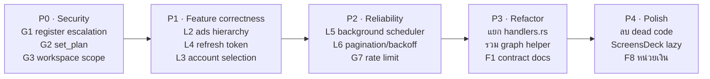

---

## 7. ภาคผนวก — Endpoint ทั้งหมด

### Auth & Setup
`POST /api/auth/register` · `POST /api/auth/login` · `GET /api/auth/me` · `POST /api/auth/logout` · `POST /api/auth/logout-all` · `POST /api/auth/change-password` · `POST /api/auth/plan` · `PATCH /api/auth/profile` · `GET/POST /api/auth/accounts` · `DELETE /api/auth/accounts/{email}`
`GET/PATCH /api/setup` · `POST /api/setup/options` · `POST /api/setup/users` · `DELETE /api/setup/users/{name}` · `POST /api/setup/roles` · `DELETE /api/setup/roles/{name}`

### Planner / Content
`GET/POST /api/posts` · `PATCH/DELETE /api/posts/{id}` · `POST /api/posts/{id}/lock|unlock`
`GET/POST /api/ideas` · `POST /api/ideas/{id}/toggle|promote`
`GET /api/tags` · `POST /api/tags/{id}` · `GET /api/metrics` · `POST /api/metrics/import` · `GET/POST /api/txns`
`GET/POST /api/content` · `GET/PATCH/DELETE /api/content/{id}` · `POST /api/content/{id}/publish|unpublish|schedule|duplicate` · `GET /api/content/{id}/revisions[/{revision}]` · `POST /api/content/{id}/revisions/{revision}/restore`
`GET /api/public/content[/{slug}]`

### Brand / Campaigns / Platforms / Ads
`GET/PATCH /api/brand` · `GET/POST /api/brand/fonts` · `DELETE /api/brand/fonts/{name}` · `GET /api/brand/fonts/{name}/file` · `POST /api/brand/images` · `GET/DELETE /api/brand/images/{name}`
`GET/POST /api/campaigns` · `GET/PATCH/DELETE /api/campaigns/{id}`
`GET /api/platforms` · `POST /api/platforms/{id}/connect|disconnect|sync`
`GET /api/live` · `GET /api/ads` · `POST /api/ads/sync|manage|boost` · `POST /api/ads/campaigns/{id}/status|budget|duplicate`
`GET /api/oauth/{platform}` · `GET /api/oauth/{platform}/start|callback|pending` · `POST /api/oauth/{platform}/choose`
`GET/POST /api/workspaces` · `PATCH/DELETE /api/workspaces/{id}` · `GET/POST /api/workspaces/{id}/members` · `DELETE /api/workspaces/{id}/members/{email}`
`GET /api/health` · `GET /api/ready` · `GET /api/docs` (debug/SWAGGER_UI=1) · `GET /api/openapi.yaml`
