# Huuk — Complete User Stories & Workflow Diagrams

> **Generated deliverable.** Reverse-engineered from `server/src/` (Rust/Axum) + `app/src/` (Vue 3 + TanStack Query).
> รวมทุก Epic ไว้ในไฟล์เดียว: **12 Epic · 100 User Stories · 35 Mermaid diagrams**
>
> โครงสร้างต่อ Epic: Personas → User Stories (actor / endpoint / permission / preconditions) → Main flow (ทุก action) → Alternative & Error flows → Acceptance Criteria → Mermaid (sequence / flowchart / state).
>
> ไฟล์แยกส่วน: `docs/user-stories/**` · ไฟล์ `.mmd` ดิบ: `docs/user-stories/diagrams/**` · สถาปัตยกรรมรวม: `docs/ARCHITECTURE-E2E-FLOW.md`

---

## Huuk — User Stories (reverse-engineered from code)

ชุดเอกสารนี้แปลงพฤติกรรมจริงของระบบ (จาก `server/src/` + `app/src/`) เป็น User Story
พร้อม Acceptance Criteria และ Mermaid diagram ที่แสดง **ทุก action** (ผู้ใช้ → UI → API → Store/Provider)

> ทุกเรื่องอ้างอิงโค้ดจริง: handler/route/error code มีระบุในแต่ละหัวข้อ

---

## สารบัญ Epic

| Epic | ไฟล์ | ฟีเจอร์ |
|---|---|---|
| E01 | [01-auth-account.md](01-auth-account.md) | ล็อกอิน/สมัคร/ออกจากระบบ/รหัสผ่าน/โปรไฟล์/แพ็กเกจ/บัญชี |
| E02 | [02-workspace.md](02-workspace.md) | Workspace: สร้าง/เปลี่ยนชื่อ/ลบ/สลับ/สมาชิก |
| E03 | [03-brand-identity.md](03-brand-identity.md) | Brand Identity (CI): ข้อมูลแบรนด์, พาเลตต์, ฟอนต์, โลโก้, moodboard, style |
| E04 | [04-content-planner.md](04-content-planner.md) | ปฏิทินคอนเทนต์ 01–12, CRUD, ล็อกแถว, promote idea |
| E05 | [05-ideas-hashtags.md](05-ideas-hashtags.md) | คลังไอเดีย, กลุ่มแฮชแท็ก |
| E06 | [06-performance-finance.md](06-performance-finance.md) | นำเข้า metrics, แดชบอร์ดประสิทธิภาพ, บัญชีรายรับรายจ่าย |
| E07 | [07-campaigns.md](07-campaigns.md) | แคมเปญคอนเทนต์ (brief, ช่วงเวลา, เป้า, ผูก content) |
| E08 | [08-platform-connections-live.md](08-platform-connections-live.md) | เชื่อมต่อแพลตฟอร์ม (OAuth), Live mirror, sync |
| E09 | [09-meta-ads.md](09-meta-ads.md) | Meta Ads mirror + จัดการแคมเปญโฆษณา (pause/budget/duplicate/boost) |
| E10 | [10-content-studio-cms.md](10-content-studio-cms.md) | CMS: สร้าง/แก้/autosave/publish/schedule/revisions |
| E11 | [11-settings-permissions.md](11-settings-permissions.md) | ตั้งค่า, users, roles, permission matrix, onboarding client |
| E12 | [12-public-delivery.md](12-public-delivery.md) | หน้า public reader ของเนื้อหาที่เผยแพร่ |

---

## Personas / Roles

| Persona | คำอธิบาย | ที่มา |
|---|---|---|
| **Anonymous** | ผู้เยี่ยมชมที่ยังไม่ล็อกอิน (เห็นเฉพาะ public) | `is_public_read` |
| **Owner** | เจ้าของ workspace/บัญชี admin — สิทธิ์ทั้งหมด | seed role `Owner` |
| **Editor** | ทีมงานคอนเทนต์ — เขียน/ล็อก/import/แคมเปญ/studio | seed role `Editor` |
| **Viewer** | อ่านอย่างเดียว | seed role `Viewer` |
| **Client** | ลูกค้า — เห็นเฉพาะ Content Studio | seed role `Client` |
| **Operator** | recovery token `X-Admin-Token` — bypass ทุก permission | `require_perm` |

## Permission Matrix (15 permissions จาก `model.rs:79-95`)

| Permission | Owner | Editor | Viewer | Client | ใช้กับ action |
|---|:--:|:--:|:--:|:--:|---|
| `setup.write` | ✅ | – | – | – | PATCH /api/setup |
| `users.manage` | ✅ | – | – | – | users/roles/accounts, onboarding |
| `posts.write` | ✅ | ✅ | – | – | เพิ่ม/แก้/ลบ post |
| `posts.lock` | ✅ | ✅ | – | – | lock/unlock แถว |
| `metrics.import` | ✅ | ✅ | – | – | import metrics |
| `finance.write` | ✅ | – | – | – | เพิ่มรายรับรายจ่าย |
| `brand.write` | ✅ | – | – | – | บันทึก brand, อัปโหลดฟอนต์/รูป |
| `ideas.write` | ✅ | ✅ | – | – | idea CRUD, promote |
| `hashtags.write` | ✅ | ✅ | – | – | เพิ่มแฮชแท็ก |
| `platforms.manage` | ✅ | – | – | – | เชื่อมต่อ/sync, ads, workspace, members |
| `content.write` | ✅ | ✅ | – | ✅ | สร้าง/แก้/duplicate content |
| `content.publish` | ✅ | ✅ | – | ✅ | publish/unpublish/schedule |
| `content.delete` | ✅ | – | – | – | ลบ content |
| `campaigns.write` | ✅ | ✅ | – | – | สร้าง/แก้ campaign |
| `campaigns.delete` | ✅ | – | – | – | ลบ campaign |

> ⚠️ Role ถูก resolve ผ่าน **display name** ของบัญชี ไม่ใช่ email/account — ดู `docs/ARCHITECTURE-E2E-FLOW.md` §G1

---

## Epic Map

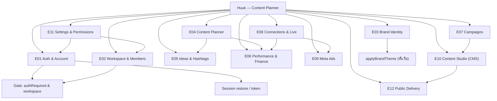
```mermaid
flowchart TD
  Root["Huuk — Content Planner"]

  Root --> E01["E01 Auth & Account"]
  Root --> E02["E02 Workspace & Members"]
  Root --> E03["E03 Brand Identity"]
  Root --> E04["E04 Content Planner"]
  Root --> E05["E05 Ideas & Hashtags"]
  Root --> E06["E06 Performance & Finance"]
  Root --> E07["E07 Campaigns"]
  Root --> E08["E08 Connections & Live"]
  Root --> E09["E09 Meta Ads"]
  Root --> E10["E10 Content Studio (CMS)"]
  Root --> E11["E11 Settings & Permissions"]
  Root --> E12["E12 Public Delivery"]

  E01 --> G1["Gate: authRequired & workspace"]
  E01 --> G2["Session restore / token"]
  E02 --> G1
  E03 --> Theme["applyBrandTheme (ทั้งเว็บ)"]
  E04 --> E05
  E04 --> E06
  E07 --> E10
  E08 --> E06
  E08 --> E09
  E10 --> E12
  E11 --> E01
  E11 --> E02
```

## Global app gate (ทุก epic เริ่มที่นี่)

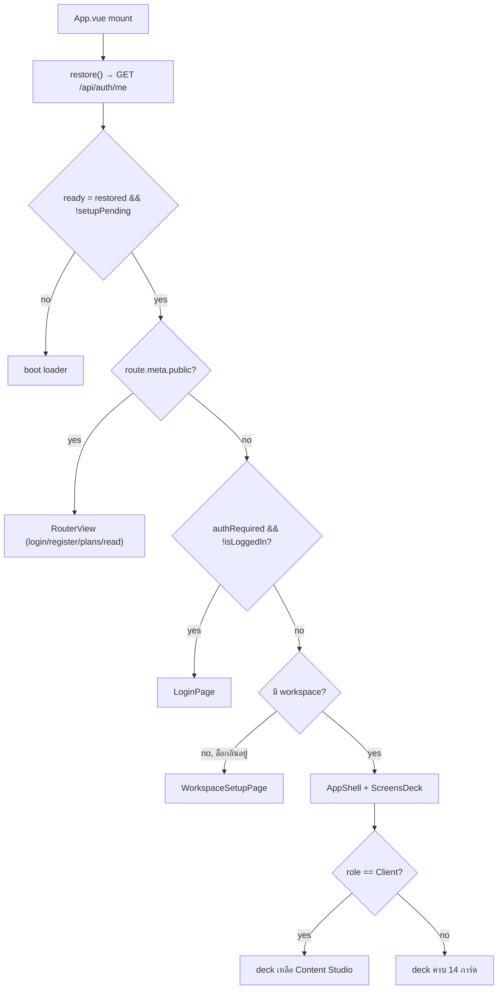
```mermaid
flowchart TD
  Boot["App.vue mount"] --> Restore["restore() → GET /api/auth/me"]
  Restore --> Ready{"ready = restored && !setupPending"}
  Ready -->|no| Loading["boot loader"]
  Ready -->|yes| Public{"route.meta.public?"}
  Public -->|yes| Render["RouterView (login/register/plans/read)"]
  Public -->|no| Auth{"authRequired && !isLoggedIn?"}
  Auth -->|yes| LoginGate["LoginPage"]
  Auth -->|no| Ws{"มี workspace?"}
  Ws -->|no, ล็อกอินอยู่| Setup["WorkspaceSetupPage"]
  Ws -->|yes| Shell["AppShell + ScreensDeck"]
  Shell --> Role{"role == Client?"}
  Role -->|yes| Studio["deck เหลือ Content Studio"]
  Role -->|no| AllCards["deck ครบ 14 การ์ด"]
```

## API envelope & error convention (ใช้ร่วมทุก epic)

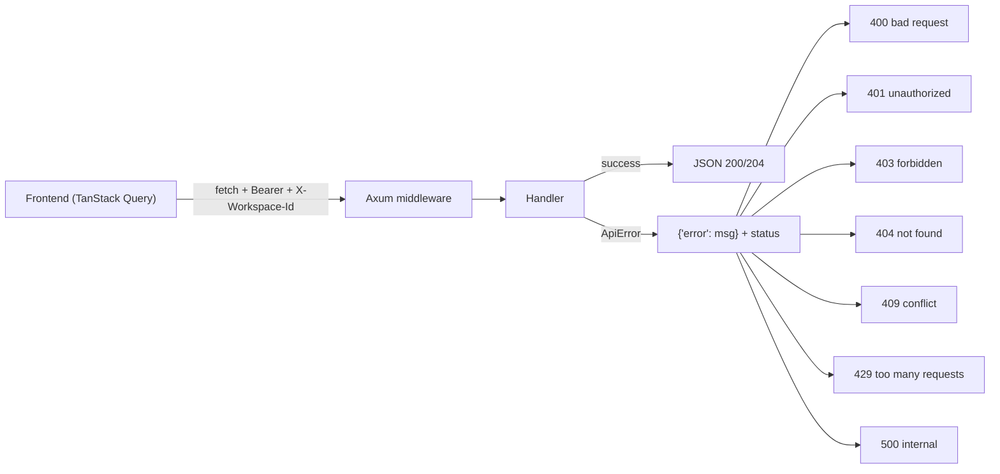
```mermaid
flowchart LR
  UI["Frontend (TanStack Query)"] -->|"fetch + Bearer + X-Workspace-Id"| MW["Axum middleware"]
  MW --> H["Handler"]
  H -->|success| J["JSON 200/204"]
  H -->|"ApiError"| Err["{'error': msg} + status"]
  Err --> E400["400 bad request"]
  Err --> E401["401 unauthorized"]
  Err --> E403["403 forbidden"]
  Err --> E404["404 not found"]
  Err --> E409["409 conflict"]
  Err --> E429["429 too many requests"]
  Err --> E500["500 internal"]
```

---

## E01 — Authentication & Account

**โมดูล:** `handlers.rs` (register/login/me/logout/logout_all/change_password/update_profile/set_plan/accounts)
**Storage:** `Store.accounts` (Argon2id), `Store.sessions` (token hash, TTL 7 วัน, cap 20/บัญชี)
**FE:** `core/auth.ts`, `core/session.ts`, `core/token.ts`, `pages/LoginPage.vue`, `RegisterPage.vue`, `PlansPage.vue`, `components/overlays/ChangePasswordModal.vue`, `ProfilePanel.vue`, `SettingsPanel.vue`

---

## Personas
- **Anonymous** — สมัคร/ล็อกอิน
- **ทุก role ที่ล็อกอิน** — จัดการบัญชีตัวเอง
- **Owner (`users.manage`)** — จัดการบัญชีในระบบ

## User Stories

| ID | As a | I want to | So that | Priority |
|---|---|---|---|---|
| US-01-01 | Anonymous | สมัครบัญชีด้วยชื่อ/อีเมล/รหัสผ่าน | เริ่มใช้ระบบ | Must |
| US-01-02 | Anonymous | ล็อกอินด้วยอีเมล+รหัสผ่าน | เข้าถึงข้อมูลของฉัน | Must |
| US-01-03 | ผู้ใช้ที่เคยล็อกอิน | เปิดแอปแล้วยังล็อกอินอยู่ | ไม่ต้องล็อกอินซ้ำ | Must |
| US-01-04 | ผู้ใช้ | ออกจากระบบเครื่องนี้ | ป้องกันคนอื่นใช้ต่อ | Must |
| US-01-05 | ผู้ใช้ | ออกจากระบบทุกอุปกรณ์ | ตัด session ที่ค้างทั้งหมด | Should |
| US-01-06 | ผู้ใช้ | เปลี่ยนรหัสผ่าน | ความปลอดภัย | Must |
| US-01-07 | ผู้ใช้ | แก้ชื่อที่แสดง | ให้ทีมเห็นชื่อถูกต้อง | Should |
| US-01-08 | ผู้ใช้ | เลือกแพ็กเกจ (free/pro/business) | ระบุแพ็กที่ใช้ | Could |
| US-01-09 | Owner | ดูรายชื่อบัญชี + จำนวน session | ตรวจสอบการใช้งาน | Should |
| US-01-10 | Owner | สร้างบัญชีให้ลูกค้า (ได้ temp password ครั้งเดียว) | onboard ลูกค้า | Must |
| US-01-11 | Owner | ลบบัญชี | ถอนสิทธิ์ | Should |

---

## US-01-01 — Register

**Actor:** Anonymous · **Endpoint:** `POST /api/auth/register` · **Permission:** none แต่ต้อง `allow_registration=true` (env `ALLOW_REGISTRATION`, default = demo)

**Preconditions:** `setup.allowRegistration == true`
**Postconditions:** มี account ใหม่ (plan=free), session เปิด, `{ token, user }`

**Main flow (ทุก action)**
1. ผู้ใช้เปิด `/register` → FE อ่าน `useSetup()` เพื่อเช็ค `allowRegistration`
2. ถ้าปิด → แสดงข้อความปิดรับสมัคร (ไม่ยิง API)
3. ผู้ใช้กรอก name/email/password (min 12)
4. กด submit → `core/auth.register()` → `api.register()`
5. FE ส่ง `POST /api/auth/register` body `{name,email,password}` **ไม่มี Authorization** (`token: null`)
6. Server validate ชื่อ/อีเมล/รหัสผ่าน (`validate_password` 12–256)
7. ตรวจซ้ำ: อีเมลซ้ำ → 409; ชื่อซ้ำกับ account อื่น → 409
8. Hash รหัสผ่านด้วย Argon2id (spawn_blocking) แล้ว re-check ใต้ write lock
9. สร้าง account (plan=free) + directory `User{name, role:"Viewer"}` (เฉพาะถ้ายังไม่มีชื่อนั้น)
10. `open_session(email)` → token 64-hex → `{ token, user }`
11. FE: `startSession(token, user)` → set `cp.token` + `queryClient.clear()` → ไป `/plans`

**Alternative / Error**
- `allow_registration=false` → 403/400 จาก server (FE ปิดปุ่มไว้ก่อน)
- อีเมล/ชื่อซ้ำ → 409
- รหัสสั้นกว่า 12 → 400

**Acceptance Criteria**
- [ ] ปุ่มสมัครซ่อนเมื่อ `allowRegistration=false`
- [ ] สมัครสำเร็จ → token ถูกเก็บ → ไปหน้า `/plans`
- [ ] อีเมล/ชื่อซ้ำได้ 409 + ข้อความอ่านรู้เรื่อง
- [ ] รหัสผ่านไม่ถูกส่งกลับหรือ log

---

## US-01-02 — Login

**Actor:** Anonymous · **Endpoint:** `POST /api/auth/login` · **Rate limit:** 10 ครั้งผิด/15 นาที/อีเมล → 429

**Main flow**
1. FE อ่าน `useSetup()` เพื่อเอา `workspaceName`
2. ส่ง `POST /api/auth/login {email,password}` (token:null, keepSessionOn401)
3. Server: `login_retry_after(email)` — ถ้าเกินลิมิต → **429** + จำนวนวินาที
4. ถ้าไม่พบอีเมล → verify กับ `dummy_password_hash()` (timing equalization)
5. `verify_password` (Argon2id)
6. ผิด → `record_login_failure` → **401**
7. ถูก → `clear_login_failures` + `open_session` (cap 20, evict เก่าสุด) → `{token,user}`
8. FE: `startSession` → clear cache → เข้าแอป

**Alternative / Error**
- 429 → แสดง "ลองใหม่ในอีก N วินาที"
- 401 → "อีเมลหรือรหัสผ่านไม่ถูกต้อง" (ไม่บอกว่าอันไหนผิด)
- 401 ตอน login **ไม่** clear session ที่มีอยู่ (`keepSessionOn401`)

**Acceptance Criteria**
- [ ] ล็อกอินซ้ำผิด 10 ครั้งล็อก 15 นาที
- [ ] ข้อความผิดพลาดไม่เปิดเผยว่าอีเมลมีจริงหรือไม่
- [ ] login สำเร็จแล้ว cache เก่าถูกล้าง

---

## US-01-03 — Session restore (ทุกครั้งที่เปิดแอป)

**Main flow**
1. `App.vue onMounted → restore()`
2. อ่าน token จาก `localStorage["cp.token"]` (หรือ in-memory)
3. ถ้าไม่มี → `clearSession()`
4. มี → `GET /api/auth/me` (Bearer)
5. Server `require_session` → `session_key(token)` (Blake2b-256) → ตรวจ `expires`
6. ถูกต้อง → `{user, plan}` → `startSession(token, user)`
7. ผิด/หมดอายุ → 401 + `WWW-Authenticate: Bearer` → FE `clearSession()`
8. network/5xx → **เก็บ** token (ไม่ force logout)

**Acceptance Criteria**
- [ ] reload แล้วยังล็อกอิน (token ยังไม่หมดอายุ)
- [ ] session หมดอายุ → ถูก logout
- [ ] server ล่มชั่วคราว → ไม่ล้าง token

---

## US-01-04 — Logout

**Main flow:** `clearSession()` ก่อน แล้วยิง `POST /api/auth/logout` (Bearer, keepSessionOn401) → server `revoke_session` → `{ok:true}` (best-effort, `.catch` กลืน error)

**Acceptance Criteria:** [ ] กด logout → token ถูกลบเฉพาะเครื่องนี้, session อื่นยังอยู่

## US-01-05 — Logout all

**Main flow:** `POST /api/auth/logout-all` → server `sessions.retain(email != caller)` → `{ok:true}`

**Acceptance Criteria:** [ ] ทุก session ของบัญชีถูกยกเลิก, ต้องล็อกอินใหม่ทุกอุปกรณ์

## US-01-06 — Change password

**Endpoint:** `POST /api/auth/change-password {oldPassword,newPassword}` · Bearer

**Main flow**
1. `ChangePasswordModal` ตรวจ new==confirm ฝั่ง FE
2. ยิง API (keepSessionOn401)
3. Server validate new 12–256
4. verify old (Argon2id) — ผิด → 401
5. hash new + บันทึก + **เก็บ session ปัจจุบันไว้, revoke session อื่นทั้งหมด**
6. → `{ok:true}`

**Acceptance Criteria**
- [ ] old ผิด → 401 ไม่เปลี่ยน
- [ ] เปลี่ยนแล้ว session อื่นถูกตัด, เครื่องปัจจุบันยังอยู่
- [ ] ไม่ห้ามตั้งรหัสซ้ำของเดิม (ตามจริง)

## US-01-07 — Update profile

**Endpoint:** `PATCH /api/auth/profile {name}` · Bearer

**Main flow:** trim/validate ชื่อ → ชื่อซ้ำกับ account อื่น → 409 → อัปเดต account.name + rename directory entry (คง role) + เขียน `post.locked_by` ใหม่ → `{user}` → FE invalidate `['accounts']`,`['setup']`

## US-01-08 — Choose plan

**Endpoint:** `POST /api/auth/plan {plan}` (free/pro/business) · Bearer **เท่านั้น**

**Main flow:** plan ไม่อยู่ในชุด → 400 → `{user}` → FE อัปเดต `currentUser`

> ⚠️ ไม่มี billing/permission — อัปเกรดตัวเองได้ (ดู Gap G2)

## US-01-09 — List accounts (admin)

**Endpoint:** `GET /api/auth/accounts` · Permission `users.manage` → `[{name,email,sessions}]` (sort by name, prune expired)

## US-01-10 — Create account / client onboarding

**Endpoint:** `POST /api/auth/accounts {name,email,role,password?}` · `users.manage`

**Main flow**
1. Owner กรอก name/email/role (ไม่ใส่ password ได้)
2. Server validate (ก่อนเช็ค auth) → `require_perm("users.manage")` ใน write lock
3. role ไม่อยู่ใน setup.roles → 400; ซ้ำ → 409
4. ถ้าไม่ส่ง password → generate `cp-<12hex>` (48-bit)
5. Hash (spawn_blocking) → re-check email → สร้าง account + directory role
6. → `{ ok, account:{...role}, temporaryPassword }` (โชว์ครั้งเดียว)
7. FE invalidate `['accounts']`,`['setup']`

**Acceptance Criteria**
- [ ] temp password แสดงครั้งเดียว ไม่เก็บฝั่ง client
- [ ] role ผิด/ซ้ำ → 400/409 ชัดเจน

## US-01-11 — Delete account (admin)

**Endpoint:** `DELETE /api/auth/accounts/{email}` · `users.manage`
**Rules:** ลบตัวเองไม่ได้ (400); ไม่พบ (404); ห้ามลบแอดมินคนสุดท้ายเมื่อ `authRequired` (400); ลบ account + sessions + directory entry (ถ้าเหลือ >1 user)

---

## Sequence — Login / Register

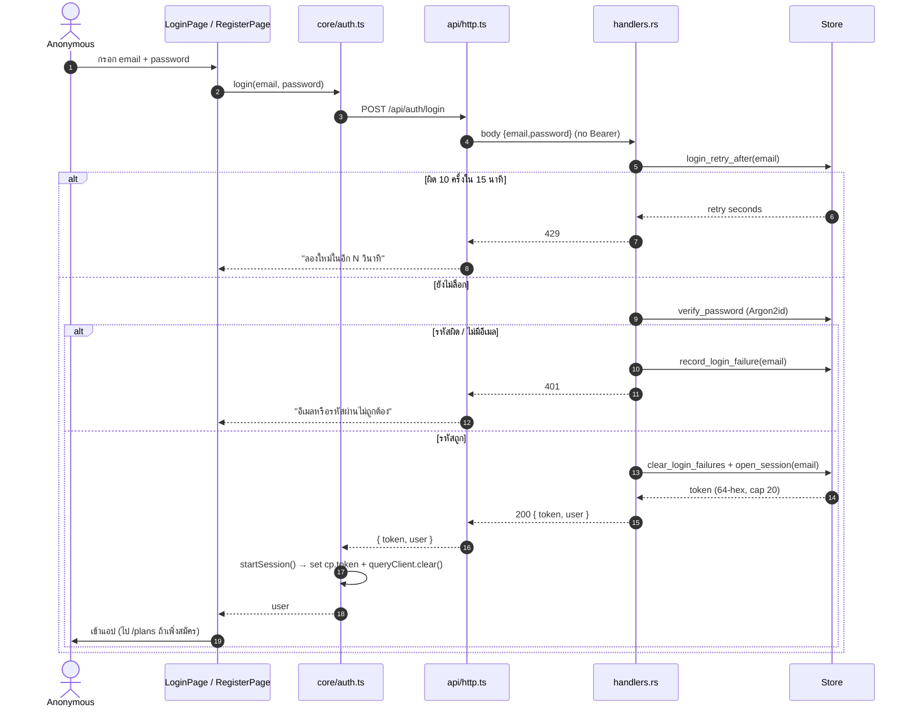
```mermaid
sequenceDiagram
  autonumber
  actor U as Anonymous
  participant LP as LoginPage / RegisterPage
  participant AUTH as core/auth.ts
  participant HTTP as api/http.ts
  participant API as handlers.rs
  participant ST as Store

  U->>LP: กรอก email + password
  LP->>AUTH: login(email, password)
  AUTH->>HTTP: POST /api/auth/login
  HTTP->>API: body {email,password} (no Bearer)
  API->>ST: login_retry_after(email)
  alt ผิด 10 ครั้งใน 15 นาที
    ST-->>API: retry seconds
    API-->>HTTP: 429
    HTTP-->>LP: "ลองใหม่ในอีก N วินาที"
  else ยังไม่ล็อก
    API->>ST: verify_password (Argon2id)
    alt รหัสผิด / ไม่มีอีเมล
      API->>ST: record_login_failure(email)
      API-->>HTTP: 401
      HTTP-->>LP: "อีเมลหรือรหัสผ่านไม่ถูกต้อง"
    else รหัสถูก
      API->>ST: clear_login_failures + open_session(email)
      ST-->>API: token (64-hex, cap 20)
      API-->>HTTP: 200 { token, user }
      HTTP-->>AUTH: { token, user }
      AUTH->>AUTH: startSession() → set cp.token + queryClient.clear()
      AUTH-->>LP: user
      LP->>U: เข้าแอป (ไป /plans ถ้าเพิ่งสมัคร)
    end
  end
```

## Sequence — Session restore / Logout / Change password

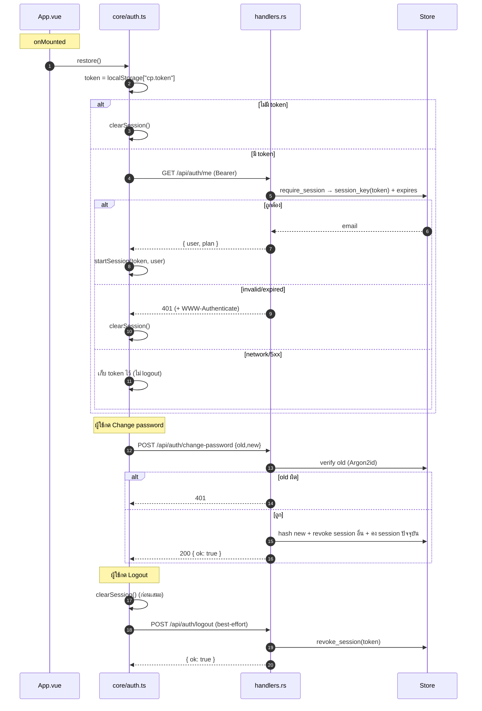
```mermaid
sequenceDiagram
  autonumber
  participant APP as App.vue
  participant AUTH as core/auth.ts
  participant API as handlers.rs
  participant ST as Store

  Note over APP: onMounted
  APP->>AUTH: restore()
  AUTH->>AUTH: token = localStorage["cp.token"]
  alt ไม่มี token
    AUTH->>AUTH: clearSession()
  else มี token
    AUTH->>API: GET /api/auth/me (Bearer)
    API->>ST: require_session → session_key(token) + expires
    alt ถูกต้อง
      ST-->>API: email
      API-->>AUTH: { user, plan }
      AUTH->>AUTH: startSession(token, user)
    else invalid/expired
      API-->>AUTH: 401 (+ WWW-Authenticate)
      AUTH->>AUTH: clearSession()
    else network/5xx
      AUTH->>AUTH: เก็บ token ไว้ (ไม่ logout)
    end
  end

  Note over AUTH: ผู้ใช้กด Change password
  AUTH->>API: POST /api/auth/change-password {old,new}
  API->>ST: verify old (Argon2id)
  alt old ผิด
    API-->>AUTH: 401
  else ถูก
    API->>ST: hash new + revoke session อื่น + คง session ปัจจุบัน
    API-->>AUTH: 200 { ok: true }
  end

  Note over AUTH: ผู้ใช้กด Logout
  AUTH->>AUTH: clearSession() (ก่อนเสมอ)
  AUTH->>API: POST /api/auth/logout (best-effort)
  API->>ST: revoke_session(token)
  API-->>AUTH: { ok: true }
```

## Flow — Admin account lifecycle

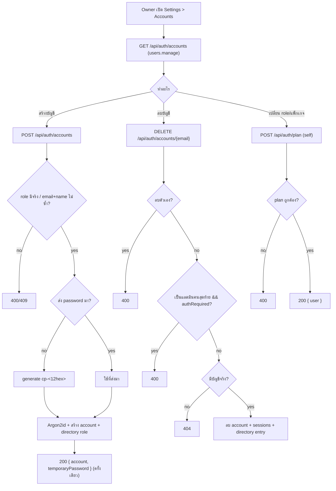
```mermaid
flowchart TD
  Start["Owner เปิด Settings > Accounts"] --> List["GET /api/auth/accounts (users.manage)"]
  List --> Action{"ทำอะไร"}
  Action -->|"สร้างบัญชี"| Create["POST /api/auth/accounts"]
  Create --> CVal{"role มีจริง / email+name ไม่ซ้ำ?"}
  CVal -->|no| C400["400/409"]
  CVal -->|yes| CPw{"ส่ง password มา?"}
  CPw -->|no| Gen["generate cp-<12hex>"]
  CPw -->|yes| Use["ใช้ที่ส่งมา"]
  Gen --> Save["Argon2id + สร้าง account + directory role"]
  Use --> Save
  Save --> Ret["200 { account, temporaryPassword } (ครั้งเดียว)"]

  Action -->|"ลบบัญชี"| Del["DELETE /api/auth/accounts/{email}"]
  Del --> DSelf{"ลบตัวเอง?"}
  DSelf -->|yes| D400["400"]
  DSelf -->|no| DLast{"เป็นแอดมินคนสุดท้าย && authRequired?"}
  DLast -->|yes| D400b["400"]
  DLast -->|no| D404{"มีบัญชีจริง?"}
  D404 -->|no| D404b["404"]
  D404 -->|yes| DGo["ลบ account + sessions + directory entry"]

  Action -->|"เปลี่ยน role/แพ็กเกจ"| Plan["POST /api/auth/plan (self)"]
  Plan --> Pv{"plan ถูกต้อง?"}
  Pv -->|no| P400["400"]
  Pv -->|yes| POk["200 { user }"]
```

---

## E02 — Workspace & Members

**โมดูล:** `server/src/workspaces.rs` + `handlers.rs` (`active_workspace_id`)
**Storage:** `Store.workspaces: Vec<Workspace>` (owner, members, brand, connections, live, ads)
**FE:** `AppShell.vue` (switcher), `WorkspaceSetupPage.vue`, `MembersPage.vue`
**Permission:** `platforms.manage` (mutations); members = `ensure_owner`

---

## แนวคิด

- แต่ละ account มีได้หลาย workspace (สูงสุด 50 ที่มองเห็น) — **ต้องมีอย่างน้อย 1 ก่อนใช้งาน planner**
- ทุก request เลือก workspace ด้วย header `X-Workspace-Id` (ถ้าไม่มี → server เลือกตัวแรกที่มองเห็น)
- workspace แยกเฉพาะ `brand`, `connections`, `live`, `ads` — ส่วน posts/ideas/content ฯลฯ เป็น global
- `visible_to(account)` = owner ว่าง (shared/legacy) **หรือ** account เป็นเจ้าของ **หรือ** เป็น member

## User Stories

| ID | As a | I want to | So that | Priority |
|---|---|---|---|---|
| US-02-01 | ผู้ใช้ที่ล็อกอินครั้งแรก | สร้าง workspace แรก | เริ่มใช้ planner | Must |
| US-02-02 | ผู้ใช้ | สลับ workspace | แยกแบรนด์/งาน | Must |
| US-02-03 | ผู้ใช้ | สร้าง workspace เพิ่ม | ทำงานหลายแบรนด์ | Should |
| US-02-04 | Owner | เปลี่ยนชื่อ workspace | ตั้งชื่อให้ตรงแบรนด์ | Should |
| US-02-05 | Owner | ลบ workspace | เลิกใช้แบรนด์นั้น | Should |
| US-02-06 | Owner | ดูรายชื่อสมาชิก | รู้ว่าใครเข้าถึงได้ | Should |
| US-02-07 | Owner | เพิ่มสมาชิกด้วยอีเมล | ให้ทีมเข้าถึง | Must |
| US-02-08 | Owner | ลบสมาชิก | ถอนสิทธิ์ | Should |

---

## US-02-01 — First-run workspace creation

**Actor:** ผู้ใช้ที่ล็อกอินและยังไม่มี workspace · **Endpoint:** `POST /api/workspaces {name}` · `platforms.manage`

**Main flow**
1. `App.vue` เห็น `isLoggedIn && workspacesLoaded && workspaces.length === 0` → render `WorkspaceSetupPage` แทน shell
2. ผู้ใช้กรอกชื่อ (trim, 1–80 ตัวอักษร)
3. `useCreateWorkspace().mutate(name)` → `POST /api/workspaces`
4. Server: `require_perm("platforms.manage")` → validate ชื่อ → เช็คจำนวน ≥ 50 → 400
5. สร้าง `ws-<random_hex(6)>` (48-bit), owner = email, brand ว่าง + 3 ช่อง connection (meta/youtube/tiktok) ปิดอยู่
6. → `WorkspaceSummary { id, name, created, connected:0, total:3, isOwner:true }`
7. FE: `setActiveWorkspace(ws.id)` → `invalidateQueries()` → `router.replace('/')`

**Acceptance Criteria**
- [ ] ล็อกอินใหม่ที่ยังไม่มี workspace ถูกกันที่หน้า setup
- [ ] สร้างสำเร็จ → active workspace ถูกตั้ง + เข้า planner
- [ ] ชื่อว่าง/ยาวเกิน 80 → 400
- [ ] เกิน 50 workspace → 400

> ⚠️ ถ้า `useWorkspaces` **error** → `workspacesLoaded=false` → ข้ามหน้า setup เข้า shell เลย (Gap F2)

## US-02-02 — Switch workspace

**Main flow**
1. กดที่ switcher → `useWorkspaces()` list
2. เลือก id → `setActiveWorkspace(id)` (เก็บ `cp.workspace` ใน localStorage)
3. `queryClient.invalidateQueries()` ทั้งหมด (ทุกอย่างขึ้นกับ workspace)
4. ทุก request ถัดไปแนบ `X-Workspace-Id`

**Edge:** ถ้า id ใน storage เก่า/ถูกลบ → AppShell fallback ไปตัวแรก (`workspaces[0]`)

## US-02-03 — Create additional workspace
เหมือน US-02-01 แต่ไม่ถูก gate — เรียกจาก switcher; ถ้าเกิน 50 → 400

## US-02-04 — Rename

**Endpoint:** `PATCH /api/workspaces/{id} {name}` · `platforms.manage`
**Main flow:** inline edit → validate ชื่อ → หา workspace ด้วย `id && visible_to(account)` → 404 ถ้าไม่เจอ → ตั้งชื่อ → `WorkspaceSummary` → FE invalidate `['workspaces']`,`['setup']`

> ⚠️ ใช้ `visible_to` ทำให้ member ก็ rename ได้ (Gap G4)

## US-02-05 — Delete

**Endpoint:** `DELETE /api/workspaces/{id}` · `platforms.manage`
**Rules**
- ห้ามลบ workspace สุดท้าย (400 "the last workspace cannot be deleted")
- ลบ: clear provider tokens + pending OAuth states/picks ของ workspace นั้น
- คืน `{ deleted, fallback }` = id workspace ที่มองเห็นตัวแรกที่เหลือ
- FE: `setActiveWorkspace(fallback)` + invalidate ทั้งหมด

**Acceptance Criteria**
- [ ] ลบตัวสุดท้ายไม่ได้
- [ ] ลบแล้ว tokens/OAuth ของ workspace ถูกล้าง
- [ ] FE สลับไป fallback ที่ server คืนมา

## US-02-06..08 — Members (owner-only)

| เรื่อง | Endpoint | Rule |
|---|---|---|
| ดูสมาชิก | `GET /api/workspaces/{id}/members` | `ensure_owner`; คืน `{owner:{...}, members:[{email,name,role}]}` |
| เพิ่มสมาชิก | `POST /api/workspaces/{id}/members {email}` | `ensure_owner`; email ต้องเป็นบัญชีที่มีจริง (404 ถ้าไม่มี); owner/ซ้ำอยู่แล้ว → 409; เก็บ lowercase |
| ลบสมาชิก | `DELETE /api/workspaces/{id}/members/{email}` | `ensure_owner`; ไม่มีในรายการ → 404 |

**Main flow (add)**
1. Owner กรอกอีเมล (MembersPage แสดงฟอร์มเฉพาะ owner)
2. `useAddWorkspaceMember` → `POST`
3. Server `ensure_owner` (404/401/403) → normalize email → หา account → 404 → 409 ถ้าซ้ำ
4. push email เข้า `workspace.members`
5. FE invalidate `['workspaces', id, 'members']` + `['workspaces']`

**Acceptance Criteria**
- [ ] Non-owner เห็นข้อความ "เฉพาะเจ้าของ" (FE) และถูก 403 (BE)
- [ ] เพิ่มอีเมลที่ไม่มีบัญชี → 404
- [ ] เพิ่มซ้ำ → 409

---

## Flow — Workspace lifecycle & scoping

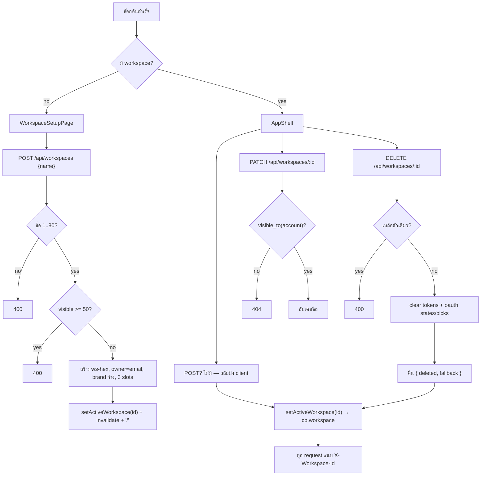
```mermaid
flowchart TD
  Login["ล็อกอินสำเร็จ"] --> Has{"มี workspace?"}
  Has -->|no| Setup["WorkspaceSetupPage"]
  Setup --> Create["POST /api/workspaces {name}"]
  Create --> VName{"ชื่อ 1..80?"}
  VName -->|no| E400["400"]
  VName -->|yes| VCap{"visible >= 50?"}
  VCap -->|yes| E400b["400"]
  VCap -->|no| Mk["สร้าง ws-hex, owner=email, brand ว่าง, 3 slots"]
  Mk --> Act["setActiveWorkspace(id) + invalidate + '/'"]
  Has -->|yes| Active["AppShell"]

  Active --> Switch["POST? ไม่มี — สลับฝั่ง client"]
  Switch --> Set["setActiveWorkspace(id) → cp.workspace"]
  Set --> Inj["ทุก request แนบ X-Workspace-Id"]

  Active --> Rename["PATCH /api/workspaces/:id"]
  Rename --> Vis{"visible_to(account)?"}
  Vis -->|no| R404["404"]
  Vis -->|yes| RDone["อัปเดตชื่อ"]

  Active --> Delete["DELETE /api/workspaces/:id"]
  Delete --> DLast{"เหลือตัวเดียว?"}
  DLast -->|yes| D400["400"]
  DLast -->|no| DClear["clear tokens + oauth states/picks"]
  DClear --> DFall["คืน { deleted, fallback }"]
  DFall --> Set
```

## Sequence — Add member (owner)

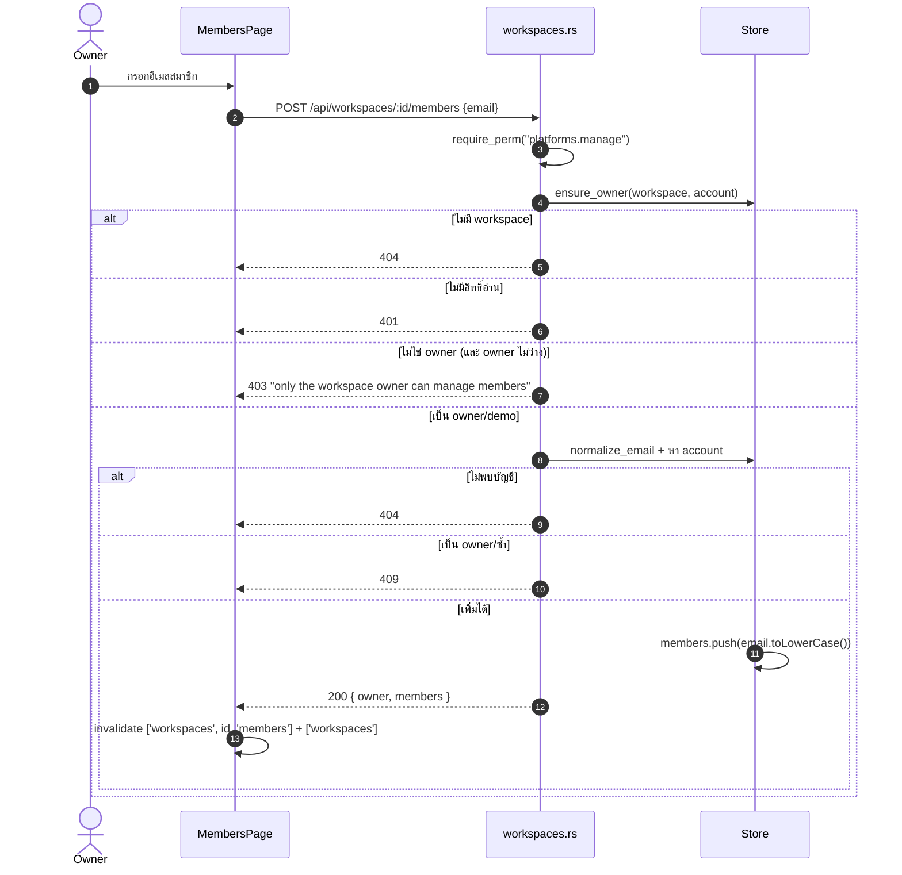
```mermaid
sequenceDiagram
  autonumber
  actor O as Owner
  participant MP as MembersPage
  participant API as workspaces.rs
  participant ST as Store

  O->>MP: กรอกอีเมลสมาชิก
  MP->>API: POST /api/workspaces/:id/members {email}
  API->>API: require_perm("platforms.manage")
  API->>ST: ensure_owner(workspace, account)
  alt ไม่มี workspace
    API-->>MP: 404
  else ไม่มีสิทธิ์อ่าน
    API-->>MP: 401
  else ไม่ใช่ owner (และ owner ไม่ว่าง)
    API-->>MP: 403 "only the workspace owner can manage members"
  else เป็น owner/demo
    API->>ST: normalize_email + หา account
    alt ไม่พบบัญชี
      API-->>MP: 404
    else เป็น owner/ซ้ำ
      API-->>MP: 409
    else เพิ่มได้
      ST->>ST: members.push(email.toLowerCase())
      API-->>MP: 200 { owner, members }
      MP->>MP: invalidate ['workspaces', id, 'members'] + ['workspaces']
    end
  end
```

---

## E03 — Brand Identity (CI)

**โมดูล:** `handlers.rs` (get_brand/save_brand, fonts, images) · `core/theme.ts` (`applyBrandTheme`)
**Storage:** `Workspace.brand: Brand`; ไฟล์ฟอนต์ใน `data/fonts/`, รูปใน `data/images/`
**FE:** `pages/BrandPage.vue` + `App.vue` (watch brand → apply ทั้งเว็บ)
**Permission:** `brand.write` (mutations); GET brand = public (ใช้ทำธีมหน้า login/reader)

---

## โมเดล Brand

| ฟิลด์ | กติกา validation (server `save_brand`) |
|---|---|
| channel, positioning, slogan, audience, voice | ความยาวตาม `validate_len` |
| dos[], donts[] | list จำกัดจำนวน/ความยาว |
| palette[] | สี (client ใช้ swatch) |
| fonts[] | ชื่อ family (อ้างอิง) |
| logos[] | **≤ 3** URL ต้องเป็น `/api/brand/images/...` หรือ `https://...` |
| moodboard[] | **≤ 12** URL แบบเดียวกัน |
| radius | 0–24 (default 12) |
| fillOpacity | 5–100 (default 100) |
| strokeWidth | 0–3 (default 1) |
| shadow | `none` / `soft` / `strong` (default soft) |

## User Stories

| ID | As a | I want to | So that | Priority |
|---|---|---|---|---|
| US-03-01 | Owner | กรอกข้อมูลแบรนด์ (positioning/slogan/audience/voice) | วางรากฐาน CI | Must |
| US-03-02 | Owner | กำหนด do/don't | เป็น guideline ทีม | Should |
| US-03-03 | Owner | กำหนดพาเลตต์สี | ใช้สีให้ตรงแบรนด์ | Must |
| US-03-04 | Owner | ดูตัวอย่างเว็บเปลี่ยนธีมทันที | เห็นผลก่อนบันทึก | Should |
| US-03-05 | Owner | ปรับ radius/fill/stroke/shadow | ปรับหน้าตาเว็บ | Could |
| US-03-06 | Owner | อัปโหลดโลโก้ (สูงสุด 3) | ใช้ในแบรนด์ | Must |
| US-03-07 | Owner | อัปโหลด moodboard (สูงสุด 12) | อ้างอิงงานภาพ | Should |
| US-03-08 | Owner | อัปโหลดฟอนต์เอง (woff2/woff/ttf/otf) | ใช้ฟอนต์แบรนด์ | Should |
| US-03-09 | Owner | ลบฟอนต์/รูปที่อัปโหลด | จัดการไฟล์ | Should |
| US-03-10 | Owner | export/import แบรนด์เป็น JSON | ย้าย/สำรอง CI | Could |

---

## US-03-01..05 — แก้ข้อมูล & style ของแบรนด์

**Endpoint:** `PATCH /api/brand` (`brand.write`) · **Read:** `GET /api/brand` (public, workspace-scoped)

**Main flow (ทุก action)**
1. เปิด `/brand` → `useBrand()` + `useBrandFonts()`
2. `App.vue` watch `[brand, fontAssets]` → `applyBrandTheme()` เปลี่ยน palette/ฟอนต์/radius/fill/stroke/shadow ทั้งเว็บทันที (`documentElement`)
3. ผู้ใช้แก้ฟิลด์ (local draft) แล้วกดบันทึกจุดนั้น ๆ
4. `useSaveBrand().mutate(patch)` → `PATCH /api/brand`
5. Server: `require_perm("brand.write")` → workspace-scoped → validate (logos ≤3, moodboard ≤12, URL ต้องเป็น image endpoint หรือ https, radius ≤24, fill 5–100, stroke ≤3, shadow ∈ set)
6. สำเร็จ → FE `setQueryData(qk.brand)` + `applyBrandTheme` + invalidate

**Error / Edge**
- URL รูปไม่ผ่าน → 400
- เกินจำนวน → 400
- `shadow` ค่าแปลก → 400

**Acceptance Criteria**
- [ ] บันทึกแล้วธีมทั้งเว็บเปลี่ยนทันทีโดยไม่ต้อง reload
- [ ] logos > 3 / moodboard > 12 → 400
- [ ] radius เกิน 24, fill ต่ำกว่า 5 → 400
- [ ] viewer/general user แก้ไม่ได้ (403)

## US-03-06/07 — อัปโหลดรูป (โลโก้ / moodboard)

**Endpoint:** `POST /api/brand/images {name,data,kind}` · `brand.write`

**Main flow**
1. FE ตรวจขนาด/ย่อรูปก่อน (`storeImage`) — 32..500px ต่อด้าน
2. base64 (ไม่มี prefix) → `POST`
3. Server: `images_dir` ต้องตั้งไว้ → decode base64 → ว่าง → 400; > 4 MiB → 400
4. ตรวจ magic + นามสกุล (png/jpg/jpeg/gif/webp — **ไม่รับ SVG**) → 400 ถ้าผิด
5. parse header dimensions → ต้อง 32–500px ทั้งสองด้าน → 400
6. ตั้งชื่อ `image_slug(stem)+ext` (alnum เท่านั้น กัน traversal), กันชนชื่อด้วย suffix
7. → `{ url, width, height }` → FE เก็บ url ลงฟิลด์ logos/moodboard แล้ว `saveBrand`

**Delete:** `DELETE /api/brand/images/{name}` · `brand.write` — กัน `name` ที่มี `/ \ ..` → 400; ตรวจ magic ก่อนลบ → 404/500

## US-03-08/09 — อัปโหลด/ลบฟอนต์

**Endpoint:** `POST /api/brand/fonts {name,data}` · `brand.write` (body limit 4 MiB)
**Read file:** `GET /api/brand/fonts/{name}/file` (public — เพราะ `@font-face` แนบ header ไม่ได้)

**Main flow**
1. อัปโหลด base64 → server: `fonts_dir` ต้องมี → ว่าง → 400; > 2 MiB → 400
2. ตรวจชนิดด้วย magic: `wOF2`(woff2), `wOFF`(woff), `00 01 00 00`/`true`(ttf), `OTTO`(otf) → 400 ถ้าไม่ตรง
3. slug ชื่อไฟล์ → เขียนไฟล์ + อัปเดต `fonts.json` manifest
4. → `FontAsset[]` → FE `setQueryData(qk.fonts)` + `applyBrandTheme` + invalidate

**Delete:** `DELETE /api/brand/fonts/{name}` — กัน traversal, ตรวจ magic, ลบไฟล์ + manifest

## US-03-10 — Export / Import brand JSON (ฝั่ง client)

- Export: รวบ `Brand` + ฟอนต์ → JSON ดาวน์โหลด
- Import: อ่าน JSON → sanitize → `saveBrand` (รูป `data:` จาก mock จะ "fix stored image" ไม่ได้ถ้าไม่ใช่ `/api/brand/images/`)

---

## Flow — Save brand & apply theme

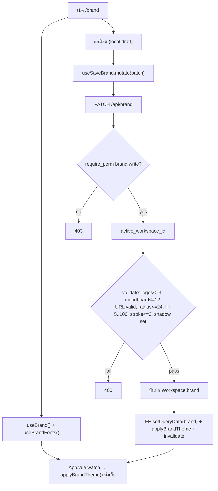
```mermaid
flowchart TD
  Open["เปิด /brand"] --> Q["useBrand() + useBrandFonts()"]
  Q --> Theme["App.vue watch → applyBrandTheme() ทั้งเว็บ"]
  Open --> Edit["แก้ฟิลด์ (local draft)"]
  Edit --> Save["useSaveBrand.mutate(patch)"]
  Save --> API["PATCH /api/brand"]
  API --> Perm{"require_perm brand.write?"}
  Perm -->|no| E403["403"]
  Perm -->|yes| WS["active_workspace_id"]
  WS --> Val{"validate: logos<=3, moodboard<=12,<br/>URL valid, radius<=24, fill 5..100, stroke<=3, shadow set"}
  Val -->|fail| E400["400"]
  Val -->|pass| Persist["บันทึก Workspace.brand"]
  Persist --> SetQ["FE setQueryData(brand) + applyBrandTheme + invalidate"]
  SetQ --> Theme
```

## Sequence — Upload font / image

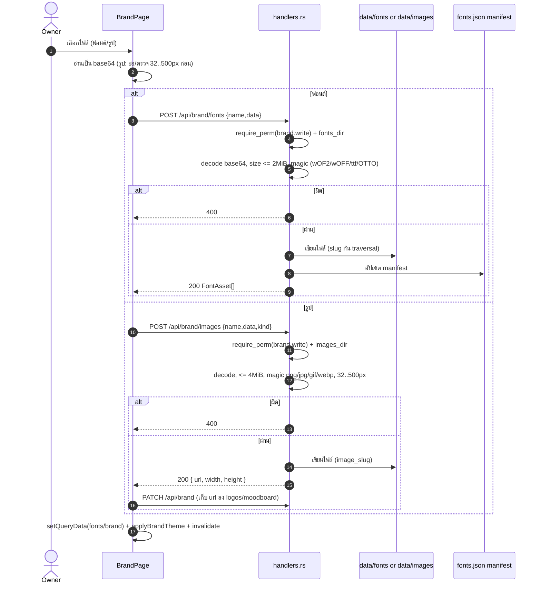
```mermaid
sequenceDiagram
  autonumber
  actor O as Owner
  participant BP as BrandPage
  participant API as handlers.rs
  participant FS as data/fonts or data/images
  participant M as fonts.json manifest

  O->>BP: เลือกไฟล์ (ฟอนต์/รูป)
  BP->>BP: อ่านเป็น base64 (รูป: ย่อ/ตรวจ 32..500px ก่อน)
  alt ฟอนต์
    BP->>API: POST /api/brand/fonts {name,data}
    API->>API: require_perm(brand.write) + fonts_dir
    API->>API: decode base64, size <= 2MiB, magic (wOF2/wOFF/ttf/OTTO)
    alt ผิด
      API-->>BP: 400
    else ผ่าน
      API->>FS: เขียนไฟล์ (slug กัน traversal)
      API->>M: อัปเดต manifest
      API-->>BP: 200 FontAsset[]
    end
  else รูป
    BP->>API: POST /api/brand/images {name,data,kind}
    API->>API: require_perm(brand.write) + images_dir
    API->>API: decode, <= 4MiB, magic png/jpg/gif/webp, 32..500px
    alt ผิด
      API-->>BP: 400
    else ผ่าน
      API->>FS: เขียนไฟล์ (image_slug)
      API-->>BP: 200 { url, width, height }
      BP->>API: PATCH /api/brand (เก็บ url ลง logos/moodboard)
    end
  end
  BP->>BP: setQueryData(fonts/brand) + applyBrandTheme + invalidate
```

---

## E04 — Content Planner (01–12)

**โมดูล:** `handlers.rs` (list_posts/add_post/update_post/delete_post/lock_post/unlock_post)
**Storage:** `Store.posts: Vec<Post>` — **global (ไม่ผูก workspace)**
**FE:** `PlannerPage.vue` (MasterTable), `CalendarPage.vue`, `FeedPage.vue`, `DashboardPage.vue`
**Permission:** `posts.write` (เพิ่ม/แก้/ลบ), `posts.lock` (ล็อก)

---

## โมเดล Post
`id, month(1-12), topic*, pillar, format, goal, date?, time, status, hook, caption, cta, hashtagGroup, hashtags[], imageUrl, note, done, platforms[], lockedBy?`

Validation (`validate_post`): month 1–12; topic ต้องไม่ว่าง; status ต้องว่างหรืออยู่ใน `setup.statuses`; platforms ต้องอยู่ใน `setup.platforms`; list ≤100 รายการ × ≤200 ตัวอักษร

## User Stories

| ID | As a | I want to | So that | Priority |
|---|---|---|---|---|
| US-04-01 | Editor | ดูตารางเดือนที่เลือก | วางแผนรายเดือน | Must |
| US-04-02 | Editor | เพิ่มแถวคอนเทนต์ใหม่ | เริ่มงานชิ้นใหม่ | Must |
| US-04-03 | Editor | เลือกแถวแล้วแก้ทุกฟิลด์ | ปรับรายละเอียดโพสต์ | Must |
| US-04-04 | Editor | บันทึกการแก้ไข | เก็บงาน | Must |
| US-04-05 | Editor | ลบแถว | เอาโพสต์ที่ไม่ใช้ออก | Should |
| US-04-06 | Editor | ล็อกแถวที่กำลังแก้ | กันคนอื่นทับ | Must |
| US-04-07 | Editor | ปลดล็อกเมื่อแก้เสร็จ | ให้คนอื่นแก้ต่อ | Must |
| US-04-08 | Editor | กรองตาม pillar/format/status/platform | หางานง่าย | Should |
| US-04-09 | Editor | เปิดโพสต์จากลิงก์ (`?post=id`) | แชร์ลิงก์ตรง | Could |
| US-04-10 | Editor | ดูปฏิทิน/ฟีดรวมจากโพสต์ | ภาพรวม | Should |

---

## US-04-01 — Load month

**Endpoint:** `GET /api/posts?month=N` (ไม่ส่ง month = ทั้งหมด)
**Main flow:** `PlannerPage` รับ prop `month` → `usePosts(month)` → query `['posts', N]`
- month ผิด/นอกช่วง → server คืน `[]` เงียบ ๆ (ไม่ error)
- แสดง `isPending` "Loading rows", error card + retry, empty card + CTA

## US-04-02 — Add

**Main flow**
1. กดเพิ่ม → เปิด draft ใหม่ (default จาก setup)
2. `useAddPost(m).mutate(draft)` → `POST /api/posts`
3. Server `require_perm("posts.write")` → `validate_post` → ตั้ง id `p-...`, `lockedBy=null`
4. → `Post` → FE invalidate `['posts']` (ทั้ง prefix)

## US-04-03/04 — Edit & Save (กับดัก lock)

**Main flow**
1. คลิกแถว → `MasterTable` ส่ง row → คัดลอกเป็น `draft` local
2. ผู้ใช้แก้ฟิลด์; `save()` whitelist เฉพาะ `EDITABLE` และแนบ `user: actor`
3. `useUpdatePost(m).mutate({id,patch})` → `PATCH /api/posts/{id}`
4. Server: `require_perm("posts.write")` → หา post (404)
5. **Lock check:** ถ้า `post.lockedBy` ตั้งอยู่ และ actor !== holder → **409**
   - actor = ชื่อบัญชี (เมื่อ auth on) หรือ `patch.user` (demo)
6. staged candidate → `validate_post` → apply (`PostPatch.apply`) → invalidate `['posts']`, `['metrics']`

**Edge**
- ล็อกโดยคนอื่น: ปุ่ม save/duplicate/delete ปิด + แสดงชื่อเจ้าของ
- patch `date` ใช้ `double_option` → `null` ล้างค่าได้

**Acceptance Criteria**
- [ ] แก้แล้ว invalidate ทั้ง `posts` และ `metrics`
- [ ] ล็อกโดยคนอื่น → save ได้ 409 + ข้อความ
- [ ] month/status/platform ผิดกติกา → 400

## US-04-05 — Delete

**Endpoint:** `DELETE /api/posts/{id}` · `posts.write` · **lock rule เดียวกับ update** (lockedBy อื่น → 409); 404 ถ้าไม่มี
→ FE invalidate `['posts', m]` + `['posts']`

## US-04-06/07 — Lock / Unlock (US-014)

**Lock:** `POST /api/posts/{id}/lock {user}` · `posts.lock`
- holder = account name (auth) หรือ `user` จาก body (demo, ว่างไม่ได้ → 400)
- ถ้าล็อกโดยคนอื่น → 409; ล็อกซ้ำโดยเจ้าของ = idempotent
**Unlock:** `POST /api/posts/{id}/unlock {user}` · `posts.lock` — ถ้าไม่ใช่ holder → 409

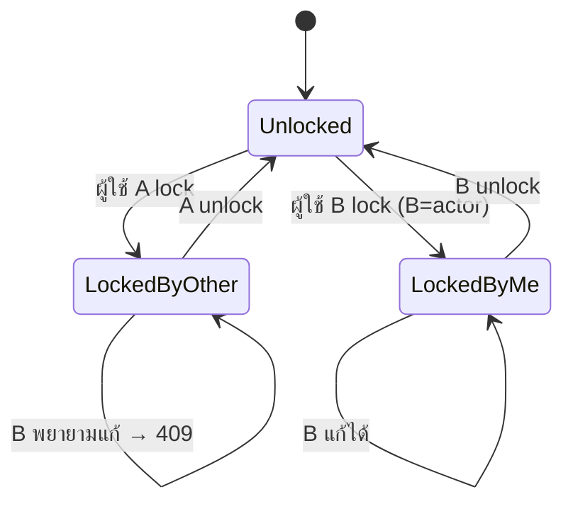
```mermaid
stateDiagram-v2
  [*] --> Unlocked
  Unlocked --> LockedByOther: ผู้ใช้ A lock
  Unlocked --> LockedByMe: ผู้ใช้ B lock (B=actor)
  LockedByMe --> Unlocked: B unlock
  LockedByOther --> Unlocked: A unlock
  LockedByOther --> LockedByOther: B พยายามแก้ → 409
  LockedByMe --> LockedByMe: B แก้ได้
```

## US-04-08..10 — Filters / deep link / derived views

- Try filter ฝั่ง client (pillar/format/status/platform) ใน CalendarPage/FeedPage
- `?post=id` ใน Planner → เลือกแถวนั้นตอน mount
- Feed/Dashboard/Performance ใช้ `useAllPosts()` (`GET /api/posts` ไม่มี month)
- CalendarPage ตาม `navDate`; Dashboard/Performance default month = 2 (hard-coded)

---

## Sequence — Edit + save with lock

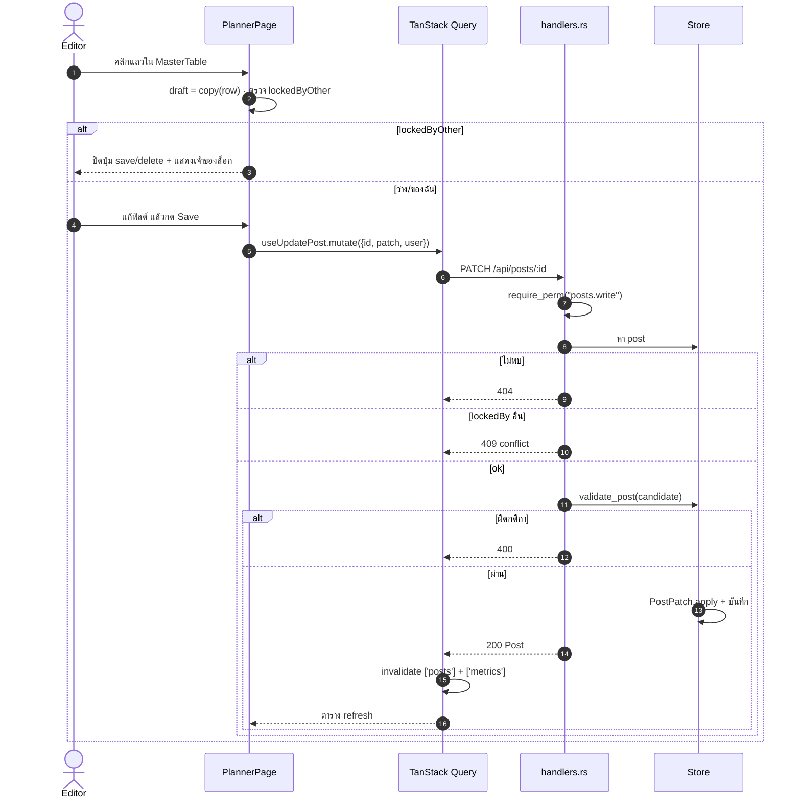
```mermaid
sequenceDiagram
  autonumber
  actor E as Editor
  participant PP as PlannerPage
  participant Q as TanStack Query
  participant API as handlers.rs
  participant ST as Store

  E->>PP: คลิกแถวใน MasterTable
  PP->>PP: draft = copy(row) · ตรวจ lockedByOther
  alt lockedByOther
    PP-->>E: ปิดปุ่ม save/delete + แสดงเจ้าของล็อก
  else ว่าง/ของฉัน
    E->>PP: แก้ฟิลด์ แล้วกด Save
    PP->>Q: useUpdatePost.mutate({id, patch, user})
    Q->>API: PATCH /api/posts/:id
    API->>API: require_perm("posts.write")
    API->>ST: หา post
    alt ไม่พบ
      API-->>Q: 404
    else lockedBy อื่น
      API-->>Q: 409 conflict
    else ok
      API->>ST: validate_post(candidate)
      alt ผิดกติกา
        API-->>Q: 400
      else ผ่าน
        ST->>ST: PostPatch.apply + บันทึก
        API-->>Q: 200 Post
        Q->>Q: invalidate ['posts'] + ['metrics']
        Q-->>PP: ตาราง refresh
      end
    end
  end
```

## Flow — Planner actions overview

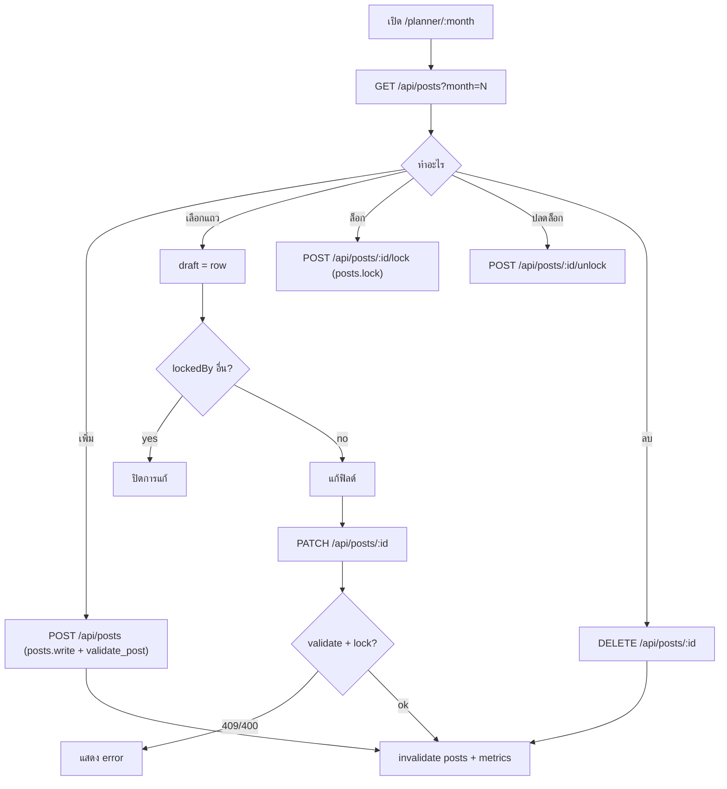
```mermaid
flowchart TD
  Open["เปิด /planner/:month"] --> List["GET /api/posts?month=N"]
  List --> Pick{"ทำอะไร"}
  Pick -->|"เพิ่ม"| Add["POST /api/posts (posts.write + validate_post)"]
  Pick -->|"เลือกแถว"| Sel["draft = row"]
  Sel --> Lock{"lockedBy อื่น?"}
  Lock -->|yes| Block["ปิดการแก้"]
  Lock -->|no| Edit["แก้ฟิลด์"]
  Edit --> Save["PATCH /api/posts/:id"]
  Save --> SV{"validate + lock?"}
  SV -->|"409/400"| Err["แสดง error"]
  SV -->|ok| Inv["invalidate posts + metrics"]
  Pick -->|"ล็อก"| Lk["POST /api/posts/:id/lock (posts.lock)"]
  Pick -->|"ปลดล็อก"| Ul["POST /api/posts/:id/unlock"]
  Pick -->|"ลบ"| Dl["DELETE /api/posts/:id"]
  Add --> Inv
  Dl --> Inv
```

---

## E05 — Ideas Bank & Hashtags

**โมดูล:** `handlers.rs` (list_ideas/add_idea/toggle_idea/promote_idea, list_tags/add_tag)
**Storage:** `Store.ideas`, `Store.hashtags` — global
**FE:** `pages/IdeasPage.vue`, `pages/HashtagsPage.vue`
**Permission:** `ideas.write`, `hashtags.write`

---

## User Stories

| ID | As a | I want to | So that | Priority |
|---|---|---|---|---|
| US-05-01 | Editor | ดูคลังไอเดีย | มีที่เก็บไอเดีย | Must |
| US-05-02 | Editor | เพิ่มไอเดีย (topic/format/idea/link) | จดไว้ก่อน | Must |
| US-05-03 | Editor | ทำเครื่องหมายว่าทำแล้ว/ยัง | ติดตามสถานะ | Should |
| US-05-04 | Editor | promote ไอเดียเป็นโพสต์ในเดือนที่เลือก | ต่อยอดเป็นงานจริง | Must |
| US-05-05 | Editor | ดูกลุ่มแฮชแท็ก | หยิบใช้เร็ว | Must |
| US-05-06 | Editor | เพิ่มแฮชแท็กเข้ากลุ่ม | ขยายคลัง | Should |

---

## US-05-01..03 — Ideas

**Endpoints**
- `GET /api/ideas` (read)
- `POST /api/ideas` (`ideas.write`) — validate topic ไม่ว่าง + ความยาว; id `i-...`
- `POST /api/ideas/{id}/toggle` (`ideas.write`) — 404 ถ้าไม่มี; สลับ `done`

**Main flow (toggle)**
1. คลิก checkbox → optimistic toggle ในเครื่อง
2. `useToggleIdea().mutate(id)` → ถ้าพลาด (error) → **revert checkbox กลับ** (โค้ดทำ manual revert)
3. สำเร็จ → invalidate `['ideas']`

**Acceptance:** [ ] ติ๊กแล้วบันทึก, [ ] error → checkbox กลับสภาพเดิม

## US-05-04 — Promote idea → Post

**Endpoint:** `POST /api/ideas/{id}/promote?month=N` (`ideas.write`) — ถ้าไม่มี `?month` → 400

**Main flow**
1. เลือกเดือนปลายทางจาก select แล้วกด promote
2. `usePromoteIdea(month).mutate(id)`
3. Server: parse/validate month (400 ถ้าผิด) → หา idea (404) → สร้าง `Post` จาก default (pillar/goal/hashtagGroup จาก setup/hashtags) → `validate_post` → ตั้ง idea.done = true → push post
4. → `Post` → FE invalidate `['ideas']` + `['posts']`

**Acceptance:** [ ] promote แล้วได้โพสต์ในเดือนนั้น + idea ถูกมาร์ค done; [ ] ไม่ส่ง month → 400

## US-05-05..06 — Hashtags

**Endpoints**
- `GET /api/tags` (read)
- `POST /api/tags/{groupId} {tag}` (`hashtags.write`) — ตัด `#` นำหน้า, dedupe; 404 ถ้าไม่พบกลุ่ม

**Main flow**
1. พิมพ์แท็กใหม่ในกลุ่ม → `useAddTag().mutate({groupId, tag})`
2. Server: `require_perm("hashtags.write")` → หากลุ่ม (404) → trim `#` → กันซ้ำ → push
3. → `HashtagGroup` ใหม่ → FE invalidate `['tags']`

**Acceptance:** [ ] แท็กซ้ำไม่เพิ่มซ้ำ; [ ] กลุ่มไม่มี → 404; [ ] `#` นำหน้าถูกตัด

---

## Sequence — Promote idea

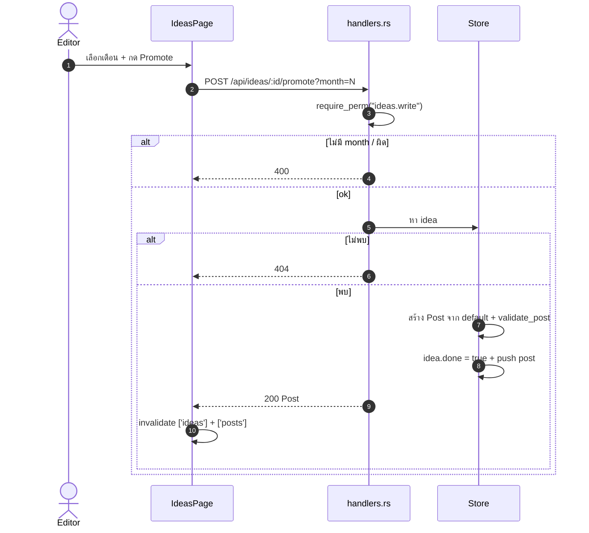
```mermaid
sequenceDiagram
  autonumber
  actor E as Editor
  participant IP as IdeasPage
  participant API as handlers.rs
  participant ST as Store

  E->>IP: เลือกเดือน + กด Promote
  IP->>API: POST /api/ideas/:id/promote?month=N
  API->>API: require_perm("ideas.write")
  alt ไม่มี month / ผิด
    API-->>IP: 400
  else ok
    API->>ST: หา idea
    alt ไม่พบ
      API-->>IP: 404
    else พบ
      ST->>ST: สร้าง Post จาก default + validate_post
      ST->>ST: idea.done = true + push post
      API-->>IP: 200 Post
      IP->>IP: invalidate ['ideas'] + ['posts']
    end
  end
```

## Flow — Ideas & hashtags overview

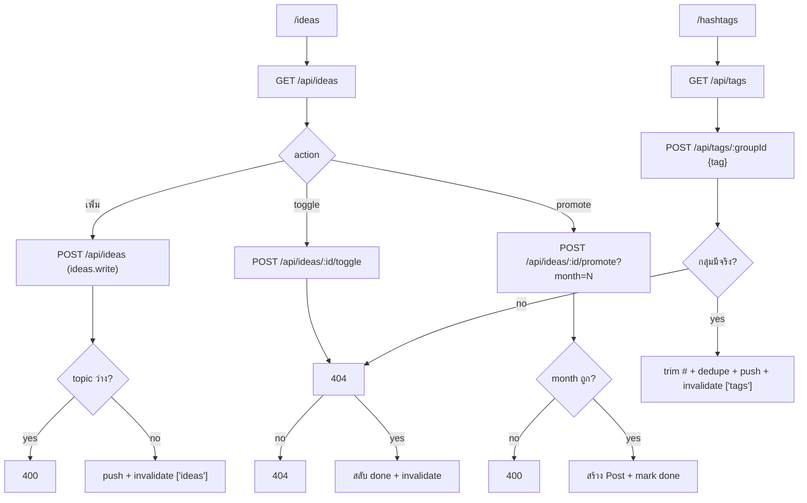
```mermaid
flowchart TD
  Ideas["/ideas"] --> L["GET /api/ideas"]
  L --> Act{"action"}
  Act -->|"เพิ่ม"| A["POST /api/ideas (ideas.write)"]
  A --> AV{"topic ว่าง?"}
  AV -->|yes| E400["400"]
  AV -->|no| OK["push + invalidate ['ideas']"]
  Act -->|"toggle"| T["POST /api/ideas/:id/toggle"]
  T --> T404{"มี idea?"}
  T404 -->|no| E404["404"]
  T404 -->|yes| TOK["สลับ done + invalidate"]
  Act -->|"promote"| P["POST /api/ideas/:id/promote?month=N"]
  P --> PV{"month ถูก?"}
  PV -->|no| P400["400"]
  PV -->|yes| POK["สร้าง Post + mark done"]

  Tags["/hashtags"] --> TL["GET /api/tags"]
  TL --> TA["POST /api/tags/:groupId {tag}"]
  TA --> TAG{"กลุ่มมีจริง?"}
  TAG -->|no| T404["404"]
  TAG -->|yes| TAdd["trim # + dedupe + push + invalidate ['tags']"]
```

---

## E06 — Performance & Finance

**โมดูล:** `handlers.rs` (list_metrics/import_metrics, list_txns/add_txn)
**Storage:** `Store.metrics`, `Store.txns` — global
**FE:** `pages/PerformancePage.vue`, `pages/DashboardPage.vue`, `pages/FinancePage.vue`
**Permission:** `metrics.import`, `finance.write`

---

## User Stories

### Performance
| ID | As a | I want to | So that | Priority |
|---|---|---|---|---|
| US-06-01 | Editor | ดูแดชบอร์ด KPI (views/likes/status/top5) | เห็นภาพรวม | Must |
| US-06-02 | Editor | นำเข้า metrics ของแพลตฟอร์มต่อเดือน | วัดผลได้ | Must |
| US-06-03 | Editor | ดูตาราง metrics ต่อโพสต์ +7 วัน | วิเคราะห์ | Should |
| US-06-04 | Editor | ดู Ads glance ในแดชบอร์ด | เห็นโฆษณาควบคู่ | Could |

### Finance
| ID | As a | I want to | So that | Priority |
|---|---|---|---|---|
| US-06-05 | Owner | ดูรายรับ/รายจ่าย/ยอดคงเหลือ | ดูแลการเงิน | Must |
| US-06-06 | Owner | บันทึกรายการ (IN/OUT) | เก็บบัญชี | Must |

---

## US-06-01 — Dashboard (client-side)

**Query:** `useDashboard(month)` = `usePosts(month)` + `useMetrics()`
**Derivation (FE):** เฉพาะ metrics ของ post ในเดือนนั้น → รวม views/likes; นับ pillar/platform/status; top5 by views
**State:** ถ้า posts/metrics error → error card; ถ้าโหลด → "Computing…"

## US-06-02 — Import metrics

**Endpoint:** `POST /api/metrics/import {platform, month}` · `metrics.import`

**Main flow**
1. PerformancePage เลือก platform + month → กด import
2. `useImportMetrics().mutate({platform, month})`
3. Server: `require_perm("metrics.import")` → platform ต้องไม่ว่างและอยู่ใน `setup.platforms` (400)
4. สร้าง pseudo-metrics แบบ deterministic (`views = 1000 + hash%9000`, `likes = views/12`) ให้ post ที่ตรง
5. upsert by `(post_id, platform)` → `{ imported, metrics }`
6. FE invalidate `['metrics']` → ปุ่มโชว์จำนวนที่ import / error

**Acceptance:** [ ] platform ผิด → 400; [ ] import ซ้ำ upsert ไม่เพิ่มซ้ำ; [ ] แสดงจำนวน imported

## US-06-03 — Performance tables
`useMetrics()` + `useAllPosts()` แสดง per-post และ +7d (ใช้ `plus7`), platform goals

## US-06-04 — Ads glance (ดู E09)
DashboardPage `useAds()` แสดง spend/alerts

## US-06-05 — Finance overview
`useTxns()` → รวม income/expense/balance + กราฟรายเดือน (client-side)

## US-06-06 — Add txn

**Endpoint:** `POST /api/txns` · `finance.write`

**Main flow**
1. FinancePage กรอก date/amount/kind/category/sub (validate เบื้องต้น)
2. `useAddTxn().mutate(draft)` → `POST /api/txns`
3. Server: `require_perm("finance.write")` → amount finite & `0 < amount ≤ 1e12`; kind ∈ {IN,OUT}; date ต้อง `YYYY-MM-DD`; category/sub ตามข้อจำกัด
4. id `t-...` → `Txn` → FE invalidate `['txns']`

**Error:** amount ≤0/ไม่ finite → 400; kind แปลก → 400; date รูปผิด → 400

**Acceptance:** [ ] บันทึกแล้วยอดรวม/กราฟอัปเดต; [ ] จำนวนติดลบ → 400

---

## Sequence — Import metrics

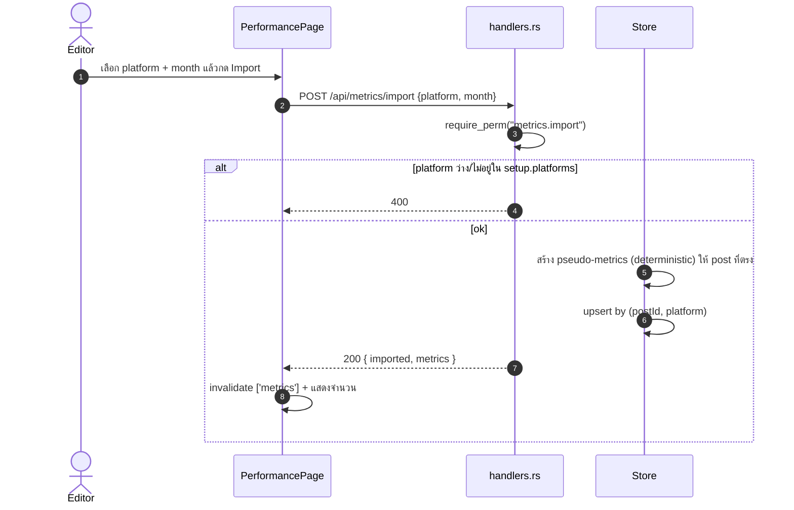
```mermaid
sequenceDiagram
  autonumber
  actor E as Editor
  participant PF as PerformancePage
  participant API as handlers.rs
  participant ST as Store

  E->>PF: เลือก platform + month แล้วกด Import
  PF->>API: POST /api/metrics/import {platform, month}
  API->>API: require_perm("metrics.import")
  alt platform ว่าง/ไม่อยู่ใน setup.platforms
    API-->>PF: 400
  else ok
    ST->>ST: สร้าง pseudo-metrics (deterministic) ให้ post ที่ตรง
    ST->>ST: upsert by (postId, platform)
    API-->>PF: 200 { imported, metrics }
    PF->>PF: invalidate ['metrics'] + แสดงจำนวน
  end
```

## Flow — Performance & Finance

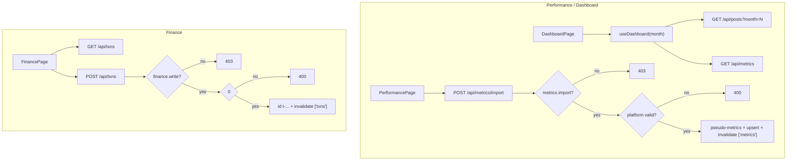
```mermaid
flowchart TD
  subgraph Perf["Performance / Dashboard"]
    D["DashboardPage"] --> DQ["useDashboard(month)"]
    DQ --> DP["GET /api/posts?month=N"]
    DQ --> DM["GET /api/metrics"]
    PP["PerformancePage"] --> IM["POST /api/metrics/import"]
    IM --> IPerm{"metrics.import?"}
    IPerm -->|no| E403["403"]
    IPerm -->|yes| IPVal{"platform valid?"}
    IPVal -->|no| E400["400"]
    IPVal -->|yes| IUpsert["pseudo-metrics + upsert + invalidate ['metrics']"]
  end
  subgraph Fin["Finance"]
    F["FinancePage"] --> FQ["GET /api/txns"]
    F --> AT["POST /api/txns"]
    AT --> FPerm{"finance.write?"}
    FPerm -->|no| F403["403"]
    FPerm -->|yes| FVal{"0<amount<=1e12, kind IN/OUT, date YYYY-MM-DD?"}
    FVal -->|no| F400["400"]
    FVal -->|yes| FAdd["id t-... + invalidate ['txns']"]
  end
```

---

## E07 — Campaigns (Content Planner Campaigns)

**โมดูล:** `handlers.rs` (list_campaigns/get_campaign/create_campaign/update_campaign/delete_campaign)
**Storage:** `Store.campaigns: Vec<Campaign>` — global
**FE:** `pages/CampaignsPage.vue` (+ดึง `useContentList` มาผูก)
**Permission:** `campaigns.write` (สร้าง/แก้), `campaigns.delete` (ลบ)

> หมายเหตุ: นี่คือ "แคมเปญคอนเทนต์" ไม่ใช่ ad campaign ของ Meta (ดู E09)

---

## โมเดล Campaign
`id, name*, objective, status(draft|active|paused|completed), startDate?, endDate?, platforms[], pillars[], hashtags[], budget, goalMetric(views|likes|reach|posts), goalTarget, owner, notes, contentIds[] (ต้องมี Content จริง), createdAt, updatedAt`

## User Stories

| ID | As a | I want to | So that | Priority |
|---|---|---|---|---|
| US-07-01 | Editor | ดูรายการแคมเปญ | ภาพรวมแคมเปญ | Must |
| US-07-02 | Editor | สร้างแคมเปญ (brief/ช่วงเวลา/เป้า) | วางแผนแคมเปญ | Must |
| US-07-03 | Editor | แก้แคมเปญ | อัปเดตแผน | Must |
| US-07-04 | Editor | ผูก content เข้าแคมเปญ | เห็นกำหนดการ | Should |
| US-07-05 | Owner | ลบแคมเปญ | เอาแคมเปญยกเลิกออก | Should |
| US-07-06 | Editor | เปิดแคมเปญจากลิงก์ (`/campaigns/:id`) | แชร์ตรง | Could |
| US-07-07 | Editor | ดูตารางกำหนดการของ content ที่ผูก | เห็น timeline | Should |

---

## US-07-01 — List

`GET /api/campaigns` (read) → `Campaign[]`

## US-07-02 — Create

**Endpoint:** `POST /api/campaigns` · `campaigns.write`

**Main flow**
1. กด "สร้างแคมเปญ" → draft ใหม่
2. `useCreateCampaign().mutate(patch)` → `POST /api/campaigns`
3. Server: `require_perm("campaigns.write")` → owner = ชื่อบัญชี หรือ `setup.owner`
4. `apply_campaign_patch` + `validate_campaign`:
   - name ไม่ว่าง ≤200; objective/owner ≤200; notes ≤5000
   - status ∈ {draft,active,paused,completed}; metric ∈ {views,likes,reach,posts}
   - budget/goalTarget finite ∈ [0,1e12]; วันที่ parse ได้และ end ≥ start
   - list caps; **ทุก contentId ต้องมีอยู่จริง (400)**
5. ตั้ง createdAt/updatedAt → `Campaign`
6. FE invalidate `['campaigns']`

**Error:** contentId ที่ไม่มี → 400; end < start → 400; metric ผิด → 400

## US-07-03 — Update
`PATCH /api/campaigns/{id}` · `campaigns.write` → staged patch + validate → updatedAt

## US-07-04/07 — Link content & schedule view
- CampaignsPage ใช้ `useContentList({})` แล้วให้เลือกผูก (เก็บใน `contentIds`)
- แสดงตารางกำหนดการ เรียงตาม scheduled/published date ของ content ที่ผูก

## US-07-05 — Delete
`DELETE /api/campaigns/{id}` · `campaigns.delete` → 404 ถ้าไม่มี

## US-07-06 — Open by id
route `:id` seed แบบ dirty-diff (JSON compare) → `select()` เขียน URL ใหม่; Save เขียนทุก editable field + parse hashtags

---

## Flow — Campaign CRUD

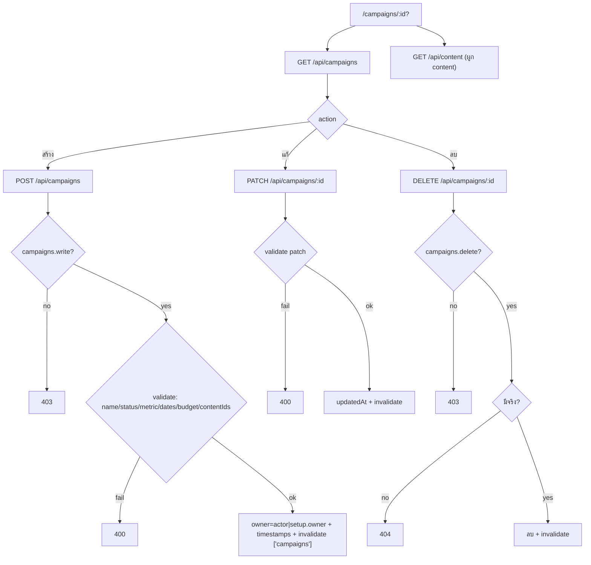
```mermaid
flowchart TD
  Open["/campaigns/:id?"] --> List["GET /api/campaigns"]
  Open --> CList["GET /api/content (ผูก content)"]
  List --> Pick{"action"}
  Pick -->|"สร้าง"| C["POST /api/campaigns"]
  C --> CPerm{"campaigns.write?"}
  CPerm -->|no| E403["403"]
  CPerm -->|yes| CVal{"validate: name/status/metric/dates/budget/contentIds"}
  CVal -->|fail| E400["400"]
  CVal -->|ok| CSave["owner=actor|setup.owner + timestamps + invalidate ['campaigns']"]
  Pick -->|"แก้"| U["PATCH /api/campaigns/:id"]
  U --> UVal{"validate patch"}
  UVal -->|fail| E400b["400"]
  UVal -->|ok| USave["updatedAt + invalidate"]
  Pick -->|"ลบ"| D["DELETE /api/campaigns/:id"]
  D --> DPerm{"campaigns.delete?"}
  DPerm -->|no| E403b["403"]
  DPerm -->|yes| D404{"มีจริง?"}
  D404 -->|no| E404["404"]
  D404 -->|yes| DGo["ลบ + invalidate"]
```

## Sequence — Create campaign with linked content

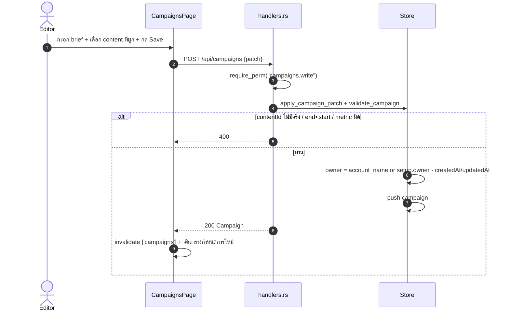
```mermaid
sequenceDiagram
  autonumber
  actor E as Editor
  participant CP as CampaignsPage
  participant API as handlers.rs
  participant ST as Store

  E->>CP: กรอก brief + เลือก content ที่ผูก + กด Save
  CP->>API: POST /api/campaigns {patch}
  API->>API: require_perm("campaigns.write")
  API->>ST: apply_campaign_patch + validate_campaign
  alt contentId ไม่มีจริง / end<start / metric ผิด
    API-->>CP: 400
  else ผ่าน
    ST->>ST: owner = account_name or setup.owner · createdAt/updatedAt
    ST->>ST: push campaign
    API-->>CP: 200 Campaign
    CP->>CP: invalidate ['campaigns'] + จัดตารางกำหนดการใหม่
  end
```

---

## E08 — Platform Connections & Live Mirror

**โมดูล:** `handlers.rs` (list/connect/disconnect/sync platforms, get_live), `oauth.rs`, `live.rs`, `secrets.rs`
**Storage:** `Workspace.connections`, `Workspace.live`; provider token = memory + `platform_tokens_enc` (ChaCha20-Poly1305)
**FE:** `components/overlays/PlatformLogin.vue`, `components/live/LiveSection.vue`, `AppShell.vue` (OAuth callback), `core/oauth.ts`, `core/platforms.ts`
**Permission:** `platforms.manage`

---

## แนวคิด
- 3 ช่องเชื่อมต่อ: `meta` (Facebook Page + Instagram ที่ผูก), `youtube`, `tiktok`
- **Mock mode** (ไม่มี credential) → connect แบบ synthetic; **Redirect mode** → OAuth 2.0 จริง
- Token เก็บต่อ workspace (`{workspace}:{platform}`), user token ของ Meta เก็บแยก `meta#user` ให้ Ads
- Live mirror refresh อัตโนมัติทุก `LIVE_REFRESH_MIN` (default 30) และกด Sync ได้ — **มีแค่ Meta ที่ดึงจริง**

## User Stories

| ID | As a | I want to | So that | Priority |
|---|---|---|---|---|
| US-08-01 | Owner | ดูสถานะการเชื่อมต่อทุกแพลตฟอร์ม | รู้ว่าเชื่อมอะไรไว้ | Must |
| US-08-02 | Owner | เชื่อมต่อ Meta (Facebook/Instagram) | ดึงโพสต์ + insight | Must |
| US-08-03 | Owner | เลือก Page เมื่อบัญชีมีหลาย Page | ผูกถูกเพจ | Must |
| US-08-04 | Owner | เชื่อมต่อ YouTube / TikTok | รวมช่องทาง | Should |
| US-08-05 | Owner | ยกเลิกการเชื่อมต่อ | ถอนสิทธิ์ | Should |
| US-08-06 | Owner | Sync ข้อมูลด้วยมือ | ดึงล่าสุดทันที | Must |
| US-08-07 | Editor | ดู Live mirror (โพสต์จริง + engagement) | เห็นผลลัพธ์จริง | Must |
| US-08-08 | Owner | reconnect เมื่อ token หมดอายุ | เชื่อมต่อกลับ | Should |

---

## US-08-01 — List platforms

`GET /api/platforms` (read) → `ConnectionView[]` = connection + `hasToken` (ไม่ถอดรหัส token)
- `hasToken=false` บนช่อง connected → UI ขึ้น "ต้อง reconnect"

## US-08-02 — Connect (OAuth redirect)

**Start:** `GET /api/oauth/{platform}/start` · `platforms.manage`
1. FE `beginOAuth(platform)` → `api.startOauth`
2. Server: `require_perm` + `active_workspace_id` → `prune_ephemeral`
3. ถ้าไม่มี credential → `{ mode:"mock", url:undefined }` (ไม่สร้าง state)
4. ถ้ามี → สร้าง `state = "st-"+random_hex(16)` (128-bit) เก็บ `OAuthState{platform,created,workspaceId}` (TTL 10 นาที) → สร้าง authorize URL (มี client_id, redirect_uri, scope, state, extra params)
5. FE `safeAuthorizeUrl` (allowlist host: facebook.com / accounts.google.com / www.tiktok.com) → `window.location = url`

**Callback:** `GET /api/oauth/{platform}/callback?code&state` (ไม่ต้อง auth โดยดีไซน์)
1. validate state: มีจริง, platform ตรง, ไม่หมดอายุ → **ลบ (single-use)**
2. resolve workspace จาก state
3. ถ้ามี `error` → redirect กลับ `?status=error&reason=...`
4. `exchange_code` (POST token endpoint) → (Meta) ต่ออายุ long-lived
5. `fetch_accounts` (`/me/accounts`) 
6. **บัญชีเดียว** → apply_account + set token (+ `meta#user`) + set Page token → spawn live refresh → redirect `?oauth=:id&status=ok`
7. **หลายบัญชี** → เก็บ `PendingPick` (TTL 10 นาที) → redirect `?status=pick&pick=...`

## US-08-03 — Choose Page (multi-account)

**Pending:** `GET /api/oauth/{platform}/pending?pick=` (has_read_access) → `{platform, accounts:[{handle,external_id}]}` (ไม่เปิด token)
**Choose:** `POST /api/oauth/{platform}/choose {pick, external_id}` · `platforms.manage`
- validate pick/platform/TTL → หา account → remove pick → apply_account + tokens → refresh → `{platform, connection}`

**FE:** AppShell watch `route.query` → ถ้า `status=pick` เปิดตัวเลือกด้วย `useOAuthPending` (enabled เมื่อมี platform+pick) → `chooseOAuthPage` → invalidate `['platforms']`

## US-08-04/05 — Connect (mock) / Disconnect

- **Mock connect:** `POST /api/platforms/{id}/connect {handle}` · `platforms.manage`
  - ถ้า provider นั้นมี credential → 400 (ต้องใช้ OAuth)
  - ไม่งั้น `mark_connected` (synthetic) + validate handle (`@handle` ≤60 หรือ URL บน host ของแพลตฟอร์ม)
- **Disconnect:** `POST /api/platforms/{id}/disconnect` → status=disconnected + clear token (+ `#user`)

## US-08-06 — Sync

`POST /api/platforms/{id}/sync` · `platforms.manage`
- ต้อง status = connected (ไม่งั้น 400)
- **Meta** → `live::refresh_workspace` (เรียก Graph นอก lock)
- **YouTube/TikTok** → bump `last_sync` + `media_count += 3` (placeholder — ยังไม่มี fetch จริง)
- ผิด → 400 (upstream error ถูก map เป็น 400)

## US-08-07 — Live mirror

`GET /api/live` (read) → `LiveData { fetchedAt, accounts[], posts[], error }`
- background `spawn_refresh_loop` (LIVE_REFRESH_MIN, default 30): refresh เฉพาะ workspace ที่ meta connected + มี token
- FE `useLive()` (ไม่ polling) — refresh ตอนกด Sync / OAuth callback

## US-08-08 — Reconnect

- FE เห็น `hasToken=false` หรือ `live.error` มีคำว่า reconnect → ปุ่ม reconnect → `beginOAuth('meta')`
- Server เตือน token refresh ผ่าน `page_views`/note (token refresh due day 45)

---

## Sequence — Redirect OAuth (connect Meta)

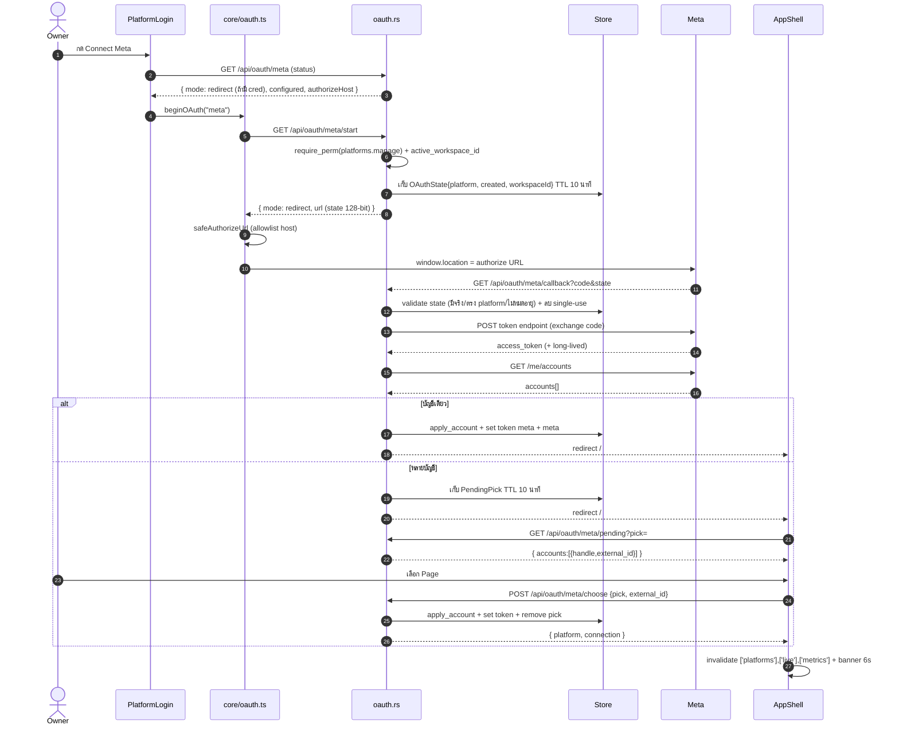
```mermaid
sequenceDiagram
  autonumber
  actor O as Owner
  participant PL as PlatformLogin
  participant OA as core/oauth.ts
  participant API as oauth.rs
  participant ST as Store
  participant P as Meta
  participant APP as AppShell

  O->>PL: กด Connect Meta
  PL->>API: GET /api/oauth/meta (status)
  API-->>PL: { mode: redirect (ถ้ามี cred), configured, authorizeHost }
  PL->>OA: beginOAuth("meta")
  OA->>API: GET /api/oauth/meta/start
  API->>API: require_perm(platforms.manage) + active_workspace_id
  API->>ST: เก็บ OAuthState{platform, created, workspaceId} TTL 10 นาที
  API-->>OA: { mode: redirect, url (state 128-bit) }
  OA->>OA: safeAuthorizeUrl (allowlist host)
  OA->>P: window.location = authorize URL
  P-->>API: GET /api/oauth/meta/callback?code&state
  API->>ST: validate state (มีจริง/ตรง platform/ไม่หมดอายุ) + ลบ single-use
  API->>P: POST token endpoint (exchange code)
  P-->>API: access_token (+ long-lived)
  API->>P: GET /me/accounts
  P-->>API: accounts[]
  alt บัญชีเดียว
    API->>ST: apply_account + set token meta + meta#user + Page token
    API-->>APP: redirect /#/profile?oauth=meta&status=ok
  else หลายบัญชี
    API->>ST: เก็บ PendingPick TTL 10 นาที
    API-->>APP: redirect /#/profile?status=pick&pick=...
    APP->>API: GET /api/oauth/meta/pending?pick=
    API-->>APP: { accounts:[{handle,external_id}] }
    O->>APP: เลือก Page
    APP->>API: POST /api/oauth/meta/choose {pick, external_id}
    API->>ST: apply_account + set token + remove pick
    API-->>APP: { platform, connection }
  end
  APP->>APP: invalidate ['platforms'],['live'],['metrics'] + banner 6s
```

## Sequence — Mock connect & Sync

```mermaid
sequenceDiagram
  autonumber
  actor O as Owner
  participant PL as PlatformLogin
  participant API as handlers.rs
  participant ST as Store
  participant LV as live.rs
  participant P as Meta

  alt ไม่มี credential (mock)
    O->>PL: กรอก @handle / URL
    PL->>API: POST /api/platforms/:id/connect {handle}
    API->>API: require_perm(platforms.manage)
    alt provider มี credential
      API-->>PL: 400 (ใช้ OAuth)
    else handle ผิด
      API-->>PL: 400
    else ok
      API->>ST: mark_connected (synthetic)
      API-->>PL: ConnectionView
    end
  end

  O->>PL: กด Sync
  PL->>API: POST /api/platforms/:id/sync
  API->>API: require_perm(platforms.manage)
  alt status != connected
    API-->>PL: 400
  else Meta
    API->>LV: refresh_workspace (นอก lock)
    LV->>P: Graph GET posts / insights
    P-->>LV: data
    LV->>ST: อัปเดต workspace.live + last_sync + media_count
    API-->>PL: ConnectionView
    PL->>PL: invalidate ['platforms'],['live'],['metrics']
  else YouTube/TikTok
    API->>ST: last_sync = now, media_count += 3 (placeholder)
    API-->>PL: ConnectionView
  end
```

## State — Connection status

```mermaid
stateDiagram-v2
  [*] --> disconnected
  disconnected --> connected: OAuth callback (redirect) หรือ connect (mock)
  connected --> connected: sync (refresh)
  connected --> disconnected: disconnect (clear token)
  connected --> error: token หมดอายุ (hasToken=false / live.error)
  error --> connected: reconnect (beginOAuth)
```

---

## E09 — Meta Ads Mirror & Management

**โมดูล:** `ads.rs`, `handlers.rs` (get_ads/sync_ads/set_ads_manage/set_ad_campaign_status/budget/duplicate/create_ad_boost)
**Storage:** `Workspace.ads: AdsData` (accounts/campaigns/adsets/ads/insights/audit/error), `Workspace.ads_manage`
**FE:** `pages/AdsPage.vue` (+ `DashboardPage`/`LiveSection` แสดงผล)
**Permission:** `platforms.manage` (ทั้งหมด) + **gate** `ads_manage`

---

## แนวคิด
- Mirror ข้อมูลโฆษณา Meta (read) + จัดการได้ (write) เมื่อ owner เปิด opt-in `ads_manage=true`
- ทุก mutation ต้องผ่าน `manage_context`: campaign ต้องอยู่ใน mirror + `ads_manage` ต้อง true
- background `spawn_ads_loop` (ADS_REFRESH_MIN, default 60) refresh เฉพาะ meta connected
- มี audit trail (`AdsAudit`) ทุก action

## User Stories

| ID | As a | I want to | So that | Priority |
|---|---|---|---|---|
| US-09-01 | Owner | ดูภาพรวมบัญชีโฆษณา/แคมเปญ/โฆษณา | เห็นสถานะโฆษณา | Must |
| US-09-02 | Owner | Sync ข้อมูลโฆษณา | ดึงล่าสุด | Must |
| US-09-03 | Owner | เปิด/ปิดสิทธิ์จัดการแคมเปญ | ควบคุมความเสี่ยง | Must |
| US-09-04 | Owner | เปิด/ปิด/archive แคมเปญ | ควบคุมการยิง | Should |
| US-09-05 | Owner | ปรับงบ (daily/lifetime) | คุมค่าใช้จ่าย | Should |
| US-09-06 | Owner | duplicate แคมเปญ | ต่อยอดเร็ว | Could |
| US-09-07 | Owner | boost โพสต์เป็นแคมเปญ | เพิ่มreach | Could |
| US-09-08 | Owner | ดู audit trail | ตรวจสอบย้อนหลัง | Should |

---

## US-09-01 — View mirror

`GET /api/ads` (read) → `AdsView` = `AdsData` + `canManage`
- แสดง empty/error/reconnect state; account picker; summary tiles; campaign→adset→ad tree; insights

## US-09-02 — Sync

`POST /api/ads/sync` · `platforms.manage` → ต้อง Meta connected → `refresh_workspace_ads`
- snapshot oauth+token ใต้ lock → เรียก Graph **นอก lock** → เขียนกลับใต้ lock (เก็บ audit ไว้)
- error → เก็บข้อมูลเดิมไว้ + set `workspace.ads.error`; handler map เป็น 400
- FE `useSyncAds` → invalidate `['ads']`

## US-09-03 — Toggle management opt-in

`POST /api/ads/manage {enabled}` · `platforms.manage`
- ตั้ง `workspace.ads_manage`
- FE: `canWrite = mayManage && view.canManage` — ปุ่มจัดการทั้งหมดถูกล็อกจนกว่าจะเปิด

## US-09-04 — Campaign status

`POST /api/ads/campaigns/{id}/status {status: ACTIVE|PAUSED|ARCHIVED}` · `platforms.manage`
**Main flow**
1. `manage_context(id)` → campaign ต้องมีใน mirror (400) + `ads_manage` true (400)
2. actor = email หรือ `"operator"`
3. Graph POST เปลี่ยนสถานะ → อัปเดต mirror → append `AdsAudit`
4. FE invalidate `['ads']`

## US-09-05 — Budget

`POST /api/ads/campaigns/{id}/budget {dailyBudget?, lifetimeBudget?}` · `platforms.manage`
- ผ่าน gate เดียวกัน; ปฏิเสธเฉพาะค่าที่เป็น 0 (ไม่มี upper bound) → 400
- Graph POST → mirror + audit

## US-09-06 — Duplicate

`POST /api/ads/campaigns/{id}/duplicate` · `platforms.manage` → Graph `/{id}/copies` → คืน `{ campaignId }`
- FE invalidate `['ads']`

## US-09-07 — Boost post → campaign

`POST /api/ads/boost {name, objective, dailyBudget, days, countries[], storyId}` · `platforms.manage`
- page_id มาจาก Meta connection `external_id` (ว่าง → 400)
- สร้าง campaign → adset → ad ตามลำดับ (3 ขั้น)
- `days` ถูก clamp 1–90 เงียบ ๆ; `special_ad_categories` hardcode `[]`

## US-09-08 — Audit

ทุก mutation สำเร็จ append `AdsAudit { at, actor, action, target, detail }` (ใหม่สุดก่อน, cap)

---

## Gate diagram — Ads mutation

```mermaid
flowchart TD
  Req["Ads mutation"] --> Perm["require_perm(platforms.manage)"]
  Perm --> Ctx["manage_context(campaignId)"]
  Ctx --> Known{"campaign อยู่ใน mirror?"}
  Known -->|no| E400a["400 unknown campaign"]
  Known -->|yes| Gate{"workspace.adsManage == true?"}
  Gate -->|no| E400b["400 เปิด campaign management ก่อน"]
  Gate -->|yes| Acct["accounts.first() (ข้อจำกัด)"]
  Acct --> Graph["Graph POST (token ใน query)"]
  Graph --> Mirror["อัปเดต mirror + AdsAudit"]
  Mirror --> Inv["FE invalidate ['ads']"]
```

## Sequence — Manage campaign status

```mermaid
sequenceDiagram
  autonumber
  actor O as Owner
  participant AP as AdsPage
  participant API as handlers.rs
  participant A as ads.rs
  participant ST as Store
  participant G as Meta Graph

  O->>AP: เปิด Ads → เปิด opt-in (ถ้ายังไม่เปิด)
  AP->>API: POST /api/ads/manage {enabled:true}
  API->>ST: ads_manage = true
  API-->>AP: { canManage: true }

  O->>AP: กด Pause แคมเปญ
  AP->>API: POST /api/ads/campaigns/:id/status {status:PAUSED}
  API->>API: require_perm("platforms.manage")
  API->>A: manage_context(id)
  A->>ST: campaign มีใน mirror? ads_manage true?
  alt ไม่ผ่าน gate
    A-->>API: error
    API-->>AP: 400
  else ผ่าน
    A->>G: Graph POST /:id {status:PAUSED}
    alt Graph error
      G-->>A: error
      A-->>API: error
      API-->>AP: 400
    else สำเร็จ
      G-->>A: ok
      A->>ST: อัปเดต mirror + append AdsAudit
      API-->>AP: 200 { ok:true }
      AP->>AP: invalidate ['ads']
    end
  end
```

## Flow — Ads lifecycle (view → sync → manage → boost)

```mermaid
flowchart TD
  Open["/ads"] --> Get["GET /api/ads → AdsView { ..., canManage }"]
  Get --> Conn{"Meta connected?"}
  Conn -->|no| Reconnect["แสดงปุ่ม reconnect (E08)"]
  Conn -->|yes| Show["แสดง accounts/campaigns/ads/insights/audit"]
  Show --> Sync["POST /api/ads/sync (platforms.manage)"]
  Sync --> SGate{"Meta connected?"}
  SGate -->|no| S400["400"]
  SGate -->|yes| SFetch["refresh_workspace_ads (Graph นอก lock)"]
  SFetch --> SWrite["mirror + audit; error → เก็บของเดิม + ads.error"]
  Show --> Manage["เปิด opt-in: POST /api/ads/manage {enabled}"]
  Manage --> Act{"action"}
  Act -->|"status"| St["POST /campaigns/:id/status"]
  Act -->|"budget"| Bu["POST /campaigns/:id/budget"]
  Act -->|"duplicate"| Du["POST /campaigns/:id/duplicate"]
  Act -->|"boost"| Bo["POST /ads/boost"]
  St --> Chk{"manage_context ผ่าน?"}
  Bu --> Chk
  Du --> Chk
  Bo --> Chk
  Chk -->|no| E400["400"]
  Chk -->|yes| Do["Graph call + mirror + audit + invalidate ['ads']"]
```

---

## E10 — Content Studio (CMS)

**โมดูล:** `handlers.rs` (content CRUD/publish/schedule/revisions/public)
**Storage:** `Store.content: Vec<Content>` — global; `Version` (optimistic concurrency), `revisions` (cap 20)
**FE:** `pages/StudioPage.vue`, `components/editor/ContentEditor.vue`, `core/markdown.ts`
**Permission:** `content.write` (สร้าง/แก้/duplicate/restore), `content.publish` (publish/unpublish/schedule), `content.delete` (ลบ)

---

## แนวคิด
- เนื้อหา 3 ชนิด: `article` / `page` / `note`; สถานะ 5: `draft/review/scheduled/published/archived`
- **Optimistic concurrency:** ทุก mutation ส่ง `version` ที่อ่านมา; ไม่ตรง → **409**
- ทุกการแก้ push revision (snapshot ก่อนแก้) cap 20
- `promote_due_scheduled` ทำงานแบบ lazy ตอนมี content read (ไม่มี background timer)

## User Stories

| ID | As a | I want to | So that | Priority |
|---|---|---|---|---|
| US-10-01 | Editor/Client | ดูรายการ content + ค้นหา/กรอง status | หาเนื้อหา | Must |
| US-10-02 | Editor/Client | สร้าง content ใหม่ | เริ่มเขียน | Must |
| US-10-03 | Editor/Client | เขียน Markdown + preview | ดูตัวอย่าง | Must |
| US-10-04 | Editor/Client | autosave ทุก ~1.5 วิ | ไม่หลุดงาน | Must |
| US-10-05 | Editor/Client | แก้ชนกันแล้วเลือก reload/keep mine | ไม่ทับงานคนอื่น | Must |
| US-10-06 | Editor/Client | publish | เผยแพร่ | Must |
| US-10-07 | Editor/Client | unpublish | ถอน | Should |
| US-10-08 | Editor/Client | ตั้งเวลา publish | วางแผน | Must |
| US-10-09 | Editor/Client | duplicate | ต่อจากของเดิม | Should |
| US-10-10 | Owner | ลบ content | เอาเนื้อหาออก | Should |
| US-10-11 | Editor | ดูประวัติ revision + preview | ย้อนดู | Should |
| US-10-12 | Editor | restore revision | ย้อนกลับ | Should |
| US-10-13 | Editor | คัดลอกลิงก์ public | แชร์ | Could |

---

## US-10-01 — List
`GET /api/content?status=&q=` (read) → `ContentSummary[]`
- list เรียก `promote_due_scheduled` (write lock) ก่อน; กรอง status และ q (title/excerpt/tags); เรียง `updatedAt` desc
- FE: ค้นหา debounce 250ms; แท็บ status; loading/error/empty

## US-10-02 — Create
`POST /api/content` · `content.write`
- บังคับ `id=c-...`, `author`, `version=1`, ล้าง publish/schedule/revisions
- status อื่นนอกจาก draft/review → **coerce เป็น draft**
- slug ว่าง → `slugify(title)` + `unique_slug`; validate capacity

## US-10-03/04/05 — Edit, Autosave, Conflict
**Get:** `GET /api/content/{id}` (read) → `Content` (revision.body ถูกตัดเป็น "")
**Update:** `PATCH /api/content/{id}` · `content.write` · body มี `version` + ฟิลด์ + `note?`

**Autosave (FE):**
1. `dirty = JSON.stringify(draft) !== baseline`
2. `watch(draft, deep)` debounce **1.5s** → `save(undefined, true)` (หยุดเมื่อ dirty=false / !canEdit / conflict / saving / !canWrite)
3. `save()` ส่งฟิลด์ editable ทั้งหมด + `version: loadedVersion` + note
4. Server: `check_content_version` (ไม่มี version → 400; ไม่ตรง → 409 พร้อม version ปัจจุบัน)
5. `push_revision` (snapshot ก่อนแก้) → `unique_slug` → `validate_content` → `version+1`, `updatedAt`
6. สำเร็จ → FE re-seed baseline + version
7. **409** → FE ขึ้น conflict banner: "Reload latest" (`reloadLatest`) หรือ "Keep mine" (`keepMine` = set loadedVersion = serverVersion + save override note)

**Status ผ่าน patch:** จำกัดเฉพาะ draft/review/archived (publish/schedule มี endpoint แยก)

**Acceptance**
- [ ] autosave เงียบทุก ~1.5s ไม่รบกวนการพิมพ์
- [ ] version ไม่ตรง → 409 + แบนเนอร์เลือกได้
- [ ] "Keep mine" ทับด้วยเวอร์ชันที่ตั้งใจ

## US-10-06/07 — Publish / Unpublish
**Publish:** `POST /api/content/{id}/publish {version}` · `content.publish`
- version ต้องตรง; title ต้องไม่ว่าง (400) → status=published + publishedAt + ล้าง schedule + revision "Published"
**Unpublish:** `POST /api/content/{id}/unpublish {version}` → status=draft + ล้าง schedule + revision "Unpublished" (**ไม่ล้าง publishedAt**)

## US-10-08 — Schedule
`POST /api/content/{id}/schedule {version, scheduledFor}` · `content.publish`
- `scheduledFor` ต้อง RFC3339 และเป็นอนาคต (ไม่งั้น 400) → status=scheduled + scheduledFor + revision "Scheduled"
- เมื่อถึงเวลา → `promote_due_scheduled` (lazy) เปลี่ยนเป็น published

## US-10-09/10 — Duplicate / Delete
- Duplicate: `POST /api/content/{id}/duplicate` · `content.write` → copy, title+" (copy)", unique slug, draft, version 1, ล้าง publish/schedule/revisions
- Delete: `DELETE /api/content/{id}` · `content.delete` → retain; 404 ถ้าไม่มี (**ไม่มี version guard**)

## US-10-11/12 — Revisions
- List: `GET /api/content/{id}/revisions` (read) → มี body ครบ, ใหม่สุดก่อน
- Get: `GET /api/content/{id}/revisions/{revision}` (read) — **FE ยังไม่มี hook นี้ (unused)**
- Restore: `POST /api/content/{id}/revisions/{revision}/restore {version}` · `content.write`
  - version ต้องตรง; revision ต้องมี (404)
  - `push_revision` (snapshot ปัจจุบัน) → คืน title/body/excerpt/seo/tags และ status **เฉพาะ draft/review ไม่งั้นบังคับ draft**; ไม่คืน kind/slug/heroImageUrl; ล้าง schedule; version++

## US-10-13 — Public link
FE สร้าง `${origin}${pathname}#/read/{slug}` → copy/open

---

## State — Content lifecycle

```mermaid
stateDiagram-v2
  [*] --> draft: create_content (coerce non-draft/review → draft)
  draft --> review: update_content status=review
  review --> draft: update_content status=draft
  draft --> archived: update_content status=archived
  review --> published: publish_content (title required, version checked)
  published --> draft: unpublish_content (publishedAt คงอยู่)
  draft --> scheduled: schedule_content (RFC3339 อนาคต)
  review --> scheduled: schedule_content
  scheduled --> published: promote_due_scheduled (lazy, ตอนมี read)
  published --> published: publish_content ซ้ำ (version++)
  archived --> draft: update_content status=draft
  draft --> draft: restore_content_revision (บังคับ draft)
```

## Sequence — Autosave, conflict & publish

```mermaid
sequenceDiagram
  autonumber
  actor E as Editor/Client
  participant CE as ContentEditor
  participant Q as TanStack Query
  participant API as handlers.rs
  participant ST as Store

  CE->>Q: useContentItem(id) → GET /api/content/:id
  API->>ST: promote_due_scheduled (write lock)
  API-->>CE: Content (revision.body = "")

  loop dirty ทุก ~1.5s
    CE->>Q: useUpdateContent({id, patch, version})
    Q->>API: PATCH /api/content/:id
    API->>ST: check_content_version
    alt ไม่ส่ง version
      API-->>Q: 400
    else version ไม่ตรง
      API-->>Q: 409 + version ปัจจุบัน
      Q-->>CE: conflict banner
      E->>CE: เลือก Reload latest หรือ Keep mine
      opt Keep mine
        CE->>CE: loadedVersion = serverVersion
        CE->>Q: PATCH ซ้ำ (override note)
      end
    else ตรง
      ST->>ST: push_revision + unique_slug + validate + version+1
      API-->>Q: 200 Content
      Q->>Q: re-seed baseline + loadedVersion
    end
  end

  E->>CE: กด Publish
  CE->>CE: ensureSaved()
  CE->>Q: usePublishContent({id, version})
  Q->>API: POST /api/content/:id/publish {version}
  API->>ST: check_content_version + title ไม่ว่าง?
  alt title ว่าง/version ไม่ตรง
    API-->>Q: 400/409
  else ok
    ST->>ST: status=published + publishedAt + revision "Published"
    API-->>Q: 200 Content
  end
```

## Sequence — Schedule & lazy promote / restore revision

```mermaid
sequenceDiagram
  autonumber
  actor E as Editor
  participant CE as ContentEditor
  participant API as handlers.rs
  participant ST as Store

  E->>CE: ตั้งวันเวลาในอนาคต → Schedule
  CE->>API: POST /api/content/:id/schedule {version, scheduledFor}
  API->>ST: parse RFC3339 + future check + version check
  alt ผิด
    API-->>CE: 400/409
  else ok
    ST->>ST: status=scheduled + scheduledFor + revision "Scheduled"
    API-->>CE: 200 Content
  end

  Note over ST: เมื่อถึงเวลา — ไม่มี background timer
  E->>API: GET /api/content (read ปกติ)
  API->>ST: promote_due_scheduled
  ST->>ST: scheduled && scheduledFor <= now → published + publishedAt + version++
  API-->>E: list ที่อัปเดตแล้ว

  E->>CE: เลือก revision → Restore
  CE->>API: POST /api/content/:id/revisions/:rev/restore {version}
  API->>ST: หา revision + version check
  alt ไม่พบ/ไม่ตรง
    API-->>CE: 404/409
  else ok
    ST->>ST: push_revision (ปัจจุบัน) + คืน title/body/seo/tags, status forced draft
    API-->>CE: 200 Content
  end
```

## Flow — Studio overview

```mermaid
flowchart TD
  Studio["/studio/:id?"] --> List["GET /api/content?status&q"]
  List --> New{"action"}
  New -->|"สร้าง"| C["POST /api/content (content.write)"]
  C --> CU["router → /studio/:id"]
  New -->|"เลือก"| Open["GET /api/content/:id"]
  Open --> Edit["แก้ + autosave PATCH (version)"]
  Edit --> V{"409?"}
  V -->|yes| Conflict["Reload latest / Keep mine"]
  V -->|no| Saved["version++ + revision"]
  Open --> Pub["POST /publish (content.publish)"]
  Open --> Unp["POST /unpublish"]
  Open --> Sch["POST /schedule"]
  Open --> Dup["POST /duplicate (content.write)"]
  Open --> Del["DELETE (content.delete)"]
  Open --> Rev["GET /revisions + POST /restore"]
  Pub --> PubOk["status=published"]
  Sch --> Prom["promote_due_scheduled (lazy)"]
  Prom --> PubOk
```

---

## E11 — Settings, Roles & Permissions

**โมดูล:** `handlers.rs` (get_setup/patch_setup/add_option/add_user/remove_user/add_role/remove_role + require_perm/has_read_access)
**Storage:** `Store.setup: SetupConfig`, `Store.accounts`, `Store.permissions` via roles
**FE:** `components/overlays/SettingsPanel.vue`, `core/queries.ts#usePermission`
**Permission:** `setup.write`, `users.manage`

---

## โมเดล SetupConfig
`language, year, owner, workspaceName, pillars[], formats[], goals[], statuses[], platforms[], showEditableColors, users[], authRequired, allowRegistration, roles[]`

## User Stories

| ID | As a | I want to | So that | Priority |
|---|---|---|---|---|
| US-11-01 | Owner | ดู/แก้ค่าตั้งต้น (ปี, owner, workspaceName) | ตั้งระบบ | Must |
| US-11-02 | Owner | เพิ่มตัวเลือก (pillar/format/goal/status/platform) | ป้อน dropdown | Must |
| US-11-03 | Owner | เพิ่ม/ลบ user ใน directory + กำหนด role | จัดทีม | Must |
| US-11-04 | Owner | สร้าง/แก้ role + ติ๊ก permission | คุมสิทธิ์ | Must |
| US-11-05 | Owner | เปิด/ปิด authRequired | บังคับล็อกอิน | Should |
| US-11-06 | Owner | กำหนดชื่อคอลัมน์/สีที่แก้ได้ | ปรับ planner | Could |
| US-11-07 | ผู้ใช้ | เห็นเฉพาะสิ่งที่ role อนุญาต | ป้องกัน misuse | Must |
| US-11-08 | Owner | เปิด registration / จัดการบัญชี | onboard | Should |

---

## US-11-01/02 — Setup & options

**Read:** `GET /api/setup` (public แต่ redact users/roles เมื่อไม่มีสิทธิ์)
**Write:** `PATCH /api/setup` · `setup.write` — รองรับ language/year/owner/workspaceName/showEditableColors/authRequired/roles
**Add option:** `POST /api/setup/options {list, item}` · `setup.write` — `list ∈ {pillars,formats,goals,statuses,platforms}`

**Main flow (add option)**
1. SettingsPanel เลือก list + พิมพ์ค่า
2. `useAddOption().mutate({list,item})` → `POST`
3. Server: `require_perm("setup.write")` → push ค่า (กันซ้ำตามกติกา) → `SetupConfig`
4. FE invalidate `['setup']`

## US-11-03 — Directory users

- `POST /api/setup/users {name, role}` · `users.manage`
- `DELETE /api/setup/users/{name}` · `users.manage`

**หมายเหตุ:** directory user ผูกกับ permission ผ่าน **ชื่อ** และอาจไม่มี account จริง (ช่องโหว่ G1)

## US-11-04 — Roles & permissions

- `POST /api/setup/roles {name, permissions[]}` · `users.manage` — permission ต้องอยู่ใน `KNOWN_PERMISSIONS` (15 ตัว) ไม่งั้น 400 (`validate_roles`)
- `DELETE /api/setup/roles/{name}` · `users.manage`
- FE role matrix re-seeds เมื่อ server signature เปลี่ยน; ล้มเหลว → revert draft

**Main flow (แก้ role matrix)**
1. ติ๊ก permission ต่อ role
2. `PATCH /api/setup { roles:[...] }` หรือ add/remove role
3. Server validate permission set → บันทึก
4. FE invalidate `['setup']` → `usePermission().can()` คำนวณใหม่ทันที

## US-11-05 — authRequired

`PATCH /api/setup { authRequired }` · `setup.write`
- เปิด = บังคับล็อกอิน (middleware `require_read_auth` เริ่มบล็อก GET ที่ไม่ public)
- ปิด = demo mode เปิด (ทุกคนเห็น/แก้ได้ — ใช้เฉพาะ dev)

## US-11-07 — Permission enforcement (ทุกหน้า)

`usePermission().can(perm)`:
1. `!setup.authRequired` → true ทั้งหมด (demo)
2. หา user ปัจจุบัน → role → permissions.includes(perm)
3. ปุ่ม/ฟิลด์ที่ไม่มีสิทธิ์ถูก disable/hide

Server-side: `require_perm` เป็นด่านจริง (FE เป็นแค่ UX)

---

## Flow — Permission decision (FE + BE)

```mermaid
flowchart TD
  Action["ผู้ใช้กด action"] --> FECan{"usePermission.can(perm)?"}
  FECan -->|no| Disable["disable/hide ปุ่ม"]
  FECan -->|yes| Call["เรียก API"]
  Call --> MW{"read? → require_read_auth"}
  MW --> Perm["require_perm(perm)"]
  Perm --> Admin{"X-Admin-Token?"}
  Admin -->|yes| Allow["อนุญาต (operator)"]
  Admin -->|no| Demo{"authRequired false?"}
  Demo -->|yes| Allow
  Demo -->|no| Sess{"valid session?"}
  Sess -->|no| E401["401"]
  Sess -->|yes| Role{"role.permissions includes perm?"}
  Role -->|no| E403["403"]
  Role -->|yes| Allow
```

## Flow — Setup & roles editing

```mermaid
flowchart TD
  S["SettingsPanel"] --> G["GET /api/setup"]
  G --> Act{"action"}
  Act -->|"แก้ค่า"| P["PATCH /api/setup"]
  P --> P1{"setup.write?"}
  P1 -->|no| P403["403"]
  P1 -->|yes| P2{"roles valid? (KNOWN_PERMISSIONS)"}
  P2 -->|no| P400["400"]
  P2 -->|yes| PSave["บันทึก + invalidate ['setup']"]
  Act -->|"เพิ่ม option"| O["POST /api/setup/options {list,item}"]
  O --> O1{"setup.write?"}
  O1 -->|no| O403["403"]
  O1 -->|yes| OSave["push + invalidate"]
  Act -->|"users"| U["POST/DELETE /api/setup/users"]
  U --> U1{"users.manage?"}
  U1 -->|no| U403["403"]
  U1 -->|yes| USave["บันทึก + invalidate"]
  Act -->|"roles"| R["POST/DELETE /api/setup/roles"]
  R --> R1{"users.manage + permissions valid?"}
  R1 -->|no| R400["400/403"]
  R1 -->|yes| RSave["บันทึก + invalidate → can() คำนวณใหม่"]
```

## Sequence — Onboarding client account (owner)

```mermaid
sequenceDiagram
  autonumber
  actor O as Owner
  participant SP as SettingsPanel
  participant API as handlers.rs
  participant ST as Store

  O->>SP: สร้างบัญชีลูกค้า (name/email/role=Client)
  SP->>API: POST /api/auth/accounts {name,email,role}
  API->>API: validate (ก่อน auth) → require_perm("users.manage")
  alt role ไม่อยู่ / ซ้ำ
    API-->>SP: 400/409
  else ok
    API->>ST: generate cp-<12hex> (ถ้าไม่ส่ง password)
    API->>ST: Argon2id + สร้าง account + ตั้ง directory role
    API-->>SP: { account, temporaryPassword }
    SP->>O: แสดง temp password ครั้งเดียว
    SP->>ST: invalidate ['accounts'] + ['setup']
  end
```

---

## E12 — Public Content Delivery (Reader)

**โมดูล:** `handlers.rs` (list_public_content/get_public_content)
**Storage:** `Store.content` (เฉพาะ `status == published`); เรียก `promote_due_scheduled` แบบ lazy
**FE:** `pages/ReadPage.vue`, `core/markdown.ts#renderMarkdown`
**Permission:** **ไม่มี (public)** — เข้าถึงได้โดยไม่ต้องล็อกอิน

---

## แนวคิด
- หน้า public read-only ที่ `/#/read` (index) และ `/#/read/{slug}` (บทความ)
- เผยเฉพาะเนื้อหาสถานะ `published`; markdown ถูก escape ก่อน render
- เป็นช่องทางที่ป้อน "delivery" ของ CMS (E10)

## User Stories

| ID | As a | I want to | So that | Priority |
|---|---|---|---|---|
| US-12-01 | Anonymous | ดูรายการบทความที่เผยแพร่ | รู้ว่ามีอะไร | Must |
| US-12-02 | Anonymous | อ่านบทความเต็มจาก slug | อ่านเนื้อหา | Must |
| US-12-03 | Anonymous | เห็นเฉพาะ published | ไม่เห็น draft | Must |
| US-12-04 | Editor | แชร์ลิงก์ public ให้ลูกค้า | ส่งงาน | Should |
| US-12-05 | Anonymous | ดูหน้า 404 เมื่อ slug ไม่มี/ไม่ publish | รู้ว่าหาไม่เจอ | Should |

---

## US-12-01 — Index

`GET /api/public/content` (public) → `ContentSummary[]`
1. `promote_due_scheduled` (เผย scheduled ที่ถึงเวลา)
2. กรองเฉพาะ `status == published`
3. เรียงตาม `publishedAt` desc → summary
4. FE `usePublicContentList()` → แสดง list

## US-12-02 — Read by slug

`GET /api/public/content/{slug}` (public) → `PublicContent { id,title,slug,kind,body,excerpt,heroImageUrl,tags,author,publishedAt,updatedAt }`
1. หา content ด้วย slug **และ** published (ไม่เจอ → 404)
2. FE `usePublicContent(slug)` → `renderMarkdown(body)` (escape ก่อนเสมอ)

**Edge**
- `/read` เปล่า → FE ยังยิง `getPublicContent('')` (ไม่มี `enabled` guard) — wasted request (Gap F6)
- slug ไม่มี/ไม่ publish → 404 → แสดง `itemQ.isError` เป็น notFound

## US-12-03 — Visibility rule

```mermaid
flowchart TD
  Req["GET /api/public/content/:slug"] --> Promote["promote_due_scheduled"]
  Promote --> Find{"พบ slug?"}
  Find -->|no| E404["404"]
  Find -->|yes| Pub{"status == published?"}
  Pub -->|no| E404b["404 (draft/review/scheduled/archived ไม่เห็น)"]
  Pub -->|yes| Ret["PublicContent (body markdown)"]
  Ret --> MD["FE renderMarkdown (escape ก่อน)"]
```

## US-12-04 — Share link
From ContentEditor: `publishedUrl = origin + pathname + '#/read/' + slug` → copy/open (ดู E10)

## US-12-05 — 404 behavior
FE แสดงสถานะ not-found จาก `isError`; ไม่มีหน้าแยกสำหรับ slug ไม่ถูกต้อง

---

## Sequence — Public reader

```mermaid
sequenceDiagram
  autonumber
  actor A as Anonymous
  participant RP as ReadPage
  participant API as handlers.rs
  participant ST as Store

  A->>RP: เปิด /#/read
  RP->>API: GET /api/public/content
  API->>ST: promote_due_scheduled (scheduled→published)
  API->>ST: กรอง status == published, เรียง publishedAt desc
  API-->>RP: ContentSummary[]
  RP-->>A: แสดง index

  A->>RP: คลิกบทความ (slug)
  RP->>API: GET /api/public/content/:slug
  API->>ST: หา slug && published
  alt ไม่พบ/ไม่ publish
    API-->>RP: 404
    RP-->>A: หน้า not found
  else พบ
    API-->>RP: PublicContent (body)
    RP->>RP: renderMarkdown (escape ก่อน render)
    RP-->>A: แสดงบทความ
  end
```

## Flow — Delivery pipeline (CMS → public)

```mermaid
flowchart LR
  Draft["Content draft"] --> Pub["publish_content (content.publish)"]
  Draft --> Sch["schedule_content"]
  Pub --> Published["status=published"]
  Sch --> Scheduled["status=scheduled"]
  Scheduled --> Promote["promote_due_scheduled (lazy ตอนมี read)"]
  Promote --> Published
  Published --> Index["GET /api/public/content"]
  Published --> BySlug["GET /api/public/content/:slug"]
  BySlug --> Reader["ReadPage → renderMarkdown"]
  Index --> Reader
```

---

