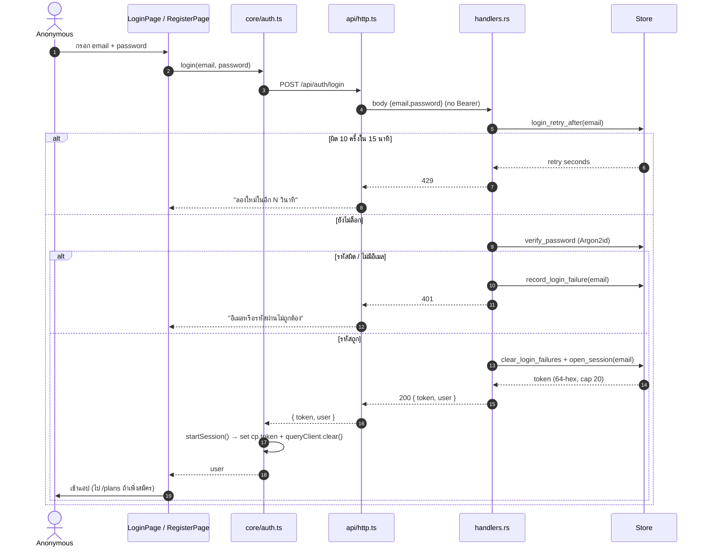
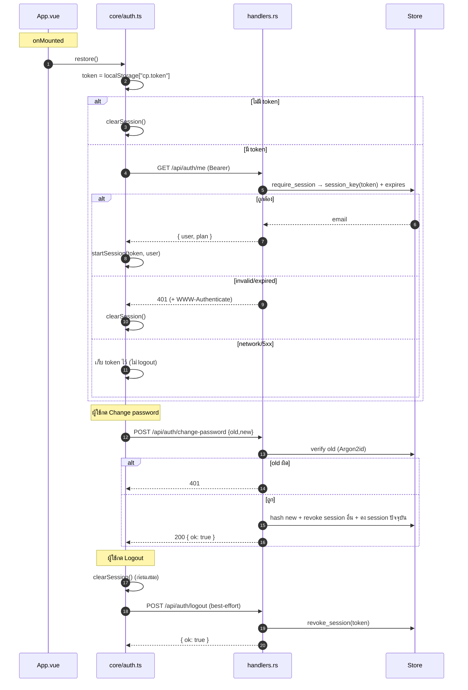
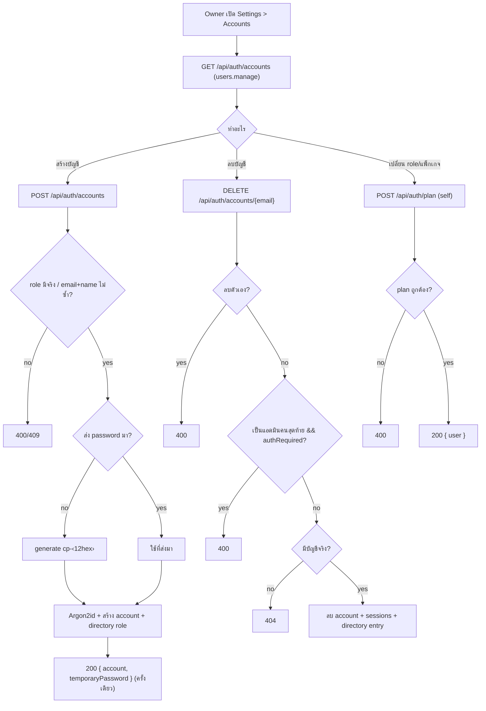

# E01 — Authentication & Account

**โมดูล:** `handlers.rs` (register/login/me/logout/logout_all/change_password/update_profile/set_plan/accounts)
**Storage:** `Store.accounts` (Argon2id), `Store.sessions` (token hash, TTL 7 วัน, cap 20/บัญชี)
**FE:** `core/auth.ts`, `core/session.ts`, `core/token.ts`, `pages/LoginPage.vue`, `RegisterPage.vue`, `PlansPage.vue`, `components/overlays/ChangePasswordModal.vue`, `ProfilePanel.vue`, `SettingsPanel.vue`

---

## Personas
- **Anonymous** — สมัคร/ล็อกอิน
- **ทุก role ที่ล็อกอิน** — จัดการบัญชีตัวเอง
- **Owner (`users.manage`)** — จัดการบัญชีในระบบ

## User Stories

| ID | As a | I want to | So that | Priority |
|---|---|---|---|---|
| US-01-01 | Anonymous | สมัครบัญชีด้วยชื่อ/อีเมล/รหัสผ่าน | เริ่มใช้ระบบ | Must |
| US-01-02 | Anonymous | ล็อกอินด้วยอีเมล+รหัสผ่าน | เข้าถึงข้อมูลของฉัน | Must |
| US-01-03 | ผู้ใช้ที่เคยล็อกอิน | เปิดแอปแล้วยังล็อกอินอยู่ | ไม่ต้องล็อกอินซ้ำ | Must |
| US-01-04 | ผู้ใช้ | ออกจากระบบเครื่องนี้ | ป้องกันคนอื่นใช้ต่อ | Must |
| US-01-05 | ผู้ใช้ | ออกจากระบบทุกอุปกรณ์ | ตัด session ที่ค้างทั้งหมด | Should |
| US-01-06 | ผู้ใช้ | เปลี่ยนรหัสผ่าน | ความปลอดภัย | Must |
| US-01-07 | ผู้ใช้ | แก้ชื่อที่แสดง | ให้ทีมเห็นชื่อถูกต้อง | Should |
| US-01-08 | ผู้ใช้ | เลือกแพ็กเกจ (free/pro/business) | ระบุแพ็กที่ใช้ | Could |
| US-01-09 | Owner | ดูรายชื่อบัญชี + จำนวน session | ตรวจสอบการใช้งาน | Should |
| US-01-10 | Owner | สร้างบัญชีให้ลูกค้า (ได้ temp password ครั้งเดียว) | onboard ลูกค้า | Must |
| US-01-11 | Owner | ลบบัญชี | ถอนสิทธิ์ | Should |

---

## US-01-01 — Register

**Actor:** Anonymous · **Endpoint:** `POST /api/auth/register` · **Permission:** none แต่ต้อง `allow_registration=true` (env `ALLOW_REGISTRATION`, default = demo)

**Preconditions:** `setup.allowRegistration == true`
**Postconditions:** มี account ใหม่ (plan=free), session เปิด, `{ token, user }`

**Main flow (ทุก action)**
1. ผู้ใช้เปิด `/register` → FE อ่าน `useSetup()` เพื่อเช็ค `allowRegistration`
2. ถ้าปิด → แสดงข้อความปิดรับสมัคร (ไม่ยิง API)
3. ผู้ใช้กรอก name/email/password (min 12)
4. กด submit → `core/auth.register()` → `api.register()`
5. FE ส่ง `POST /api/auth/register` body `{name,email,password}` **ไม่มี Authorization** (`token: null`)
6. Server validate ชื่อ/อีเมล/รหัสผ่าน (`validate_password` 12–256)
7. ตรวจซ้ำ: อีเมลซ้ำ → 409; ชื่อซ้ำกับ account อื่น → 409
8. Hash รหัสผ่านด้วย Argon2id (spawn_blocking) แล้ว re-check ใต้ write lock
9. สร้าง account (plan=free) + directory `User{name, role:"Viewer"}` (เฉพาะถ้ายังไม่มีชื่อนั้น)
10. `open_session(email)` → token 64-hex → `{ token, user }`
11. FE: `startSession(token, user)` → set `cp.token` + `queryClient.clear()` → ไป `/plans`

**Alternative / Error**
- `allow_registration=false` → 403/400 จาก server (FE ปิดปุ่มไว้ก่อน)
- อีเมล/ชื่อซ้ำ → 409
- รหัสสั้นกว่า 12 → 400

**Acceptance Criteria**
- [ ] ปุ่มสมัครซ่อนเมื่อ `allowRegistration=false`
- [ ] สมัครสำเร็จ → token ถูกเก็บ → ไปหน้า `/plans`
- [ ] อีเมล/ชื่อซ้ำได้ 409 + ข้อความอ่านรู้เรื่อง
- [ ] รหัสผ่านไม่ถูกส่งกลับหรือ log

---

## US-01-02 — Login

**Actor:** Anonymous · **Endpoint:** `POST /api/auth/login` · **Rate limit:** 10 ครั้งผิด/15 นาที/อีเมล → 429

**Main flow**
1. FE อ่าน `useSetup()` เพื่อเอา `workspaceName`
2. ส่ง `POST /api/auth/login {email,password}` (token:null, keepSessionOn401)
3. Server: `login_retry_after(email)` — ถ้าเกินลิมิต → **429** + จำนวนวินาที
4. ถ้าไม่พบอีเมล → verify กับ `dummy_password_hash()` (timing equalization)
5. `verify_password` (Argon2id)
6. ผิด → `record_login_failure` → **401**
7. ถูก → `clear_login_failures` + `open_session` (cap 20, evict เก่าสุด) → `{token,user}`
8. FE: `startSession` → clear cache → เข้าแอป

**Alternative / Error**
- 429 → แสดง "ลองใหม่ในอีก N วินาที"
- 401 → "อีเมลหรือรหัสผ่านไม่ถูกต้อง" (ไม่บอกว่าอันไหนผิด)
- 401 ตอน login **ไม่** clear session ที่มีอยู่ (`keepSessionOn401`)

**Acceptance Criteria**
- [ ] ล็อกอินซ้ำผิด 10 ครั้งล็อก 15 นาที
- [ ] ข้อความผิดพลาดไม่เปิดเผยว่าอีเมลมีจริงหรือไม่
- [ ] login สำเร็จแล้ว cache เก่าถูกล้าง

---

## US-01-03 — Session restore (ทุกครั้งที่เปิดแอป)

**Main flow**
1. `App.vue onMounted → restore()`
2. อ่าน token จาก `localStorage["cp.token"]` (หรือ in-memory)
3. ถ้าไม่มี → `clearSession()`
4. มี → `GET /api/auth/me` (Bearer)
5. Server `require_session` → `session_key(token)` (Blake2b-256) → ตรวจ `expires`
6. ถูกต้อง → `{user, plan}` → `startSession(token, user)`
7. ผิด/หมดอายุ → 401 + `WWW-Authenticate: Bearer` → FE `clearSession()`
8. network/5xx → **เก็บ** token (ไม่ force logout)

**Acceptance Criteria**
- [ ] reload แล้วยังล็อกอิน (token ยังไม่หมดอายุ)
- [ ] session หมดอายุ → ถูก logout
- [ ] server ล่มชั่วคราว → ไม่ล้าง token

---

## US-01-04 — Logout

**Main flow:** `clearSession()` ก่อน แล้วยิง `POST /api/auth/logout` (Bearer, keepSessionOn401) → server `revoke_session` → `{ok:true}` (best-effort, `.catch` กลืน error)

**Acceptance Criteria:** [ ] กด logout → token ถูกลบเฉพาะเครื่องนี้, session อื่นยังอยู่

## US-01-05 — Logout all

**Main flow:** `POST /api/auth/logout-all` → server `sessions.retain(email != caller)` → `{ok:true}`

**Acceptance Criteria:** [ ] ทุก session ของบัญชีถูกยกเลิก, ต้องล็อกอินใหม่ทุกอุปกรณ์

## US-01-06 — Change password

**Endpoint:** `POST /api/auth/change-password {oldPassword,newPassword}` · Bearer

**Main flow**
1. `ChangePasswordModal` ตรวจ new==confirm ฝั่ง FE
2. ยิง API (keepSessionOn401)
3. Server validate new 12–256
4. verify old (Argon2id) — ผิด → 401
5. hash new + บันทึก + **เก็บ session ปัจจุบันไว้, revoke session อื่นทั้งหมด**
6. → `{ok:true}`

**Acceptance Criteria**
- [ ] old ผิด → 401 ไม่เปลี่ยน
- [ ] เปลี่ยนแล้ว session อื่นถูกตัด, เครื่องปัจจุบันยังอยู่
- [ ] ไม่ห้ามตั้งรหัสซ้ำของเดิม (ตามจริง)

## US-01-07 — Update profile

**Endpoint:** `PATCH /api/auth/profile {name}` · Bearer

**Main flow:** trim/validate ชื่อ → ชื่อซ้ำกับ account อื่น → 409 → อัปเดต account.name + rename directory entry (คง role) + เขียน `post.locked_by` ใหม่ → `{user}` → FE invalidate `['accounts']`,`['setup']`

## US-01-08 — Choose plan

**Endpoint:** `POST /api/auth/plan {plan}` (free/pro/business) · Bearer **เท่านั้น**

**Main flow:** plan ไม่อยู่ในชุด → 400 → `{user}` → FE อัปเดต `currentUser`

> ⚠️ ไม่มี billing/permission — อัปเกรดตัวเองได้ (ดู Gap G2)

## US-01-09 — List accounts (admin)

**Endpoint:** `GET /api/auth/accounts` · Permission `users.manage` → `[{name,email,sessions}]` (sort by name, prune expired)

## US-01-10 — Create account / client onboarding

**Endpoint:** `POST /api/auth/accounts {name,email,role,password?}` · `users.manage`

**Main flow**
1. Owner กรอก name/email/role (ไม่ใส่ password ได้)
2. Server validate (ก่อนเช็ค auth) → `require_perm("users.manage")` ใน write lock
3. role ไม่อยู่ใน setup.roles → 400; ซ้ำ → 409
4. ถ้าไม่ส่ง password → generate `cp-<12hex>` (48-bit)
5. Hash (spawn_blocking) → re-check email → สร้าง account + directory role
6. → `{ ok, account:{...role}, temporaryPassword }` (โชว์ครั้งเดียว)
7. FE invalidate `['accounts']`,`['setup']`

**Acceptance Criteria**
- [ ] temp password แสดงครั้งเดียว ไม่เก็บฝั่ง client
- [ ] role ผิด/ซ้ำ → 400/409 ชัดเจน

## US-01-11 — Delete account (admin)

**Endpoint:** `DELETE /api/auth/accounts/{email}` · `users.manage`
**Rules:** ลบตัวเองไม่ได้ (400); ไม่พบ (404); ห้ามลบแอดมินคนสุดท้ายเมื่อ `authRequired` (400); ลบ account + sessions + directory entry (ถ้าเหลือ >1 user)

---

## Sequence — Login / Register

## Sequence — Session restore / Logout / Change password

## Flow — Admin account lifecycle

