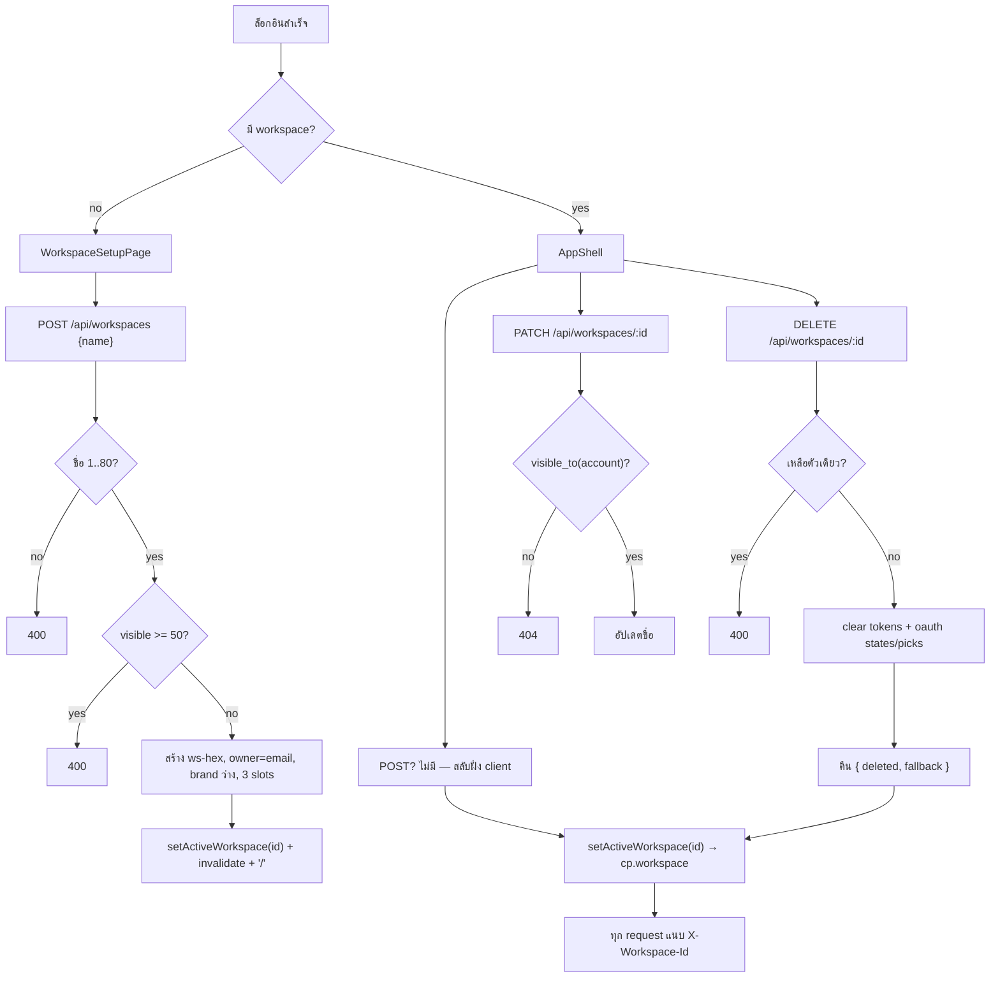
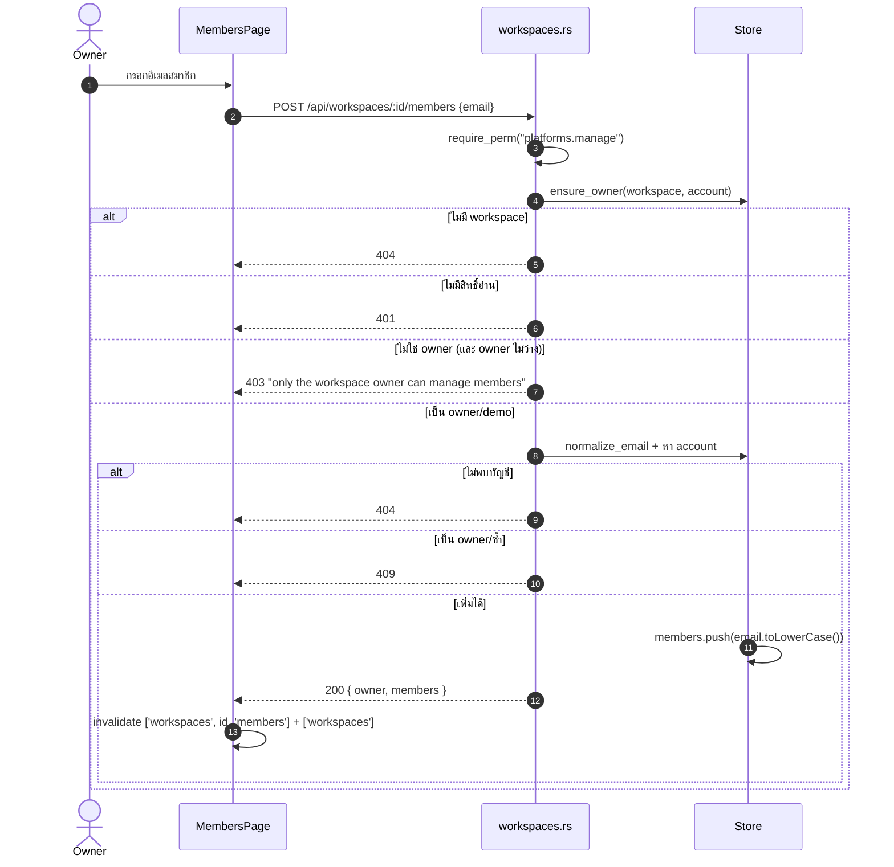

# E02 — Workspace & Members

**โมดูล:** `server/src/workspaces.rs` + `handlers.rs` (`active_workspace_id`)
**Storage:** `Store.workspaces: Vec<Workspace>` (owner, members, brand, connections, live, ads)
**FE:** `AppShell.vue` (switcher), `WorkspaceSetupPage.vue`, `MembersPage.vue`
**Permission:** `platforms.manage` (mutations); members = `ensure_owner`

---

## แนวคิด

- แต่ละ account มีได้หลาย workspace (สูงสุด 50 ที่มองเห็น) — **ต้องมีอย่างน้อย 1 ก่อนใช้งาน planner**
- ทุก request เลือก workspace ด้วย header `X-Workspace-Id` (ถ้าไม่มี → server เลือกตัวแรกที่มองเห็น)
- workspace แยกเฉพาะ `brand`, `connections`, `live`, `ads` — ส่วน posts/ideas/content ฯลฯ เป็น global
- `visible_to(account)` = owner ว่าง (shared/legacy) **หรือ** account เป็นเจ้าของ **หรือ** เป็น member

## User Stories

| ID | As a | I want to | So that | Priority |
|---|---|---|---|---|
| US-02-01 | ผู้ใช้ที่ล็อกอินครั้งแรก | สร้าง workspace แรก | เริ่มใช้ planner | Must |
| US-02-02 | ผู้ใช้ | สลับ workspace | แยกแบรนด์/งาน | Must |
| US-02-03 | ผู้ใช้ | สร้าง workspace เพิ่ม | ทำงานหลายแบรนด์ | Should |
| US-02-04 | Owner | เปลี่ยนชื่อ workspace | ตั้งชื่อให้ตรงแบรนด์ | Should |
| US-02-05 | Owner | ลบ workspace | เลิกใช้แบรนด์นั้น | Should |
| US-02-06 | Owner | ดูรายชื่อสมาชิก | รู้ว่าใครเข้าถึงได้ | Should |
| US-02-07 | Owner | เพิ่มสมาชิกด้วยอีเมล | ให้ทีมเข้าถึง | Must |
| US-02-08 | Owner | ลบสมาชิก | ถอนสิทธิ์ | Should |

---

## US-02-01 — First-run workspace creation

**Actor:** ผู้ใช้ที่ล็อกอินและยังไม่มี workspace · **Endpoint:** `POST /api/workspaces {name}` · `platforms.manage`

**Main flow**
1. `App.vue` เห็น `isLoggedIn && workspacesLoaded && workspaces.length === 0` → render `WorkspaceSetupPage` แทน shell
2. ผู้ใช้กรอกชื่อ (trim, 1–80 ตัวอักษร)
3. `useCreateWorkspace().mutate(name)` → `POST /api/workspaces`
4. Server: `require_perm("platforms.manage")` → validate ชื่อ → เช็คจำนวน ≥ 50 → 400
5. สร้าง `ws-<random_hex(6)>` (48-bit), owner = email, brand ว่าง + 3 ช่อง connection (meta/youtube/tiktok) ปิดอยู่
6. → `WorkspaceSummary { id, name, created, connected:0, total:3, isOwner:true }`
7. FE: `setActiveWorkspace(ws.id)` → `invalidateQueries()` → `router.replace('/')`

**Acceptance Criteria**
- [ ] ล็อกอินใหม่ที่ยังไม่มี workspace ถูกกันที่หน้า setup
- [ ] สร้างสำเร็จ → active workspace ถูกตั้ง + เข้า planner
- [ ] ชื่อว่าง/ยาวเกิน 80 → 400
- [ ] เกิน 50 workspace → 400

> ⚠️ ถ้า `useWorkspaces` **error** → `workspacesLoaded=false` → ข้ามหน้า setup เข้า shell เลย (Gap F2)

## US-02-02 — Switch workspace

**Main flow**
1. กดที่ switcher → `useWorkspaces()` list
2. เลือก id → `setActiveWorkspace(id)` (เก็บ `cp.workspace` ใน localStorage)
3. `queryClient.invalidateQueries()` ทั้งหมด (ทุกอย่างขึ้นกับ workspace)
4. ทุก request ถัดไปแนบ `X-Workspace-Id`

**Edge:** ถ้า id ใน storage เก่า/ถูกลบ → AppShell fallback ไปตัวแรก (`workspaces[0]`)

## US-02-03 — Create additional workspace
เหมือน US-02-01 แต่ไม่ถูก gate — เรียกจาก switcher; ถ้าเกิน 50 → 400

## US-02-04 — Rename

**Endpoint:** `PATCH /api/workspaces/{id} {name}` · `platforms.manage`
**Main flow:** inline edit → validate ชื่อ → หา workspace ด้วย `id && visible_to(account)` → 404 ถ้าไม่เจอ → ตั้งชื่อ → `WorkspaceSummary` → FE invalidate `['workspaces']`,`['setup']`

> ⚠️ ใช้ `visible_to` ทำให้ member ก็ rename ได้ (Gap G4)

## US-02-05 — Delete

**Endpoint:** `DELETE /api/workspaces/{id}` · `platforms.manage`
**Rules**
- ห้ามลบ workspace สุดท้าย (400 "the last workspace cannot be deleted")
- ลบ: clear provider tokens + pending OAuth states/picks ของ workspace นั้น
- คืน `{ deleted, fallback }` = id workspace ที่มองเห็นตัวแรกที่เหลือ
- FE: `setActiveWorkspace(fallback)` + invalidate ทั้งหมด

**Acceptance Criteria**
- [ ] ลบตัวสุดท้ายไม่ได้
- [ ] ลบแล้ว tokens/OAuth ของ workspace ถูกล้าง
- [ ] FE สลับไป fallback ที่ server คืนมา

## US-02-06..08 — Members (owner-only)

| เรื่อง | Endpoint | Rule |
|---|---|---|
| ดูสมาชิก | `GET /api/workspaces/{id}/members` | `ensure_owner`; คืน `{owner:{...}, members:[{email,name,role}]}` |
| เพิ่มสมาชิก | `POST /api/workspaces/{id}/members {email}` | `ensure_owner`; email ต้องเป็นบัญชีที่มีจริง (404 ถ้าไม่มี); owner/ซ้ำอยู่แล้ว → 409; เก็บ lowercase |
| ลบสมาชิก | `DELETE /api/workspaces/{id}/members/{email}` | `ensure_owner`; ไม่มีในรายการ → 404 |

**Main flow (add)**
1. Owner กรอกอีเมล (MembersPage แสดงฟอร์มเฉพาะ owner)
2. `useAddWorkspaceMember` → `POST`
3. Server `ensure_owner` (404/401/403) → normalize email → หา account → 404 → 409 ถ้าซ้ำ
4. push email เข้า `workspace.members`
5. FE invalidate `['workspaces', id, 'members']` + `['workspaces']`

**Acceptance Criteria**
- [ ] Non-owner เห็นข้อความ "เฉพาะเจ้าของ" (FE) และถูก 403 (BE)
- [ ] เพิ่มอีเมลที่ไม่มีบัญชี → 404
- [ ] เพิ่มซ้ำ → 409

---

## Flow — Workspace lifecycle & scoping

## Sequence — Add member (owner)

