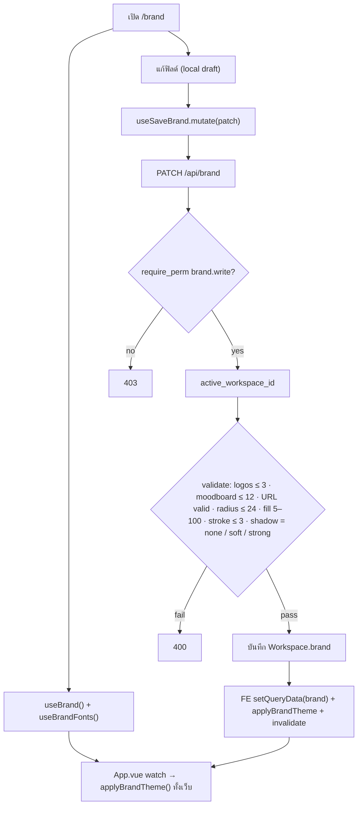
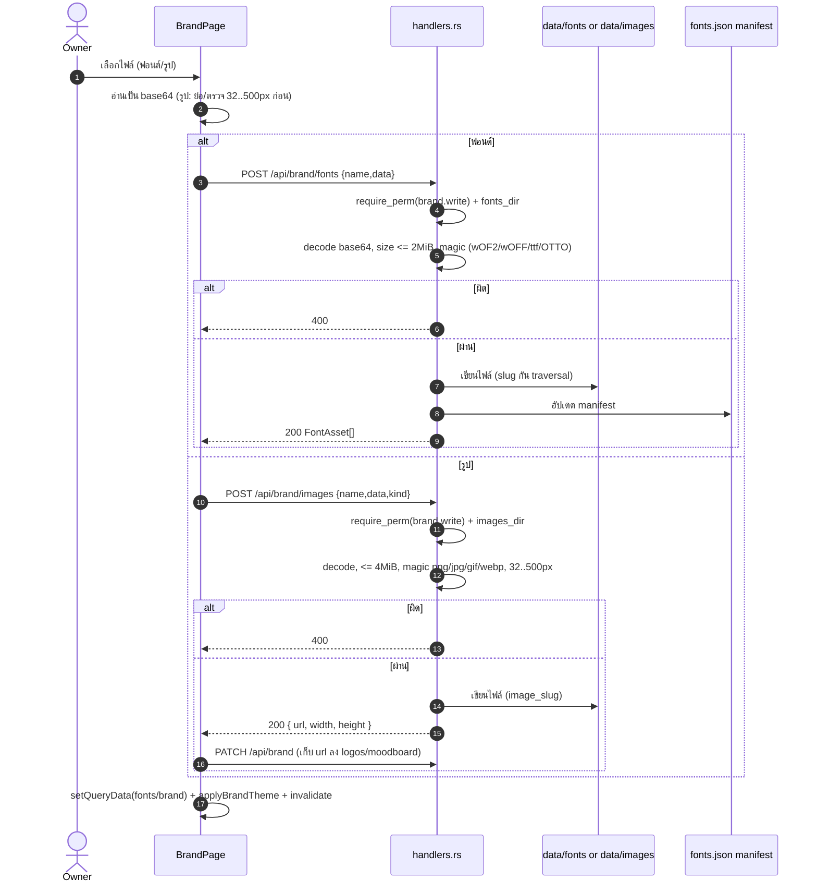

# E03 — Brand Identity (CI)

**โมดูล:** `handlers.rs` (get_brand/save_brand, fonts, images) · `core/theme.ts` (`applyBrandTheme`)
**Storage:** `Workspace.brand: Brand`; ไฟล์ฟอนต์ใน `data/fonts/`, รูปใน `data/images/`
**FE:** `pages/BrandPage.vue` + `App.vue` (watch brand → apply ทั้งเว็บ)
**Permission:** `brand.write` (mutations); GET brand = public (ใช้ทำธีมหน้า login/reader)

---

## โมเดล Brand

| ฟิลด์ | กติกา validation (server `save_brand`) |
|---|---|
| channel, positioning, slogan, audience, voice | ความยาวตาม `validate_len` |
| dos[], donts[] | list จำกัดจำนวน/ความยาว |
| palette[] | สี (client ใช้ swatch) |
| fonts[] | ชื่อ family (อ้างอิง) |
| logos[] | **≤ 3** URL ต้องเป็น `/api/brand/images/...` หรือ `https://...` |
| moodboard[] | **≤ 12** URL แบบเดียวกัน |
| radius | 0–24 (default 12) |
| fillOpacity | 5–100 (default 100) |
| strokeWidth | 0–3 (default 1) |
| shadow | `none` / `soft` / `strong` (default soft) |

## User Stories

| ID | As a | I want to | So that | Priority |
|---|---|---|---|---|
| US-03-01 | Owner | กรอกข้อมูลแบรนด์ (positioning/slogan/audience/voice) | วางรากฐาน CI | Must |
| US-03-02 | Owner | กำหนด do/don't | เป็น guideline ทีม | Should |
| US-03-03 | Owner | กำหนดพาเลตต์สี | ใช้สีให้ตรงแบรนด์ | Must |
| US-03-04 | Owner | ดูตัวอย่างเว็บเปลี่ยนธีมทันที | เห็นผลก่อนบันทึก | Should |
| US-03-05 | Owner | ปรับ radius/fill/stroke/shadow | ปรับหน้าตาเว็บ | Could |
| US-03-06 | Owner | อัปโหลดโลโก้ (สูงสุด 3) | ใช้ในแบรนด์ | Must |
| US-03-07 | Owner | อัปโหลด moodboard (สูงสุด 12) | อ้างอิงงานภาพ | Should |
| US-03-08 | Owner | อัปโหลดฟอนต์เอง (woff2/woff/ttf/otf) | ใช้ฟอนต์แบรนด์ | Should |
| US-03-09 | Owner | ลบฟอนต์/รูปที่อัปโหลด | จัดการไฟล์ | Should |
| US-03-10 | Owner | export/import แบรนด์เป็น JSON | ย้าย/สำรอง CI | Could |

---

## US-03-01..05 — แก้ข้อมูล & style ของแบรนด์

**Endpoint:** `PATCH /api/brand` (`brand.write`) · **Read:** `GET /api/brand` (public, workspace-scoped)

**Main flow (ทุก action)**
1. เปิด `/brand` → `useBrand()` + `useBrandFonts()`
2. `App.vue` watch `[brand, fontAssets]` → `applyBrandTheme()` เปลี่ยน palette/ฟอนต์/radius/fill/stroke/shadow ทั้งเว็บทันที (`documentElement`)
3. ผู้ใช้แก้ฟิลด์ (local draft) แล้วกดบันทึกจุดนั้น ๆ
4. `useSaveBrand().mutate(patch)` → `PATCH /api/brand`
5. Server: `require_perm("brand.write")` → workspace-scoped → validate (logos ≤3, moodboard ≤12, URL ต้องเป็น image endpoint หรือ https, radius ≤24, fill 5–100, stroke ≤3, shadow ∈ set)
6. สำเร็จ → FE `setQueryData(qk.brand)` + `applyBrandTheme` + invalidate

**Error / Edge**
- URL รูปไม่ผ่าน → 400
- เกินจำนวน → 400
- `shadow` ค่าแปลก → 400

**Acceptance Criteria**
- [ ] บันทึกแล้วธีมทั้งเว็บเปลี่ยนทันทีโดยไม่ต้อง reload
- [ ] logos > 3 / moodboard > 12 → 400
- [ ] radius เกิน 24, fill ต่ำกว่า 5 → 400
- [ ] viewer/general user แก้ไม่ได้ (403)

## US-03-06/07 — อัปโหลดรูป (โลโก้ / moodboard)

**Endpoint:** `POST /api/brand/images {name,data,kind}` · `brand.write`

**Main flow**
1. FE ตรวจขนาด/ย่อรูปก่อน (`storeImage`) — 32..500px ต่อด้าน
2. base64 (ไม่มี prefix) → `POST`
3. Server: `images_dir` ต้องตั้งไว้ → decode base64 → ว่าง → 400; > 4 MiB → 400
4. ตรวจ magic + นามสกุล (png/jpg/jpeg/gif/webp — **ไม่รับ SVG**) → 400 ถ้าผิด
5. parse header dimensions → ต้อง 32–500px ทั้งสองด้าน → 400
6. ตั้งชื่อ `image_slug(stem)+ext` (alnum เท่านั้น กัน traversal), กันชนชื่อด้วย suffix
7. → `{ url, width, height }` → FE เก็บ url ลงฟิลด์ logos/moodboard แล้ว `saveBrand`

**Delete:** `DELETE /api/brand/images/{name}` · `brand.write` — กัน `name` ที่มี `/ \ ..` → 400; ตรวจ magic ก่อนลบ → 404/500

## US-03-08/09 — อัปโหลด/ลบฟอนต์

**Endpoint:** `POST /api/brand/fonts {name,data}` · `brand.write` (body limit 4 MiB)
**Read file:** `GET /api/brand/fonts/{name}/file` (public — เพราะ `@font-face` แนบ header ไม่ได้)

**Main flow**
1. อัปโหลด base64 → server: `fonts_dir` ต้องมี → ว่าง → 400; > 2 MiB → 400
2. ตรวจชนิดด้วย magic: `wOF2`(woff2), `wOFF`(woff), `00 01 00 00`/`true`(ttf), `OTTO`(otf) → 400 ถ้าไม่ตรง
3. slug ชื่อไฟล์ → เขียนไฟล์ + อัปเดต `fonts.json` manifest
4. → `FontAsset[]` → FE `setQueryData(qk.fonts)` + `applyBrandTheme` + invalidate

**Delete:** `DELETE /api/brand/fonts/{name}` — กัน traversal, ตรวจ magic, ลบไฟล์ + manifest

## US-03-10 — Export / Import brand JSON (ฝั่ง client)

- Export: รวบ `Brand` + ฟอนต์ → JSON ดาวน์โหลด
- Import: อ่าน JSON → sanitize → `saveBrand` (รูป `data:` จาก mock จะ "fix stored image" ไม่ได้ถ้าไม่ใช่ `/api/brand/images/`)

---

## Flow — Save brand & apply theme

## Sequence — Upload font / image

