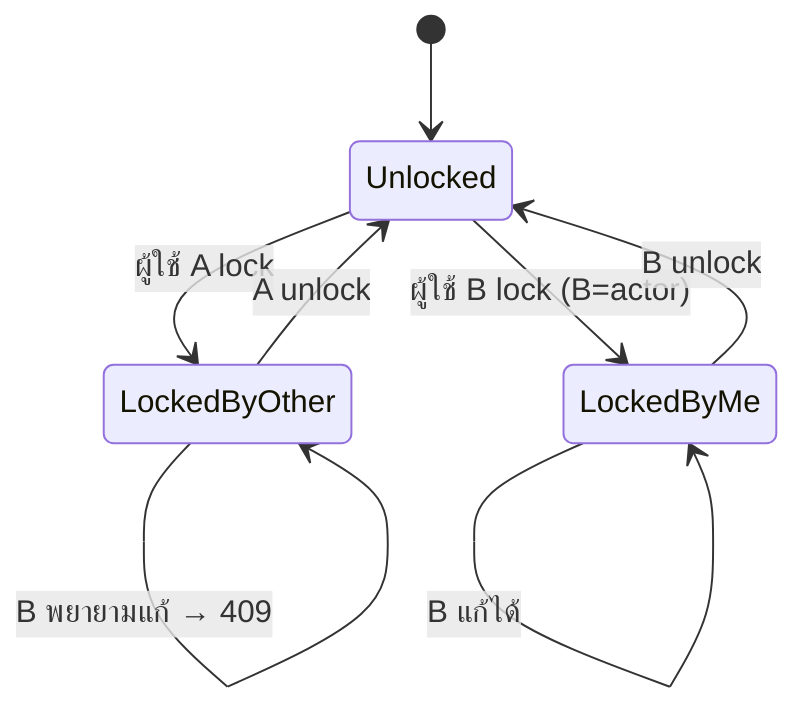
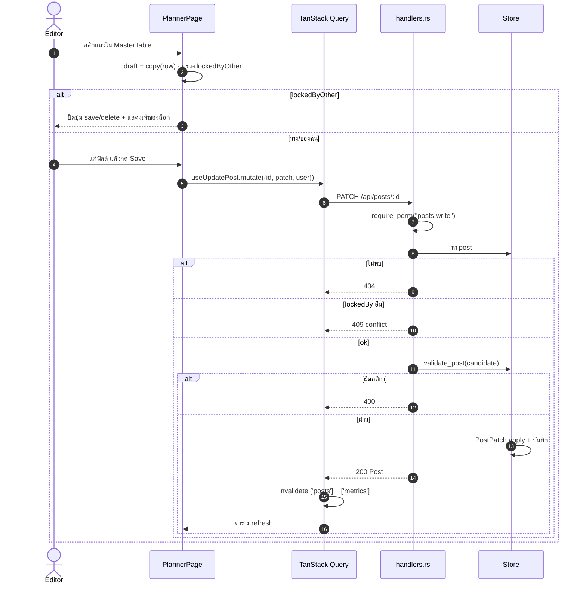
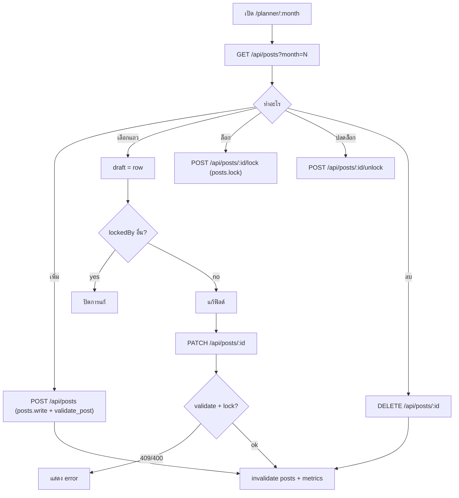

# E04 — Content Planner (01–12)

**โมดูล:** `handlers.rs` (list_posts/add_post/update_post/delete_post/lock_post/unlock_post)
**Storage:** `Store.posts: Vec<Post>` — **global (ไม่ผูก workspace)**
**FE:** `PlannerPage.vue` (MasterTable), `CalendarPage.vue`, `FeedPage.vue`, `DashboardPage.vue`
**Permission:** `posts.write` (เพิ่ม/แก้/ลบ), `posts.lock` (ล็อก)

---

## โมเดล Post
`id, month(1-12), topic*, pillar, format, goal, date?, time, status, hook, caption, cta, hashtagGroup, hashtags[], imageUrl, note, done, platforms[], lockedBy?`

Validation (`validate_post`): month 1–12; topic ต้องไม่ว่าง; status ต้องว่างหรืออยู่ใน `setup.statuses`; platforms ต้องอยู่ใน `setup.platforms`; list ≤100 รายการ × ≤200 ตัวอักษร

## User Stories

| ID | As a | I want to | So that | Priority |
|---|---|---|---|---|
| US-04-01 | Editor | ดูตารางเดือนที่เลือก | วางแผนรายเดือน | Must |
| US-04-02 | Editor | เพิ่มแถวคอนเทนต์ใหม่ | เริ่มงานชิ้นใหม่ | Must |
| US-04-03 | Editor | เลือกแถวแล้วแก้ทุกฟิลด์ | ปรับรายละเอียดโพสต์ | Must |
| US-04-04 | Editor | บันทึกการแก้ไข | เก็บงาน | Must |
| US-04-05 | Editor | ลบแถว | เอาโพสต์ที่ไม่ใช้ออก | Should |
| US-04-06 | Editor | ล็อกแถวที่กำลังแก้ | กันคนอื่นทับ | Must |
| US-04-07 | Editor | ปลดล็อกเมื่อแก้เสร็จ | ให้คนอื่นแก้ต่อ | Must |
| US-04-08 | Editor | กรองตาม pillar/format/status/platform | หางานง่าย | Should |
| US-04-09 | Editor | เปิดโพสต์จากลิงก์ (`?post=id`) | แชร์ลิงก์ตรง | Could |
| US-04-10 | Editor | ดูปฏิทิน/ฟีดรวมจากโพสต์ | ภาพรวม | Should |

---

## US-04-01 — Load month

**Endpoint:** `GET /api/posts?month=N` (ไม่ส่ง month = ทั้งหมด)
**Main flow:** `PlannerPage` รับ prop `month` → `usePosts(month)` → query `['posts', N]`
- month ผิด/นอกช่วง → server คืน `[]` เงียบ ๆ (ไม่ error)
- แสดง `isPending` "Loading rows", error card + retry, empty card + CTA

## US-04-02 — Add

**Main flow**
1. กดเพิ่ม → เปิด draft ใหม่ (default จาก setup)
2. `useAddPost(m).mutate(draft)` → `POST /api/posts`
3. Server `require_perm("posts.write")` → `validate_post` → ตั้ง id `p-...`, `lockedBy=null`
4. → `Post` → FE invalidate `['posts']` (ทั้ง prefix)

## US-04-03/04 — Edit & Save (กับดัก lock)

**Main flow**
1. คลิกแถว → `MasterTable` ส่ง row → คัดลอกเป็น `draft` local
2. ผู้ใช้แก้ฟิลด์; `save()` whitelist เฉพาะ `EDITABLE` และแนบ `user: actor`
3. `useUpdatePost(m).mutate({id,patch})` → `PATCH /api/posts/{id}`
4. Server: `require_perm("posts.write")` → หา post (404)
5. **Lock check:** ถ้า `post.lockedBy` ตั้งอยู่ และ actor !== holder → **409**
   - actor = ชื่อบัญชี (เมื่อ auth on) หรือ `patch.user` (demo)
6. staged candidate → `validate_post` → apply (`PostPatch.apply`) → invalidate `['posts']`, `['metrics']`

**Edge**
- ล็อกโดยคนอื่น: ปุ่ม save/duplicate/delete ปิด + แสดงชื่อเจ้าของ
- patch `date` ใช้ `double_option` → `null` ล้างค่าได้

**Acceptance Criteria**
- [ ] แก้แล้ว invalidate ทั้ง `posts` และ `metrics`
- [ ] ล็อกโดยคนอื่น → save ได้ 409 + ข้อความ
- [ ] month/status/platform ผิดกติกา → 400

## US-04-05 — Delete

**Endpoint:** `DELETE /api/posts/{id}` · `posts.write` · **lock rule เดียวกับ update** (lockedBy อื่น → 409); 404 ถ้าไม่มี
→ FE invalidate `['posts', m]` + `['posts']`

## US-04-06/07 — Lock / Unlock (US-014)

**Lock:** `POST /api/posts/{id}/lock {user}` · `posts.lock`
- holder = account name (auth) หรือ `user` จาก body (demo, ว่างไม่ได้ → 400)
- ถ้าล็อกโดยคนอื่น → 409; ล็อกซ้ำโดยเจ้าของ = idempotent
**Unlock:** `POST /api/posts/{id}/unlock {user}` · `posts.lock` — ถ้าไม่ใช่ holder → 409

## US-04-08..10 — Filters / deep link / derived views

- Try filter ฝั่ง client (pillar/format/status/platform) ใน CalendarPage/FeedPage
- `?post=id` ใน Planner → เลือกแถวนั้นตอน mount
- Feed/Dashboard/Performance ใช้ `useAllPosts()` (`GET /api/posts` ไม่มี month)
- CalendarPage ตาม `navDate`; Dashboard/Performance default month = 2 (hard-coded)

---

## Sequence — Edit + save with lock

## Flow — Planner actions overview

