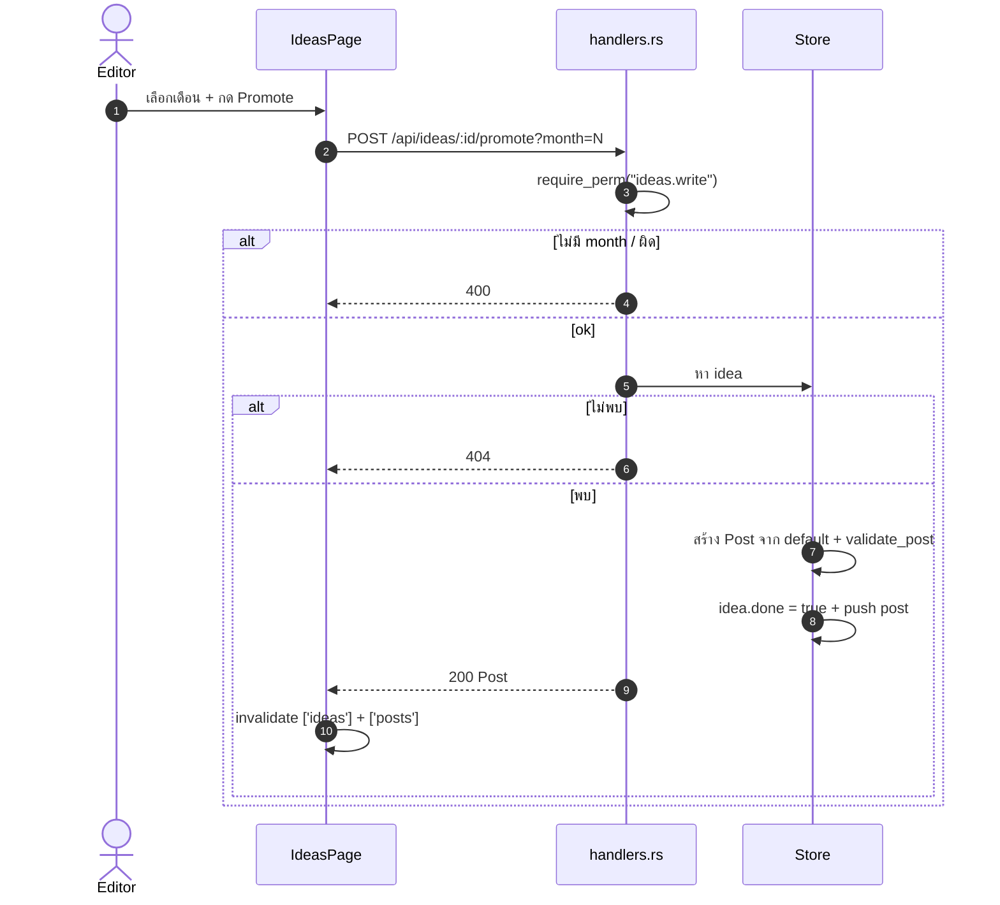
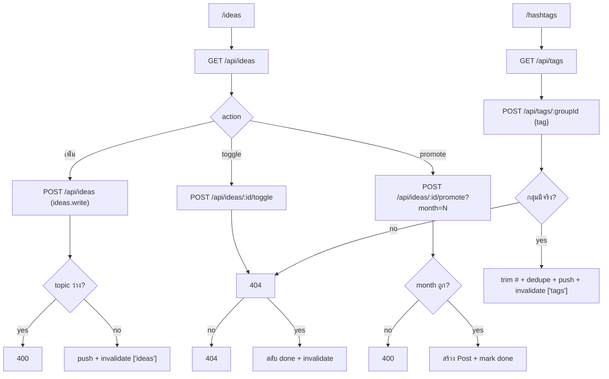

# E05 — Ideas Bank & Hashtags

**โมดูล:** `handlers.rs` (list_ideas/add_idea/toggle_idea/promote_idea, list_tags/add_tag)
**Storage:** `Store.ideas`, `Store.hashtags` — global
**FE:** `pages/IdeasPage.vue`, `pages/HashtagsPage.vue`
**Permission:** `ideas.write`, `hashtags.write`

---

## User Stories

| ID | As a | I want to | So that | Priority |
|---|---|---|---|---|
| US-05-01 | Editor | ดูคลังไอเดีย | มีที่เก็บไอเดีย | Must |
| US-05-02 | Editor | เพิ่มไอเดีย (topic/format/idea/link) | จดไว้ก่อน | Must |
| US-05-03 | Editor | ทำเครื่องหมายว่าทำแล้ว/ยัง | ติดตามสถานะ | Should |
| US-05-04 | Editor | promote ไอเดียเป็นโพสต์ในเดือนที่เลือก | ต่อยอดเป็นงานจริง | Must |
| US-05-05 | Editor | ดูกลุ่มแฮชแท็ก | หยิบใช้เร็ว | Must |
| US-05-06 | Editor | เพิ่มแฮชแท็กเข้ากลุ่ม | ขยายคลัง | Should |

---

## US-05-01..03 — Ideas

**Endpoints**
- `GET /api/ideas` (read)
- `POST /api/ideas` (`ideas.write`) — validate topic ไม่ว่าง + ความยาว; id `i-...`
- `POST /api/ideas/{id}/toggle` (`ideas.write`) — 404 ถ้าไม่มี; สลับ `done`

**Main flow (toggle)**
1. คลิก checkbox → optimistic toggle ในเครื่อง
2. `useToggleIdea().mutate(id)` → ถ้าพลาด (error) → **revert checkbox กลับ** (โค้ดทำ manual revert)
3. สำเร็จ → invalidate `['ideas']`

**Acceptance:** [ ] ติ๊กแล้วบันทึก, [ ] error → checkbox กลับสภาพเดิม

## US-05-04 — Promote idea → Post

**Endpoint:** `POST /api/ideas/{id}/promote?month=N` (`ideas.write`) — ถ้าไม่มี `?month` → 400

**Main flow**
1. เลือกเดือนปลายทางจาก select แล้วกด promote
2. `usePromoteIdea(month).mutate(id)`
3. Server: parse/validate month (400 ถ้าผิด) → หา idea (404) → สร้าง `Post` จาก default (pillar/goal/hashtagGroup จาก setup/hashtags) → `validate_post` → ตั้ง idea.done = true → push post
4. → `Post` → FE invalidate `['ideas']` + `['posts']`

**Acceptance:** [ ] promote แล้วได้โพสต์ในเดือนนั้น + idea ถูกมาร์ค done; [ ] ไม่ส่ง month → 400

## US-05-05..06 — Hashtags

**Endpoints**
- `GET /api/tags` (read)
- `POST /api/tags/{groupId} {tag}` (`hashtags.write`) — ตัด `#` นำหน้า, dedupe; 404 ถ้าไม่พบกลุ่ม

**Main flow**
1. พิมพ์แท็กใหม่ในกลุ่ม → `useAddTag().mutate({groupId, tag})`
2. Server: `require_perm("hashtags.write")` → หากลุ่ม (404) → trim `#` → กันซ้ำ → push
3. → `HashtagGroup` ใหม่ → FE invalidate `['tags']`

**Acceptance:** [ ] แท็กซ้ำไม่เพิ่มซ้ำ; [ ] กลุ่มไม่มี → 404; [ ] `#` นำหน้าถูกตัด

---

## Sequence — Promote idea

## Flow — Ideas & hashtags overview

