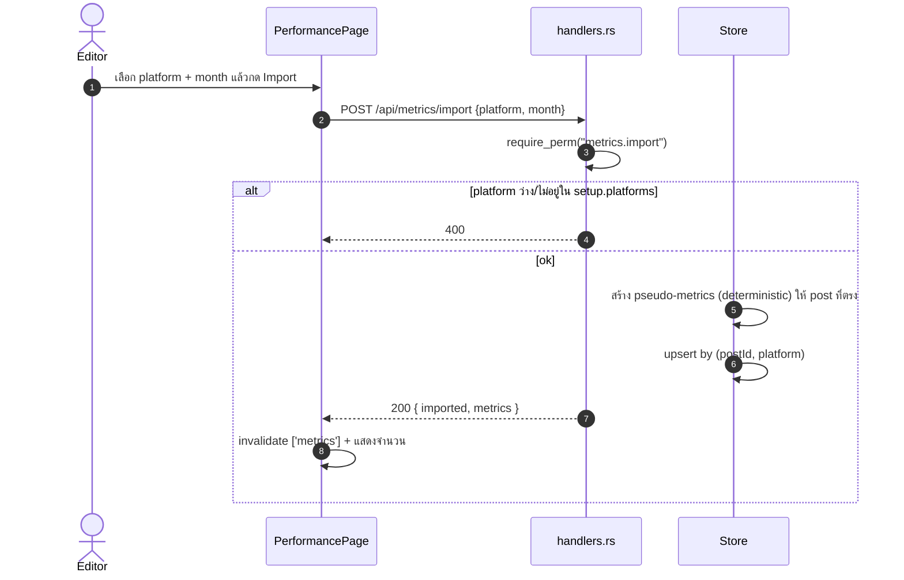

# E06 — Performance & Finance

**โมดูล:** `handlers.rs` (list_metrics/import_metrics, list_txns/add_txn)
**Storage:** `Store.metrics`, `Store.txns` — global
**FE:** `pages/PerformancePage.vue`, `pages/DashboardPage.vue`, `pages/FinancePage.vue`
**Permission:** `metrics.import`, `finance.write`

---

## User Stories

### Performance
| ID | As a | I want to | So that | Priority |
|---|---|---|---|---|
| US-06-01 | Editor | ดูแดชบอร์ด KPI (views/likes/status/top5) | เห็นภาพรวม | Must |
| US-06-02 | Editor | นำเข้า metrics ของแพลตฟอร์มต่อเดือน | วัดผลได้ | Must |
| US-06-03 | Editor | ดูตาราง metrics ต่อโพสต์ +7 วัน | วิเคราะห์ | Should |
| US-06-04 | Editor | ดู Ads glance ในแดชบอร์ด | เห็นโฆษณาควบคู่ | Could |

### Finance
| ID | As a | I want to | So that | Priority |
|---|---|---|---|---|
| US-06-05 | Owner | ดูรายรับ/รายจ่าย/ยอดคงเหลือ | ดูแลการเงิน | Must |
| US-06-06 | Owner | บันทึกรายการ (IN/OUT) | เก็บบัญชี | Must |

---

## US-06-01 — Dashboard (client-side)

**Query:** `useDashboard(month)` = `usePosts(month)` + `useMetrics()`
**Derivation (FE):** เฉพาะ metrics ของ post ในเดือนนั้น → รวม views/likes; นับ pillar/platform/status; top5 by views
**State:** ถ้า posts/metrics error → error card; ถ้าโหลด → "Computing…"

## US-06-02 — Import metrics

**Endpoint:** `POST /api/metrics/import {platform, month}` · `metrics.import`

**Main flow**
1. PerformancePage เลือก platform + month → กด import
2. `useImportMetrics().mutate({platform, month})`
3. Server: `require_perm("metrics.import")` → platform ต้องไม่ว่างและอยู่ใน `setup.platforms` (400)
4. สร้าง pseudo-metrics แบบ deterministic (`views = 1000 + hash%9000`, `likes = views/12`) ให้ post ที่ตรง
5. upsert by `(post_id, platform)` → `{ imported, metrics }`
6. FE invalidate `['metrics']` → ปุ่มโชว์จำนวนที่ import / error

**Acceptance:** [ ] platform ผิด → 400; [ ] import ซ้ำ upsert ไม่เพิ่มซ้ำ; [ ] แสดงจำนวน imported

## US-06-03 — Performance tables
`useMetrics()` + `useAllPosts()` แสดง per-post และ +7d (ใช้ `plus7`), platform goals

## US-06-04 — Ads glance (ดู E09)
DashboardPage `useAds()` แสดง spend/alerts

## US-06-05 — Finance overview
`useTxns()` → รวม income/expense/balance + กราฟรายเดือน (client-side)

## US-06-06 — Add txn

**Endpoint:** `POST /api/txns` · `finance.write`

**Main flow**
1. FinancePage กรอก date/amount/kind/category/sub (validate เบื้องต้น)
2. `useAddTxn().mutate(draft)` → `POST /api/txns`
3. Server: `require_perm("finance.write")` → amount finite & `0 < amount ≤ 1e12`; kind ∈ {IN,OUT}; date ต้อง `YYYY-MM-DD`; category/sub ตามข้อจำกัด
4. id `t-...` → `Txn` → FE invalidate `['txns']`

**Error:** amount ≤0/ไม่ finite → 400; kind แปลก → 400; date รูปผิด → 400

**Acceptance:** [ ] บันทึกแล้วยอดรวม/กราฟอัปเดต; [ ] จำนวนติดลบ → 400

---

## Sequence — Import metrics



## Flow — Performance & Finance

```mermaid
flowchart TD
  subgraph Perf["Performance / Dashboard"]
    D["DashboardPage"] --> DQ["useDashboard(month)"]
    DQ --> DP["GET /api/posts?month=N"]
    DQ --> DM["GET /api/metrics"]
    PP["PerformancePage"] --> IM["POST /api/metrics/import"]
    IM --> IPerm{"metrics.import?"}
    IPerm -->|no| E403["403"]
    IPerm -->|yes| IPVal{"platform valid?"}
    IPVal -->|no| E400["400"]
    IPVal -->|yes| IUpsert["pseudo-metrics + upsert + invalidate ['metrics']"]
  end
  subgraph Fin["Finance"]
    F["FinancePage"] --> FQ["GET /api/txns"]
    F --> AT["POST /api/txns"]
    AT --> FPerm{"finance.write?"}
    FPerm -->|no| F403["403"]
    FPerm -->|yes|     FVal{"amount > 0 และ ≤ 1e12 · kind IN/OUT · date YYYY-MM-DD?"}
    FVal -->|no| F400["400"]
    FVal -->|yes| FAdd["id t-... + invalidate ['txns']"]
  end
```
