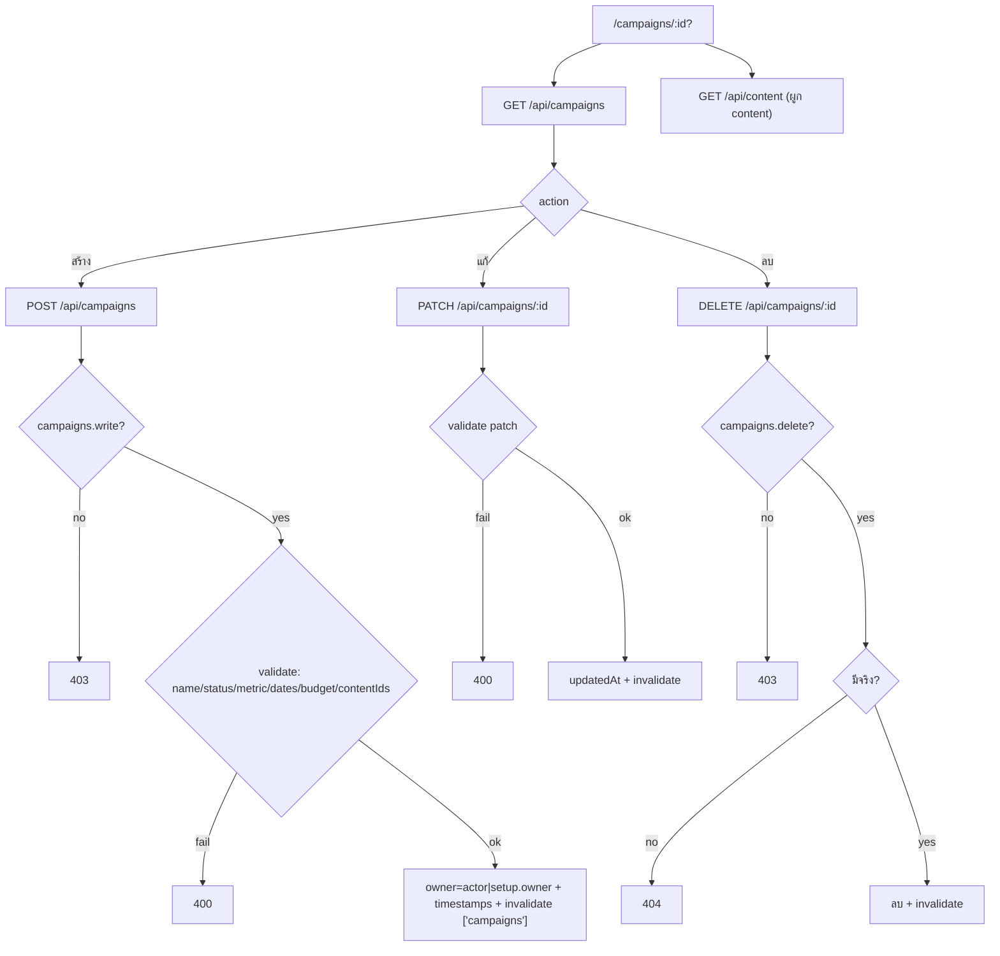
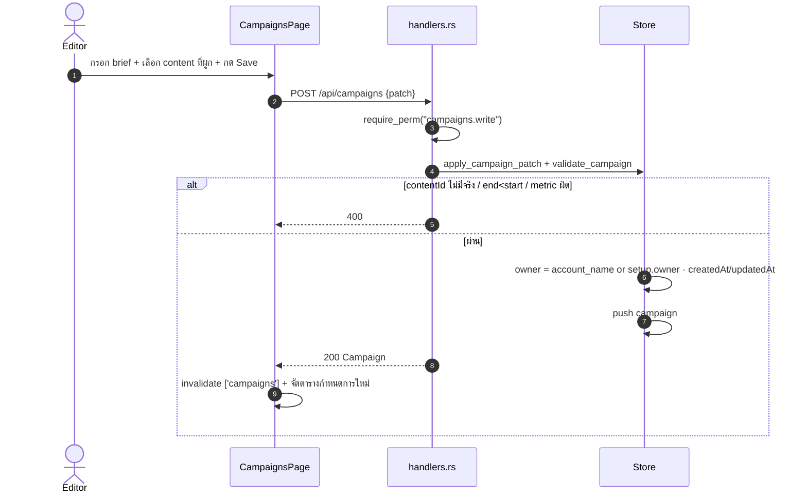

# E07 — Campaigns (Content Planner Campaigns)

**โมดูล:** `handlers.rs` (list_campaigns/get_campaign/create_campaign/update_campaign/delete_campaign)
**Storage:** `Store.campaigns: Vec<Campaign>` — global
**FE:** `pages/CampaignsPage.vue` (+ดึง `useContentList` มาผูก)
**Permission:** `campaigns.write` (สร้าง/แก้), `campaigns.delete` (ลบ)

> หมายเหตุ: นี่คือ "แคมเปญคอนเทนต์" ไม่ใช่ ad campaign ของ Meta (ดู E09)

---

## โมเดล Campaign
`id, name*, objective, status(draft|active|paused|completed), startDate?, endDate?, platforms[], pillars[], hashtags[], budget, goalMetric(views|likes|reach|posts), goalTarget, owner, notes, contentIds[] (ต้องมี Content จริง), createdAt, updatedAt`

## User Stories

| ID | As a | I want to | So that | Priority |
|---|---|---|---|---|
| US-07-01 | Editor | ดูรายการแคมเปญ | ภาพรวมแคมเปญ | Must |
| US-07-02 | Editor | สร้างแคมเปญ (brief/ช่วงเวลา/เป้า) | วางแผนแคมเปญ | Must |
| US-07-03 | Editor | แก้แคมเปญ | อัปเดตแผน | Must |
| US-07-04 | Editor | ผูก content เข้าแคมเปญ | เห็นกำหนดการ | Should |
| US-07-05 | Owner | ลบแคมเปญ | เอาแคมเปญยกเลิกออก | Should |
| US-07-06 | Editor | เปิดแคมเปญจากลิงก์ (`/campaigns/:id`) | แชร์ตรง | Could |
| US-07-07 | Editor | ดูตารางกำหนดการของ content ที่ผูก | เห็น timeline | Should |

---

## US-07-01 — List

`GET /api/campaigns` (read) → `Campaign[]`

## US-07-02 — Create

**Endpoint:** `POST /api/campaigns` · `campaigns.write`

**Main flow**
1. กด "สร้างแคมเปญ" → draft ใหม่
2. `useCreateCampaign().mutate(patch)` → `POST /api/campaigns`
3. Server: `require_perm("campaigns.write")` → owner = ชื่อบัญชี หรือ `setup.owner`
4. `apply_campaign_patch` + `validate_campaign`:
   - name ไม่ว่าง ≤200; objective/owner ≤200; notes ≤5000
   - status ∈ {draft,active,paused,completed}; metric ∈ {views,likes,reach,posts}
   - budget/goalTarget finite ∈ [0,1e12]; วันที่ parse ได้และ end ≥ start
   - list caps; **ทุก contentId ต้องมีอยู่จริง (400)**
5. ตั้ง createdAt/updatedAt → `Campaign`
6. FE invalidate `['campaigns']`

**Error:** contentId ที่ไม่มี → 400; end < start → 400; metric ผิด → 400

## US-07-03 — Update
`PATCH /api/campaigns/{id}` · `campaigns.write` → staged patch + validate → updatedAt

## US-07-04/07 — Link content & schedule view
- CampaignsPage ใช้ `useContentList({})` แล้วให้เลือกผูก (เก็บใน `contentIds`)
- แสดงตารางกำหนดการ เรียงตาม scheduled/published date ของ content ที่ผูก

## US-07-05 — Delete
`DELETE /api/campaigns/{id}` · `campaigns.delete` → 404 ถ้าไม่มี

## US-07-06 — Open by id
route `:id` seed แบบ dirty-diff (JSON compare) → `select()` เขียน URL ใหม่; Save เขียนทุก editable field + parse hashtags

---

## Flow — Campaign CRUD

## Sequence — Create campaign with linked content

