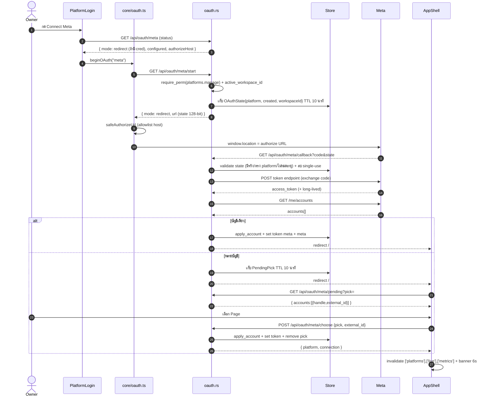
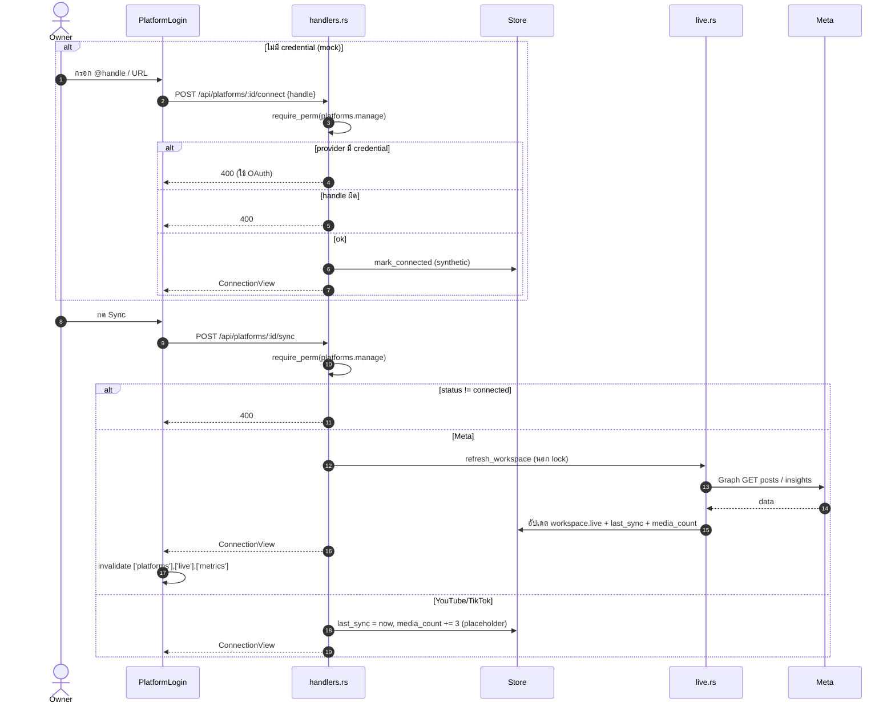
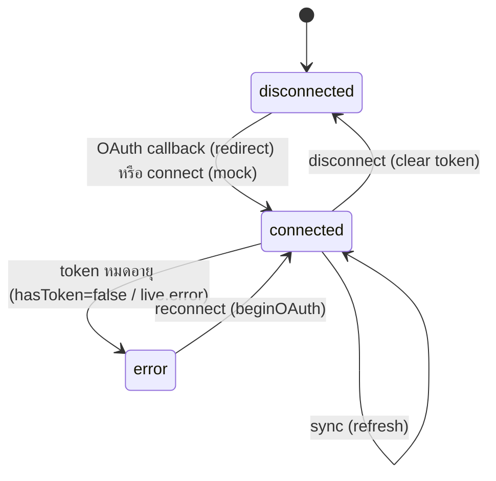

# E08 — Platform Connections & Live Mirror

**โมดูล:** `handlers.rs` (list/connect/disconnect/sync platforms, get_live), `oauth.rs`, `live.rs`, `secrets.rs`
**Storage:** `Workspace.connections`, `Workspace.live`; provider token = memory + `platform_tokens_enc` (ChaCha20-Poly1305)
**FE:** `components/overlays/PlatformLogin.vue`, `components/live/LiveSection.vue`, `AppShell.vue` (OAuth callback), `core/oauth.ts`, `core/platforms.ts`
**Permission:** `platforms.manage`

---

## แนวคิด
- 3 ช่องเชื่อมต่อ: `meta` (Facebook Page + Instagram ที่ผูก), `youtube`, `tiktok`
- **Mock mode** (ไม่มี credential) → connect แบบ synthetic; **Redirect mode** → OAuth 2.0 จริง
- Token เก็บต่อ workspace (`{workspace}:{platform}`), user token ของ Meta เก็บแยก `meta#user` ให้ Ads
- Live mirror refresh อัตโนมัติทุก `LIVE_REFRESH_MIN` (default 30) และกด Sync ได้ — **มีแค่ Meta ที่ดึงจริง**

## User Stories

| ID | As a | I want to | So that | Priority |
|---|---|---|---|---|
| US-08-01 | Owner | ดูสถานะการเชื่อมต่อทุกแพลตฟอร์ม | รู้ว่าเชื่อมอะไรไว้ | Must |
| US-08-02 | Owner | เชื่อมต่อ Meta (Facebook/Instagram) | ดึงโพสต์ + insight | Must |
| US-08-03 | Owner | เลือก Page เมื่อบัญชีมีหลาย Page | ผูกถูกเพจ | Must |
| US-08-04 | Owner | เชื่อมต่อ YouTube / TikTok | รวมช่องทาง | Should |
| US-08-05 | Owner | ยกเลิกการเชื่อมต่อ | ถอนสิทธิ์ | Should |
| US-08-06 | Owner | Sync ข้อมูลด้วยมือ | ดึงล่าสุดทันที | Must |
| US-08-07 | Editor | ดู Live mirror (โพสต์จริง + engagement) | เห็นผลลัพธ์จริง | Must |
| US-08-08 | Owner | reconnect เมื่อ token หมดอายุ | เชื่อมต่อกลับ | Should |

---

## US-08-01 — List platforms

`GET /api/platforms` (read) → `ConnectionView[]` = connection + `hasToken` (ไม่ถอดรหัส token)
- `hasToken=false` บนช่อง connected → UI ขึ้น "ต้อง reconnect"

## US-08-02 — Connect (OAuth redirect)

**Start:** `GET /api/oauth/{platform}/start` · `platforms.manage`
1. FE `beginOAuth(platform)` → `api.startOauth`
2. Server: `require_perm` + `active_workspace_id` → `prune_ephemeral`
3. ถ้าไม่มี credential → `{ mode:"mock", url:undefined }` (ไม่สร้าง state)
4. ถ้ามี → สร้าง `state = "st-"+random_hex(16)` (128-bit) เก็บ `OAuthState{platform,created,workspaceId}` (TTL 10 นาที) → สร้าง authorize URL (มี client_id, redirect_uri, scope, state, extra params)
5. FE `safeAuthorizeUrl` (allowlist host: facebook.com / accounts.google.com / www.tiktok.com) → `window.location = url`

**Callback:** `GET /api/oauth/{platform}/callback?code&state` (ไม่ต้อง auth โดยดีไซน์)
1. validate state: มีจริง, platform ตรง, ไม่หมดอายุ → **ลบ (single-use)**
2. resolve workspace จาก state
3. ถ้ามี `error` → redirect กลับ `?status=error&reason=...`
4. `exchange_code` (POST token endpoint) → (Meta) ต่ออายุ long-lived
5. `fetch_accounts` (`/me/accounts`) 
6. **บัญชีเดียว** → apply_account + set token (+ `meta#user`) + set Page token → spawn live refresh → redirect `?oauth=:id&status=ok`
7. **หลายบัญชี** → เก็บ `PendingPick` (TTL 10 นาที) → redirect `?status=pick&pick=...`

## US-08-03 — Choose Page (multi-account)

**Pending:** `GET /api/oauth/{platform}/pending?pick=` (has_read_access) → `{platform, accounts:[{handle,external_id}]}` (ไม่เปิด token)
**Choose:** `POST /api/oauth/{platform}/choose {pick, external_id}` · `platforms.manage`
- validate pick/platform/TTL → หา account → remove pick → apply_account + tokens → refresh → `{platform, connection}`

**FE:** AppShell watch `route.query` → ถ้า `status=pick` เปิดตัวเลือกด้วย `useOAuthPending` (enabled เมื่อมี platform+pick) → `chooseOAuthPage` → invalidate `['platforms']`

## US-08-04/05 — Connect (mock) / Disconnect

- **Mock connect:** `POST /api/platforms/{id}/connect {handle}` · `platforms.manage`
  - ถ้า provider นั้นมี credential → 400 (ต้องใช้ OAuth)
  - ไม่งั้น `mark_connected` (synthetic) + validate handle (`@handle` ≤60 หรือ URL บน host ของแพลตฟอร์ม)
- **Disconnect:** `POST /api/platforms/{id}/disconnect` → status=disconnected + clear token (+ `#user`)

## US-08-06 — Sync

`POST /api/platforms/{id}/sync` · `platforms.manage`
- ต้อง status = connected (ไม่งั้น 400)
- **Meta** → `live::refresh_workspace` (เรียก Graph นอก lock)
- **YouTube/TikTok** → bump `last_sync` + `media_count += 3` (placeholder — ยังไม่มี fetch จริง)
- ผิด → 400 (upstream error ถูก map เป็น 400)

## US-08-07 — Live mirror

`GET /api/live` (read) → `LiveData { fetchedAt, accounts[], posts[], error }`
- background `spawn_refresh_loop` (LIVE_REFRESH_MIN, default 30): refresh เฉพาะ workspace ที่ meta connected + มี token
- FE `useLive()` (ไม่ polling) — refresh ตอนกด Sync / OAuth callback

## US-08-08 — Reconnect

- FE เห็น `hasToken=false` หรือ `live.error` มีคำว่า reconnect → ปุ่ม reconnect → `beginOAuth('meta')`
- Server เตือน token refresh ผ่าน `page_views`/note (token refresh due day 45)

---

## Sequence — Redirect OAuth (connect Meta)

## Sequence — Mock connect & Sync

## State — Connection status

