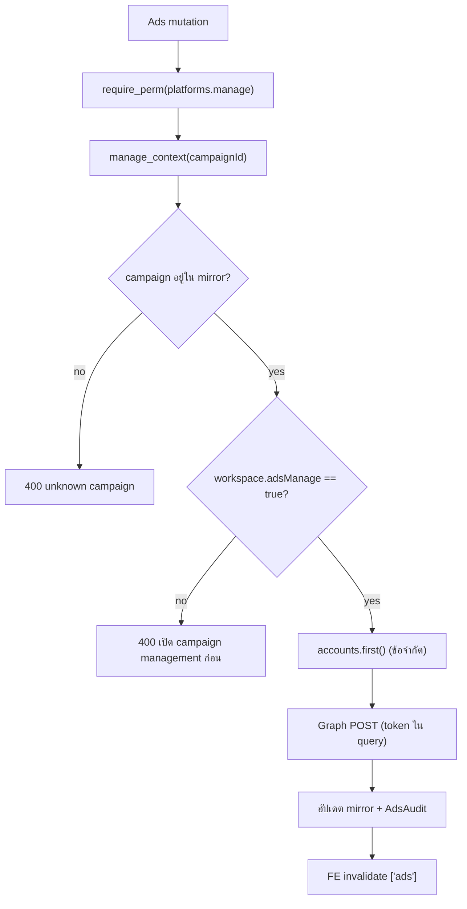
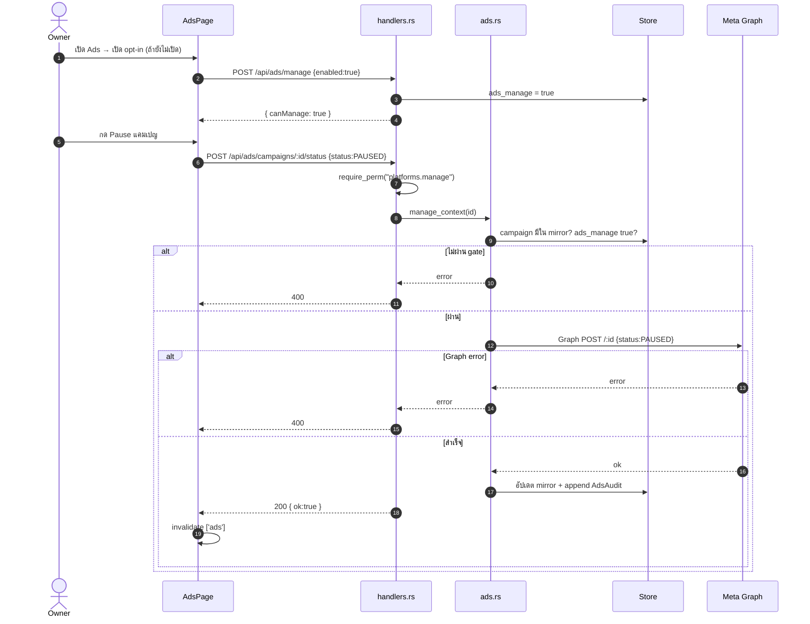
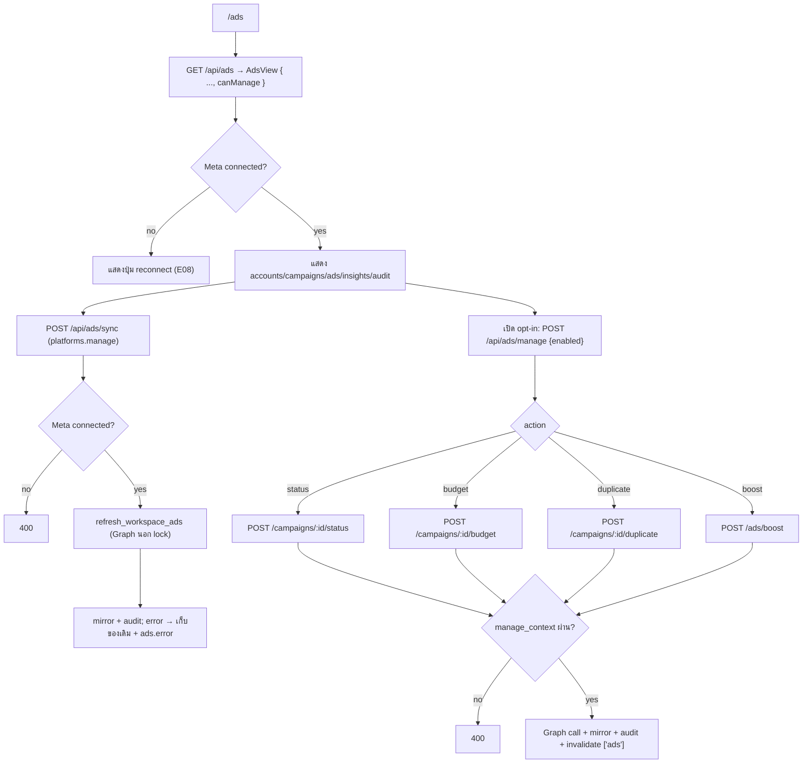

# E09 — Meta Ads Mirror & Management

**โมดูล:** `ads.rs`, `handlers.rs` (get_ads/sync_ads/set_ads_manage/set_ad_campaign_status/budget/duplicate/create_ad_boost)
**Storage:** `Workspace.ads: AdsData` (accounts/campaigns/adsets/ads/insights/audit/error), `Workspace.ads_manage`
**FE:** `pages/AdsPage.vue` (+ `DashboardPage`/`LiveSection` แสดงผล)
**Permission:** `platforms.manage` (ทั้งหมด) + **gate** `ads_manage`

---

## แนวคิด
- Mirror ข้อมูลโฆษณา Meta (read) + จัดการได้ (write) เมื่อ owner เปิด opt-in `ads_manage=true`
- ทุก mutation ต้องผ่าน `manage_context`: campaign ต้องอยู่ใน mirror + `ads_manage` ต้อง true
- background `spawn_ads_loop` (ADS_REFRESH_MIN, default 60) refresh เฉพาะ meta connected
- มี audit trail (`AdsAudit`) ทุก action

## User Stories

| ID | As a | I want to | So that | Priority |
|---|---|---|---|---|
| US-09-01 | Owner | ดูภาพรวมบัญชีโฆษณา/แคมเปญ/โฆษณา | เห็นสถานะโฆษณา | Must |
| US-09-02 | Owner | Sync ข้อมูลโฆษณา | ดึงล่าสุด | Must |
| US-09-03 | Owner | เปิด/ปิดสิทธิ์จัดการแคมเปญ | ควบคุมความเสี่ยง | Must |
| US-09-04 | Owner | เปิด/ปิด/archive แคมเปญ | ควบคุมการยิง | Should |
| US-09-05 | Owner | ปรับงบ (daily/lifetime) | คุมค่าใช้จ่าย | Should |
| US-09-06 | Owner | duplicate แคมเปญ | ต่อยอดเร็ว | Could |
| US-09-07 | Owner | boost โพสต์เป็นแคมเปญ | เพิ่มreach | Could |
| US-09-08 | Owner | ดู audit trail | ตรวจสอบย้อนหลัง | Should |

---

## US-09-01 — View mirror

`GET /api/ads` (read) → `AdsView` = `AdsData` + `canManage`
- แสดง empty/error/reconnect state; account picker; summary tiles; campaign→adset→ad tree; insights

## US-09-02 — Sync

`POST /api/ads/sync` · `platforms.manage` → ต้อง Meta connected → `refresh_workspace_ads`
- snapshot oauth+token ใต้ lock → เรียก Graph **นอก lock** → เขียนกลับใต้ lock (เก็บ audit ไว้)
- error → เก็บข้อมูลเดิมไว้ + set `workspace.ads.error`; handler map เป็น 400
- FE `useSyncAds` → invalidate `['ads']`

## US-09-03 — Toggle management opt-in

`POST /api/ads/manage {enabled}` · `platforms.manage`
- ตั้ง `workspace.ads_manage`
- FE: `canWrite = mayManage && view.canManage` — ปุ่มจัดการทั้งหมดถูกล็อกจนกว่าจะเปิด

## US-09-04 — Campaign status

`POST /api/ads/campaigns/{id}/status {status: ACTIVE|PAUSED|ARCHIVED}` · `platforms.manage`
**Main flow**
1. `manage_context(id)` → campaign ต้องมีใน mirror (400) + `ads_manage` true (400)
2. actor = email หรือ `"operator"`
3. Graph POST เปลี่ยนสถานะ → อัปเดต mirror → append `AdsAudit`
4. FE invalidate `['ads']`

## US-09-05 — Budget

`POST /api/ads/campaigns/{id}/budget {dailyBudget?, lifetimeBudget?}` · `platforms.manage`
- ผ่าน gate เดียวกัน; ปฏิเสธเฉพาะค่าที่เป็น 0 (ไม่มี upper bound) → 400
- Graph POST → mirror + audit

## US-09-06 — Duplicate

`POST /api/ads/campaigns/{id}/duplicate` · `platforms.manage` → Graph `/{id}/copies` → คืน `{ campaignId }`
- FE invalidate `['ads']`

## US-09-07 — Boost post → campaign

`POST /api/ads/boost {name, objective, dailyBudget, days, countries[], storyId}` · `platforms.manage`
- page_id มาจาก Meta connection `external_id` (ว่าง → 400)
- สร้าง campaign → adset → ad ตามลำดับ (3 ขั้น)
- `days` ถูก clamp 1–90 เงียบ ๆ; `special_ad_categories` hardcode `[]`

## US-09-08 — Audit

ทุก mutation สำเร็จ append `AdsAudit { at, actor, action, target, detail }` (ใหม่สุดก่อน, cap)

---

## Gate diagram — Ads mutation

## Sequence — Manage campaign status

## Flow — Ads lifecycle (view → sync → manage → boost)

