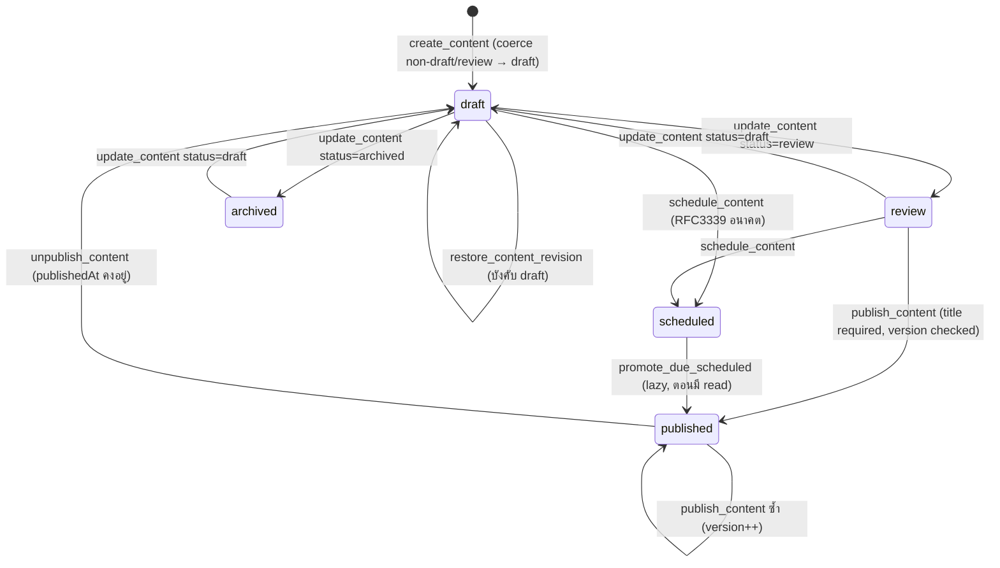
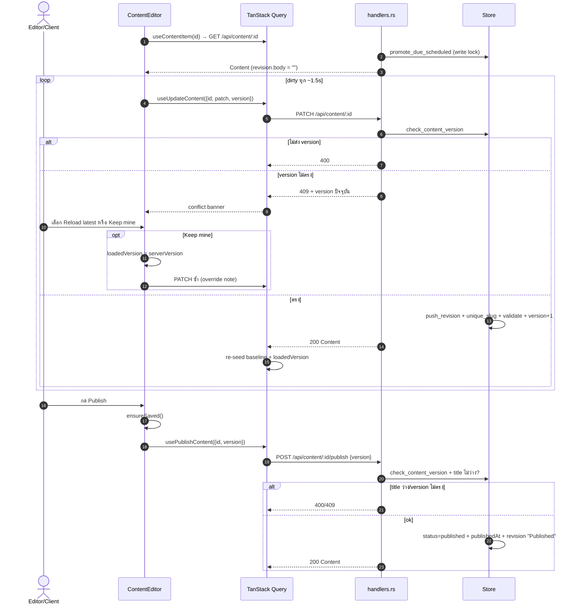
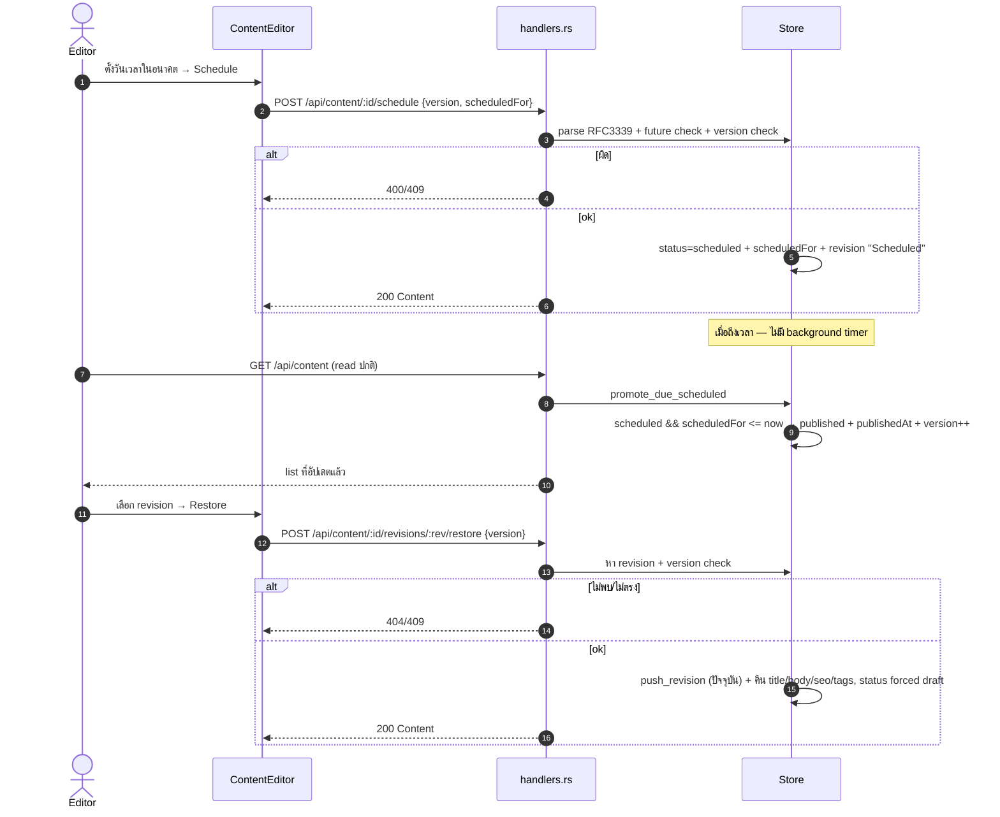
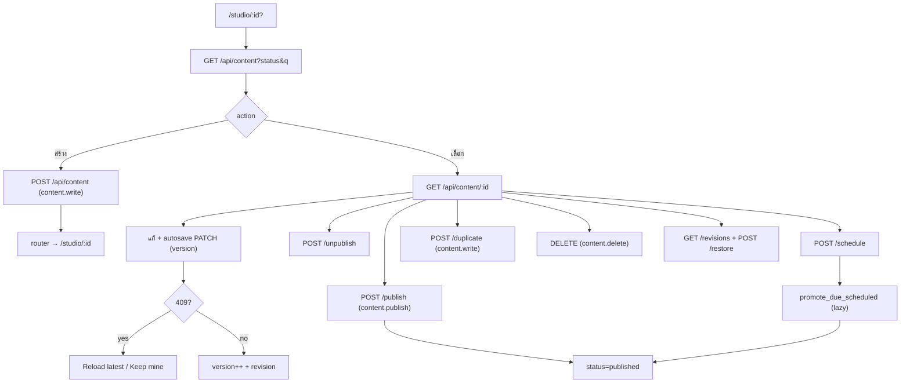

# E10 — Content Studio (CMS)

**โมดูล:** `handlers.rs` (content CRUD/publish/schedule/revisions/public)
**Storage:** `Store.content: Vec<Content>` — global; `Version` (optimistic concurrency), `revisions` (cap 20)
**FE:** `pages/StudioPage.vue`, `components/editor/ContentEditor.vue`, `core/markdown.ts`
**Permission:** `content.write` (สร้าง/แก้/duplicate/restore), `content.publish` (publish/unpublish/schedule), `content.delete` (ลบ)

---

## แนวคิด
- เนื้อหา 3 ชนิด: `article` / `page` / `note`; สถานะ 5: `draft/review/scheduled/published/archived`
- **Optimistic concurrency:** ทุก mutation ส่ง `version` ที่อ่านมา; ไม่ตรง → **409**
- ทุกการแก้ push revision (snapshot ก่อนแก้) cap 20
- `promote_due_scheduled` ทำงานแบบ lazy ตอนมี content read (ไม่มี background timer)

## User Stories

| ID | As a | I want to | So that | Priority |
|---|---|---|---|---|
| US-10-01 | Editor/Client | ดูรายการ content + ค้นหา/กรอง status | หาเนื้อหา | Must |
| US-10-02 | Editor/Client | สร้าง content ใหม่ | เริ่มเขียน | Must |
| US-10-03 | Editor/Client | เขียน Markdown + preview | ดูตัวอย่าง | Must |
| US-10-04 | Editor/Client | autosave ทุก ~1.5 วิ | ไม่หลุดงาน | Must |
| US-10-05 | Editor/Client | แก้ชนกันแล้วเลือก reload/keep mine | ไม่ทับงานคนอื่น | Must |
| US-10-06 | Editor/Client | publish | เผยแพร่ | Must |
| US-10-07 | Editor/Client | unpublish | ถอน | Should |
| US-10-08 | Editor/Client | ตั้งเวลา publish | วางแผน | Must |
| US-10-09 | Editor/Client | duplicate | ต่อจากของเดิม | Should |
| US-10-10 | Owner | ลบ content | เอาเนื้อหาออก | Should |
| US-10-11 | Editor | ดูประวัติ revision + preview | ย้อนดู | Should |
| US-10-12 | Editor | restore revision | ย้อนกลับ | Should |
| US-10-13 | Editor | คัดลอกลิงก์ public | แชร์ | Could |

---

## US-10-01 — List
`GET /api/content?status=&q=` (read) → `ContentSummary[]`
- list เรียก `promote_due_scheduled` (write lock) ก่อน; กรอง status และ q (title/excerpt/tags); เรียง `updatedAt` desc
- FE: ค้นหา debounce 250ms; แท็บ status; loading/error/empty

## US-10-02 — Create
`POST /api/content` · `content.write`
- บังคับ `id=c-...`, `author`, `version=1`, ล้าง publish/schedule/revisions
- status อื่นนอกจาก draft/review → **coerce เป็น draft**
- slug ว่าง → `slugify(title)` + `unique_slug`; validate capacity

## US-10-03/04/05 — Edit, Autosave, Conflict
**Get:** `GET /api/content/{id}` (read) → `Content` (revision.body ถูกตัดเป็น "")
**Update:** `PATCH /api/content/{id}` · `content.write` · body มี `version` + ฟิลด์ + `note?`

**Autosave (FE):**
1. `dirty = JSON.stringify(draft) !== baseline`
2. `watch(draft, deep)` debounce **1.5s** → `save(undefined, true)` (หยุดเมื่อ dirty=false / !canEdit / conflict / saving / !canWrite)
3. `save()` ส่งฟิลด์ editable ทั้งหมด + `version: loadedVersion` + note
4. Server: `check_content_version` (ไม่มี version → 400; ไม่ตรง → 409 พร้อม version ปัจจุบัน)
5. `push_revision` (snapshot ก่อนแก้) → `unique_slug` → `validate_content` → `version+1`, `updatedAt`
6. สำเร็จ → FE re-seed baseline + version
7. **409** → FE ขึ้น conflict banner: "Reload latest" (`reloadLatest`) หรือ "Keep mine" (`keepMine` = set loadedVersion = serverVersion + save override note)

**Status ผ่าน patch:** จำกัดเฉพาะ draft/review/archived (publish/schedule มี endpoint แยก)

**Acceptance**
- [ ] autosave เงียบทุก ~1.5s ไม่รบกวนการพิมพ์
- [ ] version ไม่ตรง → 409 + แบนเนอร์เลือกได้
- [ ] "Keep mine" ทับด้วยเวอร์ชันที่ตั้งใจ

## US-10-06/07 — Publish / Unpublish
**Publish:** `POST /api/content/{id}/publish {version}` · `content.publish`
- version ต้องตรง; title ต้องไม่ว่าง (400) → status=published + publishedAt + ล้าง schedule + revision "Published"
**Unpublish:** `POST /api/content/{id}/unpublish {version}` → status=draft + ล้าง schedule + revision "Unpublished" (**ไม่ล้าง publishedAt**)

## US-10-08 — Schedule
`POST /api/content/{id}/schedule {version, scheduledFor}` · `content.publish`
- `scheduledFor` ต้อง RFC3339 และเป็นอนาคต (ไม่งั้น 400) → status=scheduled + scheduledFor + revision "Scheduled"
- เมื่อถึงเวลา → `promote_due_scheduled` (lazy) เปลี่ยนเป็น published

## US-10-09/10 — Duplicate / Delete
- Duplicate: `POST /api/content/{id}/duplicate` · `content.write` → copy, title+" (copy)", unique slug, draft, version 1, ล้าง publish/schedule/revisions
- Delete: `DELETE /api/content/{id}` · `content.delete` → retain; 404 ถ้าไม่มี (**ไม่มี version guard**)

## US-10-11/12 — Revisions
- List: `GET /api/content/{id}/revisions` (read) → มี body ครบ, ใหม่สุดก่อน
- Get: `GET /api/content/{id}/revisions/{revision}` (read) — **FE ยังไม่มี hook นี้ (unused)**
- Restore: `POST /api/content/{id}/revisions/{revision}/restore {version}` · `content.write`
  - version ต้องตรง; revision ต้องมี (404)
  - `push_revision` (snapshot ปัจจุบัน) → คืน title/body/excerpt/seo/tags และ status **เฉพาะ draft/review ไม่งั้นบังคับ draft**; ไม่คืน kind/slug/heroImageUrl; ล้าง schedule; version++

## US-10-13 — Public link
FE สร้าง `${origin}${pathname}#/read/{slug}` → copy/open

---

## State — Content lifecycle

## Sequence — Autosave, conflict & publish

## Sequence — Schedule & lazy promote / restore revision

## Flow — Studio overview

