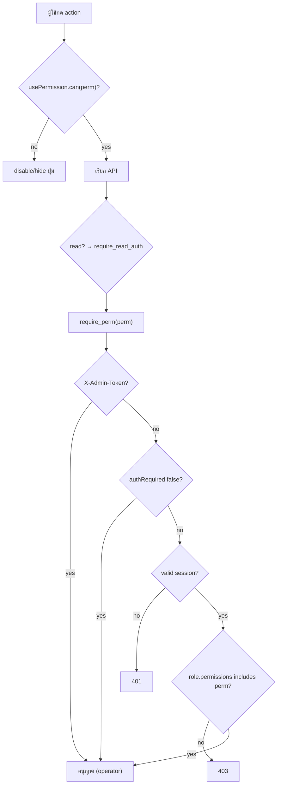
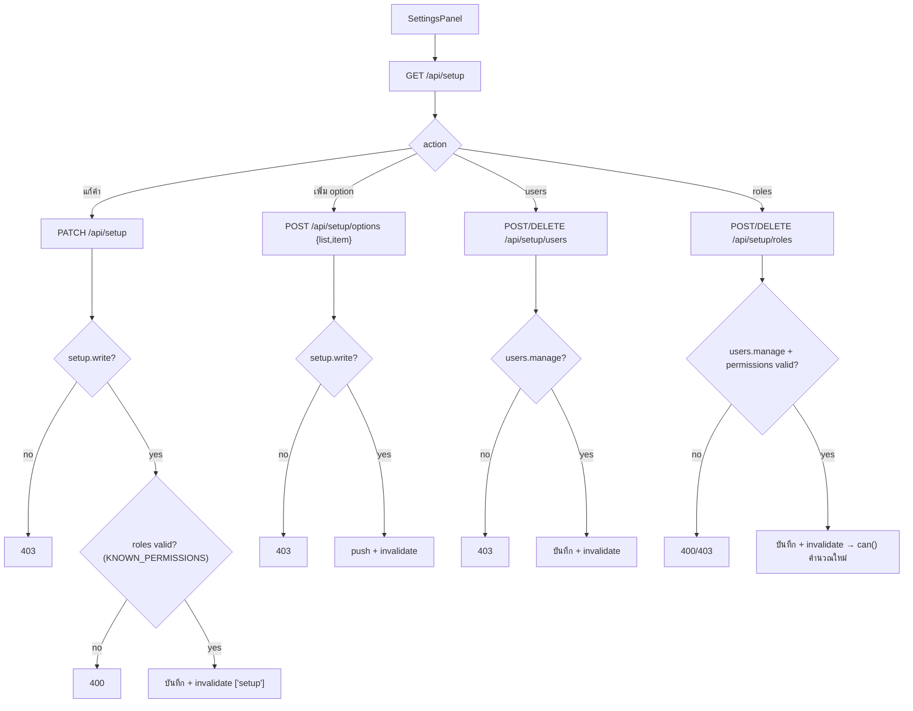
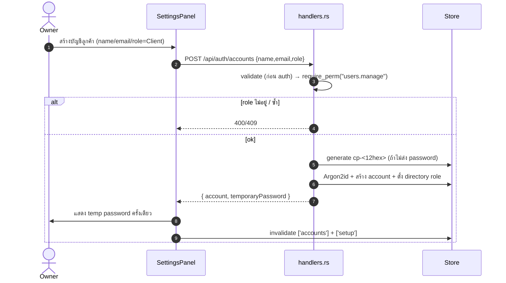

# E11 — Settings, Roles & Permissions

**โมดูล:** `handlers.rs` (get_setup/patch_setup/add_option/add_user/remove_user/add_role/remove_role + require_perm/has_read_access)
**Storage:** `Store.setup: SetupConfig`, `Store.accounts`, `Store.permissions` via roles
**FE:** `components/overlays/SettingsPanel.vue`, `core/queries.ts#usePermission`
**Permission:** `setup.write`, `users.manage`

---

## โมเดล SetupConfig
`language, year, owner, workspaceName, pillars[], formats[], goals[], statuses[], platforms[], showEditableColors, users[], authRequired, allowRegistration, roles[]`

## User Stories

| ID | As a | I want to | So that | Priority |
|---|---|---|---|---|
| US-11-01 | Owner | ดู/แก้ค่าตั้งต้น (ปี, owner, workspaceName) | ตั้งระบบ | Must |
| US-11-02 | Owner | เพิ่มตัวเลือก (pillar/format/goal/status/platform) | ป้อน dropdown | Must |
| US-11-03 | Owner | เพิ่ม/ลบ user ใน directory + กำหนด role | จัดทีม | Must |
| US-11-04 | Owner | สร้าง/แก้ role + ติ๊ก permission | คุมสิทธิ์ | Must |
| US-11-05 | Owner | เปิด/ปิด authRequired | บังคับล็อกอิน | Should |
| US-11-06 | Owner | กำหนดชื่อคอลัมน์/สีที่แก้ได้ | ปรับ planner | Could |
| US-11-07 | ผู้ใช้ | เห็นเฉพาะสิ่งที่ role อนุญาต | ป้องกัน misuse | Must |
| US-11-08 | Owner | เปิด registration / จัดการบัญชี | onboard | Should |

---

## US-11-01/02 — Setup & options

**Read:** `GET /api/setup` (public แต่ redact users/roles เมื่อไม่มีสิทธิ์)
**Write:** `PATCH /api/setup` · `setup.write` — รองรับ language/year/owner/workspaceName/showEditableColors/authRequired/roles
**Add option:** `POST /api/setup/options {list, item}` · `setup.write` — `list ∈ {pillars,formats,goals,statuses,platforms}`

**Main flow (add option)**
1. SettingsPanel เลือก list + พิมพ์ค่า
2. `useAddOption().mutate({list,item})` → `POST`
3. Server: `require_perm("setup.write")` → push ค่า (กันซ้ำตามกติกา) → `SetupConfig`
4. FE invalidate `['setup']`

## US-11-03 — Directory users

- `POST /api/setup/users {name, role}` · `users.manage`
- `DELETE /api/setup/users/{name}` · `users.manage`

**หมายเหตุ:** directory user ผูกกับ permission ผ่าน **ชื่อ** และอาจไม่มี account จริง (ช่องโหว่ G1)

## US-11-04 — Roles & permissions

- `POST /api/setup/roles {name, permissions[]}` · `users.manage` — permission ต้องอยู่ใน `KNOWN_PERMISSIONS` (15 ตัว) ไม่งั้น 400 (`validate_roles`)
- `DELETE /api/setup/roles/{name}` · `users.manage`
- FE role matrix re-seeds เมื่อ server signature เปลี่ยน; ล้มเหลว → revert draft

**Main flow (แก้ role matrix)**
1. ติ๊ก permission ต่อ role
2. `PATCH /api/setup { roles:[...] }` หรือ add/remove role
3. Server validate permission set → บันทึก
4. FE invalidate `['setup']` → `usePermission().can()` คำนวณใหม่ทันที

## US-11-05 — authRequired

`PATCH /api/setup { authRequired }` · `setup.write`
- เปิด = บังคับล็อกอิน (middleware `require_read_auth` เริ่มบล็อก GET ที่ไม่ public)
- ปิด = demo mode เปิด (ทุกคนเห็น/แก้ได้ — ใช้เฉพาะ dev)

## US-11-07 — Permission enforcement (ทุกหน้า)

`usePermission().can(perm)`:
1. `!setup.authRequired` → true ทั้งหมด (demo)
2. หา user ปัจจุบัน → role → permissions.includes(perm)
3. ปุ่ม/ฟิลด์ที่ไม่มีสิทธิ์ถูก disable/hide

Server-side: `require_perm` เป็นด่านจริง (FE เป็นแค่ UX)

---

## Flow — Permission decision (FE + BE)

## Flow — Setup & roles editing

## Sequence — Onboarding client account (owner)

