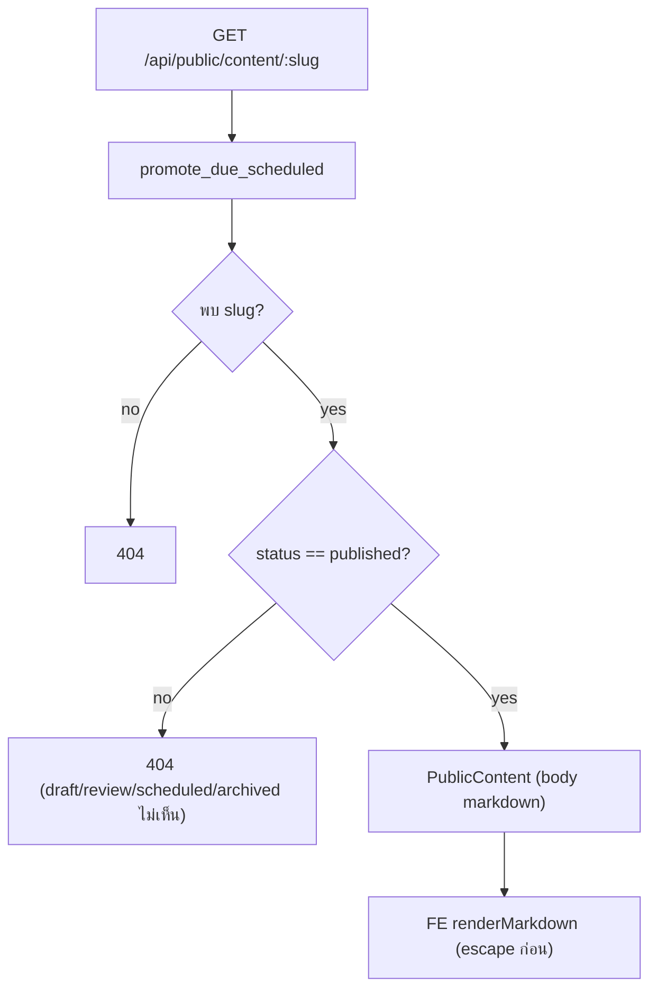
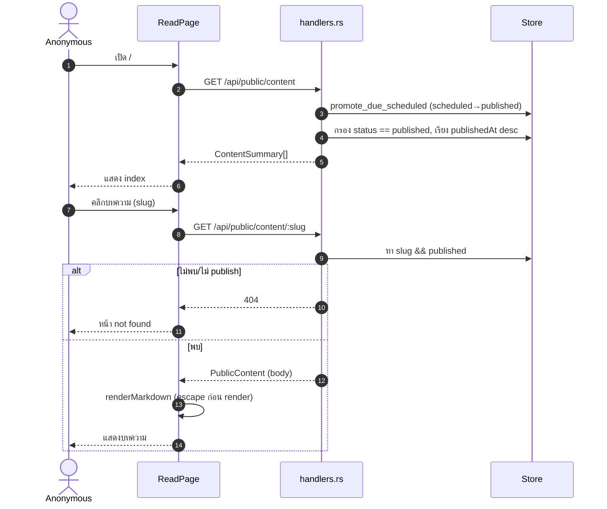
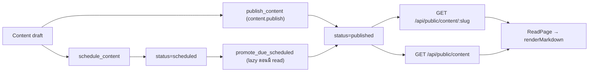

# E12 — Public Content Delivery (Reader)

**โมดูล:** `handlers.rs` (list_public_content/get_public_content)
**Storage:** `Store.content` (เฉพาะ `status == published`); เรียก `promote_due_scheduled` แบบ lazy
**FE:** `pages/ReadPage.vue`, `core/markdown.ts#renderMarkdown`
**Permission:** **ไม่มี (public)** — เข้าถึงได้โดยไม่ต้องล็อกอิน

---

## แนวคิด
- หน้า public read-only ที่ `/#/read` (index) และ `/#/read/{slug}` (บทความ)
- เผยเฉพาะเนื้อหาสถานะ `published`; markdown ถูก escape ก่อน render
- เป็นช่องทางที่ป้อน "delivery" ของ CMS (E10)

## User Stories

| ID | As a | I want to | So that | Priority |
|---|---|---|---|---|
| US-12-01 | Anonymous | ดูรายการบทความที่เผยแพร่ | รู้ว่ามีอะไร | Must |
| US-12-02 | Anonymous | อ่านบทความเต็มจาก slug | อ่านเนื้อหา | Must |
| US-12-03 | Anonymous | เห็นเฉพาะ published | ไม่เห็น draft | Must |
| US-12-04 | Editor | แชร์ลิงก์ public ให้ลูกค้า | ส่งงาน | Should |
| US-12-05 | Anonymous | ดูหน้า 404 เมื่อ slug ไม่มี/ไม่ publish | รู้ว่าหาไม่เจอ | Should |

---

## US-12-01 — Index

`GET /api/public/content` (public) → `ContentSummary[]`
1. `promote_due_scheduled` (เผย scheduled ที่ถึงเวลา)
2. กรองเฉพาะ `status == published`
3. เรียงตาม `publishedAt` desc → summary
4. FE `usePublicContentList()` → แสดง list

## US-12-02 — Read by slug

`GET /api/public/content/{slug}` (public) → `PublicContent { id,title,slug,kind,body,excerpt,heroImageUrl,tags,author,publishedAt,updatedAt }`
1. หา content ด้วย slug **และ** published (ไม่เจอ → 404)
2. FE `usePublicContent(slug)` → `renderMarkdown(body)` (escape ก่อนเสมอ)

**Edge**
- `/read` เปล่า → FE ยังยิง `getPublicContent('')` (ไม่มี `enabled` guard) — wasted request (Gap F6)
- slug ไม่มี/ไม่ publish → 404 → แสดง `itemQ.isError` เป็น notFound

## US-12-03 — Visibility rule

## US-12-04 — Share link
From ContentEditor: `publishedUrl = origin + pathname + '#/read/' + slug` → copy/open (ดู E10)

## US-12-05 — 404 behavior
FE แสดงสถานะ not-found จาก `isError`; ไม่มีหน้าแยกสำหรับ slug ไม่ถูกต้อง

---

## Sequence — Public reader

## Flow — Delivery pipeline (CMS → public)

