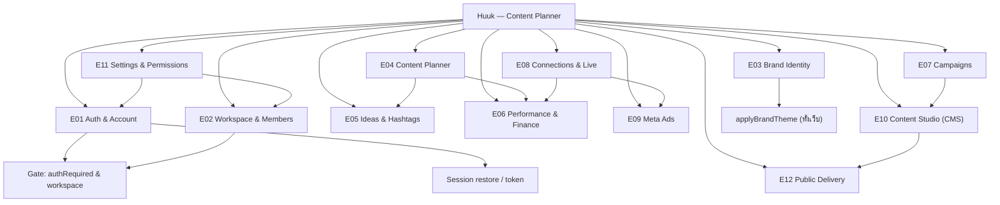
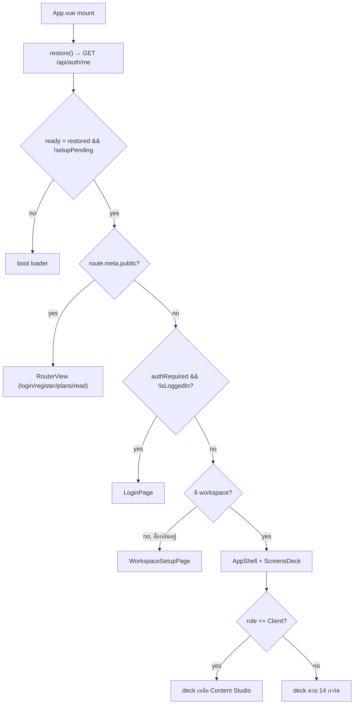
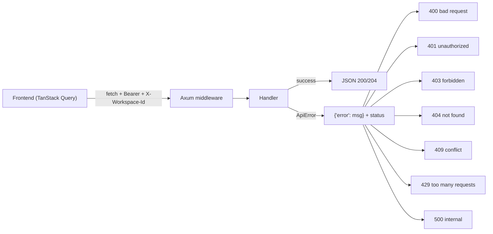

# Huuk — User Stories (reverse-engineered from code)

ชุดเอกสารนี้แปลงพฤติกรรมจริงของระบบ (จาก `server/src/` + `app/src/`) เป็น User Story
พร้อม Acceptance Criteria และ Mermaid diagram ที่แสดง **ทุก action** (ผู้ใช้ → UI → API → Store/Provider)

> ทุกเรื่องอ้างอิงโค้ดจริง: handler/route/error code มีระบุในแต่ละหัวข้อ

---

## สารบัญ Epic

| Epic | ไฟล์ | ฟีเจอร์ |
|---|---|---|
| E01 | [01-auth-account.md](01-auth-account.md) | ล็อกอิน/สมัคร/ออกจากระบบ/รหัสผ่าน/โปรไฟล์/แพ็กเกจ/บัญชี |
| E02 | [02-workspace.md](02-workspace.md) | Workspace: สร้าง/เปลี่ยนชื่อ/ลบ/สลับ/สมาชิก |
| E03 | [03-brand-identity.md](03-brand-identity.md) | Brand Identity (CI): ข้อมูลแบรนด์, พาเลตต์, ฟอนต์, โลโก้, moodboard, style |
| E04 | [04-content-planner.md](04-content-planner.md) | ปฏิทินคอนเทนต์ 01–12, CRUD, ล็อกแถว, promote idea |
| E05 | [05-ideas-hashtags.md](05-ideas-hashtags.md) | คลังไอเดีย, กลุ่มแฮชแท็ก |
| E06 | [06-performance-finance.md](06-performance-finance.md) | นำเข้า metrics, แดชบอร์ดประสิทธิภาพ, บัญชีรายรับรายจ่าย |
| E07 | [07-campaigns.md](07-campaigns.md) | แคมเปญคอนเทนต์ (brief, ช่วงเวลา, เป้า, ผูก content) |
| E08 | [08-platform-connections-live.md](08-platform-connections-live.md) | เชื่อมต่อแพลตฟอร์ม (OAuth), Live mirror, sync |
| E09 | [09-meta-ads.md](09-meta-ads.md) | Meta Ads mirror + จัดการแคมเปญโฆษณา (pause/budget/duplicate/boost) |
| E10 | [10-content-studio-cms.md](10-content-studio-cms.md) | CMS: สร้าง/แก้/autosave/publish/schedule/revisions |
| E11 | [11-settings-permissions.md](11-settings-permissions.md) | ตั้งค่า, users, roles, permission matrix, onboarding client |
| E12 | [12-public-delivery.md](12-public-delivery.md) | หน้า public reader ของเนื้อหาที่เผยแพร่ |

---

## Personas / Roles

| Persona | คำอธิบาย | ที่มา |
|---|---|---|
| **Anonymous** | ผู้เยี่ยมชมที่ยังไม่ล็อกอิน (เห็นเฉพาะ public) | `is_public_read` |
| **Owner** | เจ้าของ workspace/บัญชี admin — สิทธิ์ทั้งหมด | seed role `Owner` |
| **Editor** | ทีมงานคอนเทนต์ — เขียน/ล็อก/import/แคมเปญ/studio | seed role `Editor` |
| **Viewer** | อ่านอย่างเดียว | seed role `Viewer` |
| **Client** | ลูกค้า — เห็นเฉพาะ Content Studio | seed role `Client` |
| **Operator** | recovery token `X-Admin-Token` — bypass ทุก permission | `require_perm` |

## Permission Matrix (15 permissions จาก `model.rs:79-95`)

| Permission | Owner | Editor | Viewer | Client | ใช้กับ action |
|---|:--:|:--:|:--:|:--:|---|
| `setup.write` | ✅ | – | – | – | PATCH /api/setup |
| `users.manage` | ✅ | – | – | – | users/roles/accounts, onboarding |
| `posts.write` | ✅ | ✅ | – | – | เพิ่ม/แก้/ลบ post |
| `posts.lock` | ✅ | ✅ | – | – | lock/unlock แถว |
| `metrics.import` | ✅ | ✅ | – | – | import metrics |
| `finance.write` | ✅ | – | – | – | เพิ่มรายรับรายจ่าย |
| `brand.write` | ✅ | – | – | – | บันทึก brand, อัปโหลดฟอนต์/รูป |
| `ideas.write` | ✅ | ✅ | – | – | idea CRUD, promote |
| `hashtags.write` | ✅ | ✅ | – | – | เพิ่มแฮชแท็ก |
| `platforms.manage` | ✅ | – | – | – | เชื่อมต่อ/sync, ads, workspace, members |
| `content.write` | ✅ | ✅ | – | ✅ | สร้าง/แก้/duplicate content |
| `content.publish` | ✅ | ✅ | – | ✅ | publish/unpublish/schedule |
| `content.delete` | ✅ | – | – | – | ลบ content |
| `campaigns.write` | ✅ | ✅ | – | – | สร้าง/แก้ campaign |
| `campaigns.delete` | ✅ | – | – | – | ลบ campaign |

> ⚠️ Role ถูก resolve ผ่าน **display name** ของบัญชี ไม่ใช่ email/account — ดู `docs/ARCHITECTURE-E2E-FLOW.md` §G1

---

## Epic Map

## Global app gate (ทุก epic เริ่มที่นี่)

## API envelope & error convention (ใช้ร่วมทุก epic)

